# 威廉玛丽学院【中英⚡高级计算机体系结构｜CSCI654 Spring 2025, Advanced Computer Architecture】 p13 P13 CPU 核心架构 1 -BV1evfwBVEUG_p13-

In today's lecture， we're going to start with the core design。

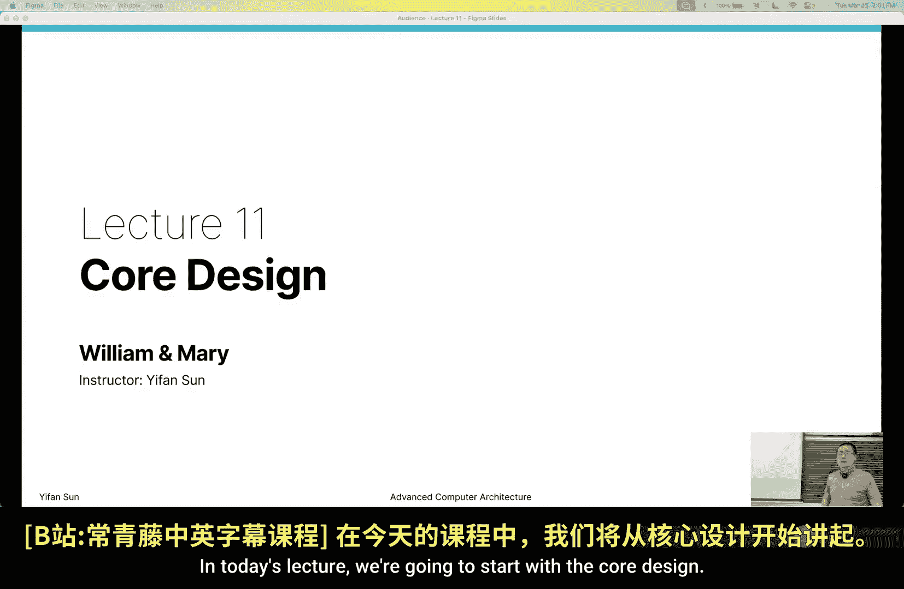

嗯。能。So we're going to design a CPU core， simple CPU core that supports riskfi Ia from as if we're designing a sequential logic and computational logic。

 although we're not going to all the way to the gate level and re level are going to show you how components are connected and how data flows from one place to another。

 Okay， have a quick review of the instructions， then we have these instructions that。Looks like this。

 right， So we have a and the op code and some op print and these op has registers and the op can also have immediate values。

 Now， we know from last time that each instruction takes4 byte the memory。

 So the date the instruction is stored as part of the memory。

 So you need to have a address to fetch the data， and that address is called PC is stored in the PC register。

 So the PC stores address for the instruction that were going to execute。

Then there's open end and there's registers， so those are the basic things that we need to provide at the beginning without designing everything so we so we consider this a few components as the basic building points and we start from there。

 what are the basic points we have a PC which is a single register in this case when we say a single register。

 it means a set of flip flops that store 32 bit data right that's the 32 registers from the previous concept。

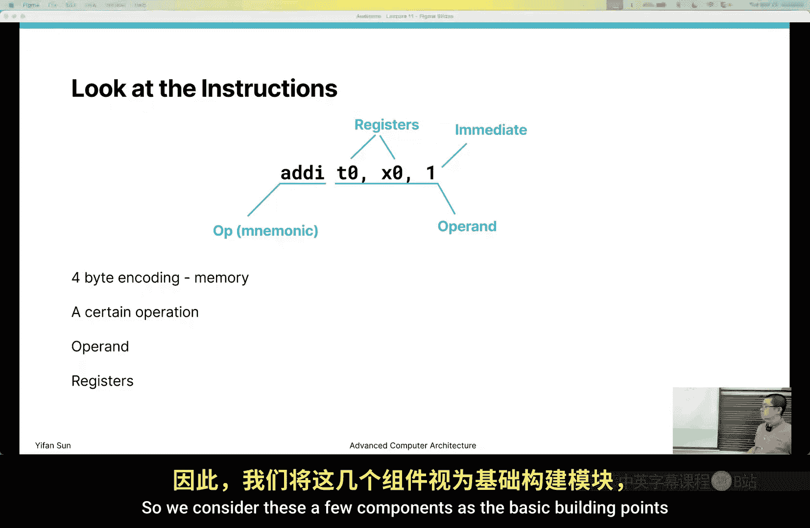

Now we have an instruction memory。 Now every memory component takes address and to output some data。

 Now for the address， we always give a byte a byte level address and it 32 B long。

 and output here in this case， we always consider as a 32 bit wide machine then or read will always tell will provide a4 by data。

 Okay， then similarly， we have this data memory。 Then data memory also provide has a data。

 Then we can we have a address。 then we can read a data from as an output port。

 Then we can also write。Data into data memory for instruction memory， this is a read only memory。

 we never want to modify the instruction， but for the data part， we want to modify。

 we want to write into the data memory。 so there has an extra input port and another control port that is called write enable。

 So when we have right enable equals one we set the corresponding data that's just indexed by the address to the value of write data then also we have a register file。

 then register file is a multiported register file then we have three ports by three port because most of instructions have three opera two input opera and one output opera In this case。

 we have three addresses or register number And remember we only have 32 registers。

 So5 bit is good enough to index the register。那 also the A one。Connects to R D1， A2 connects R D 2。

 and those are always connected。 whenever you provide a1， the output is always give R D1 in the。

Next cycle。 then the right data and the right enable and A 3。

 these three are are connected together so that we can control writing。Now。

 we need to write enable 3 equals one。 Then that corresponding register will be set to that number。

 Okay， so those are the basic blocks。 And we're going to connect these building blocks and eventually build a core。

Let see。The first step since we don't know what the instruction we need to execute。

 the first step is always to load the instruction or sometimes this there's a specific name in this step is called fetch So we fetch the instruction so that we know the instruction to execute so we simply connect the PC with the instruction memory So the output of the read is the instruction itself and a little bit output has a real meaning。

Then this 32 bit information is complex， so we need to。

 we cannot just provide a single line to connect things together and just directly make it work。

 So we need to consider different cases。Let's start by a load instruction。 Now。

 a load instruction starts with this。Encoding we typically read from the right side to the left side。

 So the op code is from this is the op code， and this is the destination， final destination。

 the Rs1 is the source。 So this is source。 So then the bit is from 19 to 15 to from 15 to 19。

 So we take this a few bit out and just directly put into a1 this register。ok， this。

AndThe register that we need。 Then once we connect this one。

 we can consider R D1 or can already provide the data that we need。Now by the way， here。

 although this is a registered file， we can consider this register file can immediately provide us data。

 we do not really we ignore this clock cycle for now okay。Then immediately we have this data ready。

 we have this RD1 ready， and what is this RD1 and this RD1。It's actually the R S1 here。

 This is read the data。 So this is a source。 So this is the。X 9， x 9 is the data here， right。

 is the register that is being output from here。 And there's also a-4， which is an immediate value。

 which is encoded in this part。 right， and this immediate value is。12 bit immediate value。

 Then eventually， when we want to sum up data， sum up two numbers together， we。

 we basically need to sum the register value with this-4 right， Then when we want to divide either。

 We want to say we want to divide 32 bit either， we cannot easily design a 32 by。32 by 12 bit adder。

 So that's difficult。 So then we actually need to come to convert this immediate value into a 32 bit value。

Right，But without changing its real value， So we just need to extend it。

 So then we need to add a sign extension。A extension unit。 Now this extension unit。

 although I don't set the real content there， but you should know how it actually can be designed because you have learned how combination logics are designed。

 right， So take some time you definitely can design this extension unit。

 So we basically start with FFC。 Then we extend it to 32 bit F F F F many F and a C。

 So this is a minus-4。And 32 bit。 Okay， now we take the the。Emedia value。Okay。

 then we have this value and this address， this offset and this address。

 we need to sum them together when we sum we use a unit called AOU unit。what is an AO U unit。

 A AO U stands for arithme logic unit is basically a calculator。 Its a combination of logic。

 but it' a calculator then calculate whatever operation that you wanted to calculate。

 And so like prim。AL use can do some operation minus operation can do comparison。

 can do bitwise operation。 Advanced A L use can do multiplication division， log， signine。

 cosine tangent， this type of operations。 But anyway， it's a。

AOU is a combination logic that can calculate the result。 Now， by the way， for A O U。

 how A O U is typically designed is basically you have the other unit， right。

 Then you also have the modification unit。 So you do all the calculation。 Then at the end。

 there's a selector， There's a。Mipplexer。Right a multixer that has multiple input and use a bit。

 Use some a few bit to select what is the exact output。 In this case， this is the AOU control。

 The A OU control determines what operation that we're actually performing。

Then the output equals to the sum of these two operations in this case， were equals to 2，0，0，0。Okay。

 now AO U can do this calculation and can generate the value output。

 And this output is the address that eventually we want to read from the data memory， right。

 So then we simply can connect these two together。This address connect to this point as the address Then immediately we get the data that we want to read。

Now we get this part， this is a load operation， then we can already load the data where we want to send the data。

 the load data needs to be eventually stored into Act 6， right。Then x 6， where is x 6。

 x 6 is in the register file。 That means we need to connect the data。

 connect this output data back to the register file， then to the R W D3 port。

 So that's why we add another wire from R D。Connect back to the WT3， and also we connect this one。

 a3，11 to 7， these a few bits。That's the RD bit。Okay， and the RD bit is x 6。 Then this， we know。

 okay， we want to write into x 6 register。 Then we eventually can store there。Okay， so at this case。

 then although it's a sequential logic or computational logic and there's a clock， there's a clock。

 now basically。You can see。Just let's ignore a clock for now that is basically a big computational logic that can for whatever input that can generate the output。

 is there suggest a loop that eventually loops back to the register file。Okay。

 so we consider the whole operation can be completed in one cycle time。

 although you can see the data path is actually very long and it can may take a long very long time to finish this exc。

 Now， a very long time， maybe a few microsecond level。Okay， to complete the whole process。

So if you want to develop a simple core， then this is the very basic structure。

 then we are just going to consider more type of instructions and see how these cores are connected together。

Okay， so well， one last step。那。After executing this instruction。

 we need to move forward so that in the next cycle we execute the next instruction。

 so we need to get a PC， then we plus it by four， and this is hard coded4 because we know each instruction is4 by long。

 so we plus four， then we connect back so it rises to the PC in the next cycle。ok。

So it does not use the A U to help with。It does not use AOU， otherwise， if you only have one adder。

 you have to take two cycles to perform the operation。

If it was consistent as like varying length of instructions， right， So if it was cyst。

 would it have to use an AU or would it do something。啊呀。Well， AO you cic have。But。

The Cic still requires AOU， so anything that needs a calculation， we consider that is the。A U unit。

 the program。Just。I guess it would just take the like the brick instruction set。Yeah if later on。

 you can see a multi example that eventually we can use the LU to perform the sum operation。

 still very likely you want to have a separate adder。It's not super expensive。

 but it may delay the execution， right？Okay， so now after that。

 we consider some other type of instructions。 So this is a type S。

 which is a store operation in a store operation， we have。We also have a memory calculation part。

 so this part won't change， so we still have this A1 to RD1 and to AOU part and also from the sign extension immediate sign extension and get from here。

 it's just the one thing the immediate value is actually divided into two parts， right。

So it's either， its either here is here， but in。Load instruction now is R S 2 is part of the immediate operation。

 So how we can solve this problem is basically。By consider by adding a control bit so that this control bit we just。

Direct from 7 to 13， everything that from the immediate point。From this point to this point。

 not everything to this sign extension， but we use an extra。Beat。😡。

AnEx control signal to control which exact signal that we want to type of sign extension that we want to do。

Okay， so this is still a combinational logic and should be easy to design。

Then this is sign extension， but back to this part， then other than。So in load operation， this is a。

In load operation， this is a destination right this is a destination register in this case。

 this is another this is the data that we eventually want to write into this address。So and it's。

Given at the A2 port， so we need to connect A2 port and we connect this part to A2 and we read a value and we read it and we eventually write this piece of data into the data memory。

Into the data memory， then the data memory with write enabled。

 then we can write this piece of data into early。Okay， so in this case。

 you can see the writing enable is another control signal that eventually， if it's enabled or not。

 depends on which instruction we're executing。If we're excluding load。

 we the right enable to false if it's where excluding a store， we right it enabled to chew。ok。能。Okay。

 let's keep going。 This time， we're considering a R type。

 R type is the most common type of instructions。 is the calculation type。

 So we take two registers as input and we do the calculation and we store the result in another register。

So in this case。In this case， we want R D2 to connect to source B。

 we already have RD1 connect to source A。 We want R D2 to connect to source B then。

Soce B is an input port of the AOU is an input port when I say port is just a few wires that takes input signal。

So whenever we want to reuse。An input port from the other two output ports。We need a multiplexer。

 We need to。Merge these two signals into one。 So here。This is a multixer。喂。

Branch out another wire here and connect to a multiplexer。 Now， whenever we need a multiplexer。

 we need a control signal。 And this control signal here will write as AL U source。 So basically。

 it selects。The AOU source， where we want to get the AOU source from， let's say if it's 0。

 we select from RD2， if it's one， we select from immediate value。Okay， so this is a multiplexer。

 and you can see all these gates。 sorry， all these control signals are like traffic control。

 right to allow you pass， allow this pass， allow that pass or allow this action to happen。

 Allow that action to happen。Okay， then but what we draw here are the main data paths that the data needs to pass from one place to another。

ok。😊，Any questions so far。你嘅货咯。嗯。So for。Now we need to consider another type of operations。

 like in this case is a branch operation。 So what is the branch operation is basically an operation on the PC。

 So we need to do the calculation on the PC。 In this case。

 if we need to do the calculation on the PC。 And here we also need to consider the immediate value。

 So the immediate value is a very important part。 So in this case， we take out the PC。

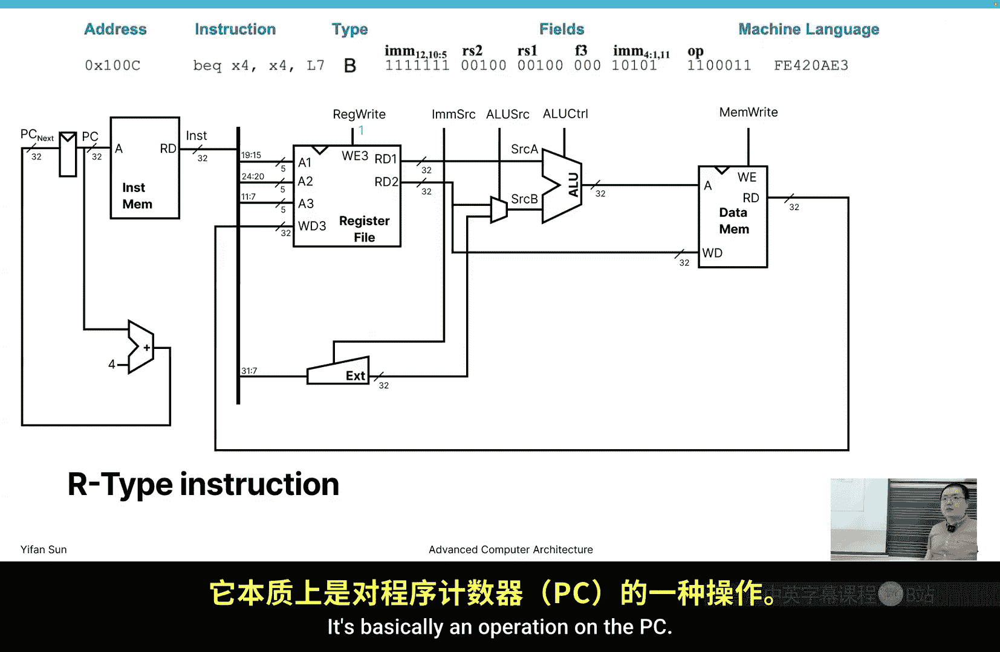

We have another adder， now of course， you can reuse the AOU。

 but we just make it simple to use another adder here。Then this adder with the sign extended value。

 so it's 32 bit by 32 bit here， then we sum the value together， then we go back。

 then eventually we store it back to PC。In this case， we need another selector， the PC source。

On the regular path， we simply add by four， but on jump or branch operations。

 we need to calculate the value in this case。We set a selector。 and for most of the time。

 we only allow the by plus four path to go through。

 but when we are dealing with jump or branch operation。

 we let this path to go through and we store the calculated result as the PC。 and we can。

Jump to the L 7。 L 7 is a label here。 So this label in a assembly instruction is a label。

 but when we encode it into a binary， its number。ok。

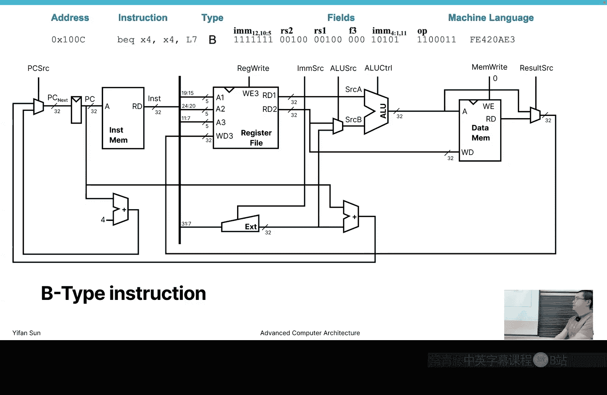

Let see if we have another thing。 Okay， so there are other type of instructions。

 but I hope you can basically understand the principle of how we design these type of things。

 If we need to connect something， we just like pull a wire and connect to somewhere else。

 But whenever we need to connect something somewhere else， we just need a more complex or more。

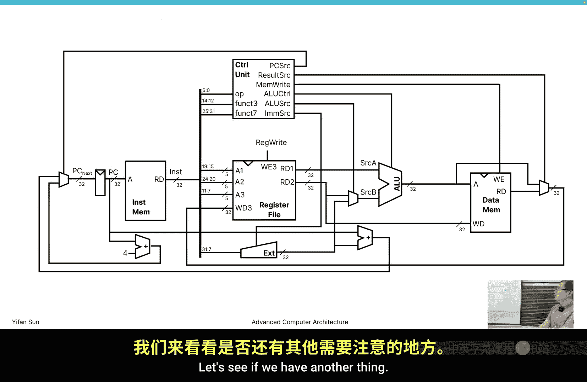

Multiple as or more complex multiple as to control which signal can pass。

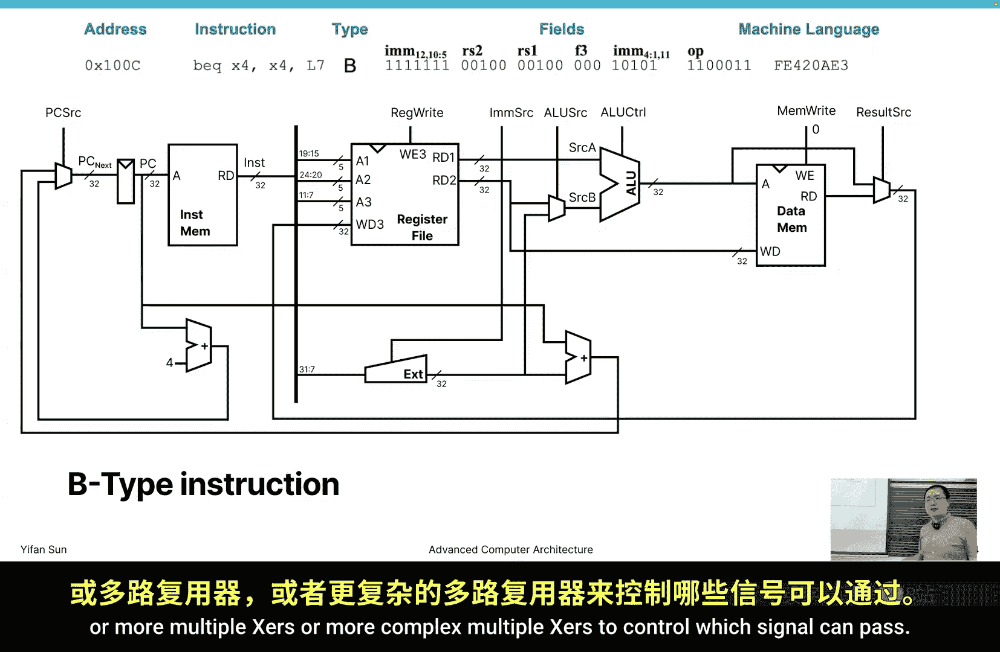

ok。So in this case， we need a control unit to help us to generate these control signals。Now。

 we say we say this is part is a control unit， but this control unit， you may， you may feel oh。

 there's a lot of input and a lot of output， but。With with the design of a combination logic。

 no we can shouldn't be very hard to define this control unit， right。

 then so this control unit basically takes the op。The functions 3 and function 7 field and to calculate what are the signals that needs to be generated。

 So basically there should be a root table。 So for our instructions。

 some bit needs to be enabled and for B instructions， some other bits， it needs to be enabled。ok。So。

 this is a control。

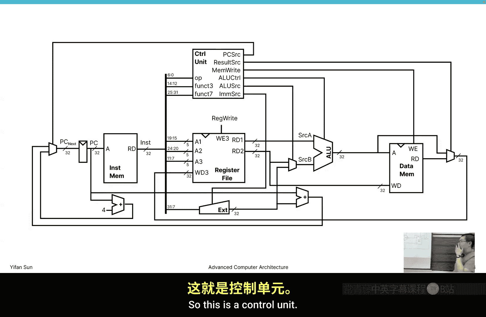

Unit。So whenever we design this unit， we want to perform performance understanding。

 we need to analyze the performance。So we typically consider when we execute a program or execution time equals the number of instructions。

Multiply by。How many let's calculate this part first cycle by instruction right。

 So instruction multiply by cycle per instruction cycle per instruction is also often called CPI cycle per instruction right So how many cycle per instruction instruction multiply by CPI gets the number of cycles。

The number of cycles multiply by second per cycle converses to seconds。RightSo second is the real。

 It the time that we care about that we want to minimize。

 So we we always want to improve the performance。 So we want to reduce the time。能。

For a program when we design a hardware。Of micro architectureiture。

 if we don't design the opening system and the compiler。

 we typically consider instruction is something that we cannot change。

The compiler generates this program， now we just faithfully to exclude it， we cannot reduce it。Then？

The part that we can change is the second per cycle and the cycle per instruction。 right。

 So in this case， we have a very good estimation for cycle per instruction， we just。

Assume that we can calculate one instruction per cycle since we consider hoing is a single cycle operation。

Now， although we do not consider the。

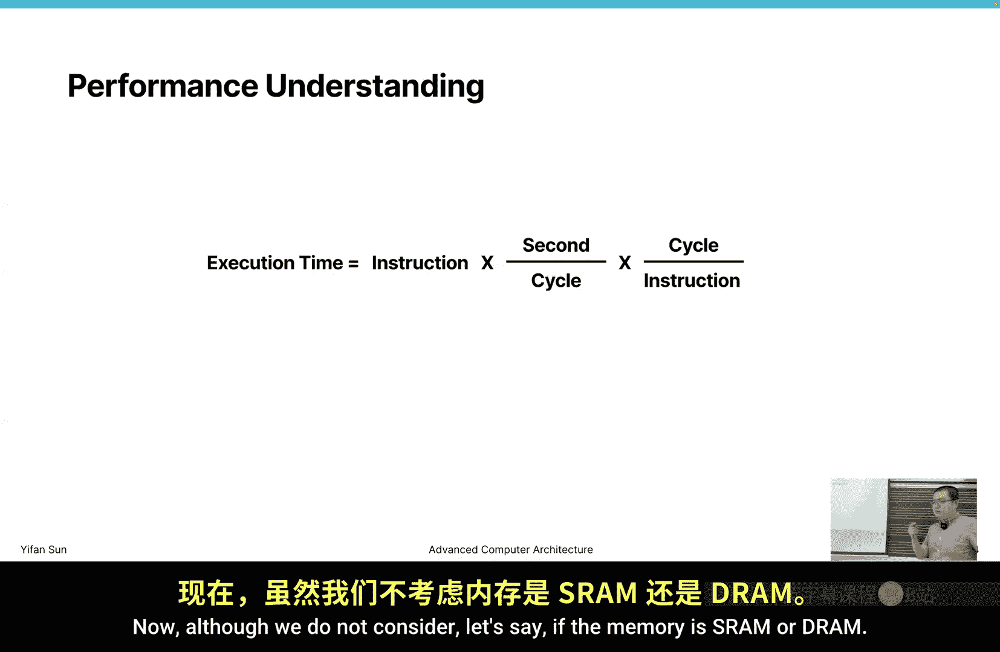

They say if the memory is sM or D， if it's sm is probably we can do it， if it's D。

 probably it takes more cycles。

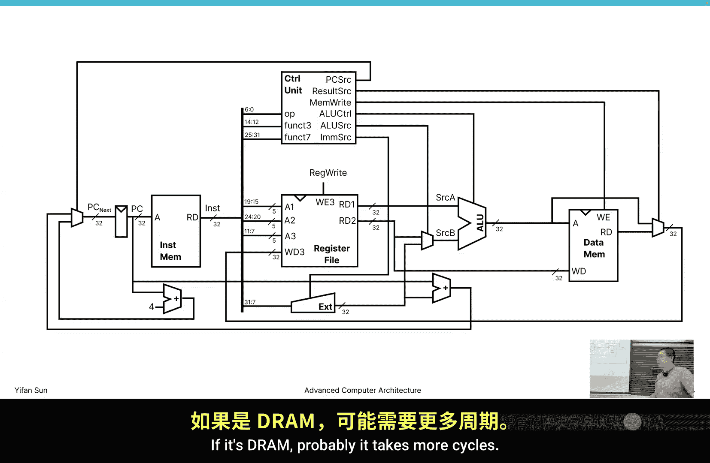

But anyway， if we extend length the duration of a cycle， then we can complete everything。

 every instruction within one cycle time。 right， So cycle per instruction， in this case。

 CPI for single cycle。Core design。Is one。Then the second per cycle。

 I don't want to precisely calculate it， but quantitative， the quantitative understanding is since。

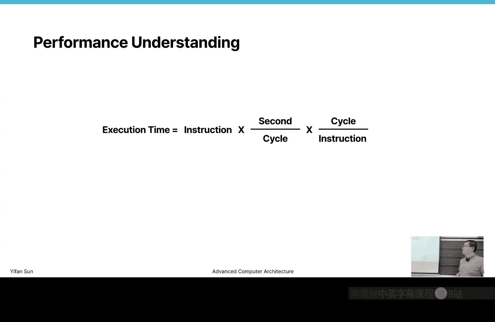

Since for every cycle， we need to go through a long path that we need to perform all these operations。

 It takes a very long time。For us to wait the signal to propagate from one end and back to the other end to complete all the operationss。

 So to wait for the signal to get stable。This value must be a rather long value。Okay。

 so we have a single cycle data path and we have one CPI， but do we have a very long cycle time。

So especially when we consider something like。For load and store operations。

 we need to do the data map， right， but for other operations。

 we probably the AOU can directly just get us the result and can get right the result back to the WD3。

To write back。 So do we really have to wait for another for do we really have to go through the data memory。

 although even if we're not reading anything。Well， you you consider as long as we provide a data address。

 we can read something out。 So that's actual。

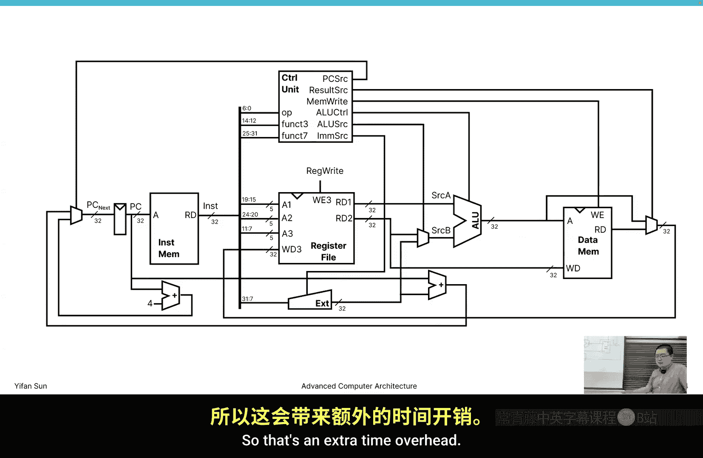

Time overhead。Okay， so in this case， we want to improve the design by reducing the cycle time and to do not let things wait。

 like other instructions to wait。So that creates the multi cycle core design。

We still design CPU core with sequential logic， but we can wait for more than one cycles to complete one instruction。

 but still we never let two instructions to overlap the execution。ok。Now in this case。

 we really I think the purpose here is just to let you feel another flavor of the design。

 so in this case we consider instruction and data memory to be merged together so in the old school Van Neman structure。

I think to the one of the most important contribution of one o made is to define the one o。

Architecture， and by the definition， instruction are nothing special。

 but a piece of specialized the data they stored in the memory。

 So it's stored in the same hardware unit。 And even today is stored at the same unit。

 But the improvement is at the last level at the。First level cache display the database。But here。

 let's just assume they store in the same memory and see how we can design this type of system with a motorcycle design。

Still the first stage， nothing special， we connect the PC with the address so we can read the instruction。

Then， since we are doing a multi design。And this instruction needs to stay there because otherwise this address may need to change later。

Change the what， change the data that we want to write back or change the data that we want to read。

 right Now it's the same data memory。 So there's only one port。

 So we have to lock the instruction in this， have to lock the instruction using a set of register to temporarily store it there so that。

For the rest of the program， we can use this。We can use the instruction values。The instruction bit。

Okay， so still nothing special here。We have the sign extension， we have the immediate source。

 then we have the AOU operation sorry we have the open register open that goes to a1 port。O。

 then from A1 port， then we get read the RD1 data。Still， once we're done with one operation。

 we store it in。Register so that we can use it later。 When it's a multi cycle design。

 we need to use register to stay there and to help us lock the data。 In this case。

 we have enabled signal only when IR right is enabled。When W Li， when I write is one。

 we can allow the read the data to store in the instruction， otherwise。

We do not this to overwride instruction。 For example， if we want to read some real data。

 not instruction data， value data， then this read result may be something else， not instruction。

 right here， we just lock it here when we don't really need to consider its a。

We don't really have to have an enable signal。Then we have an AOU。

 weve set source A and source B just as before and there's an AOU control after AOU we get a result。

 we set the AOU out value and this value is stored in another set of registers so that we can use it or dispatch it to different places later。

 according to the instruction type。呢。They say， they still consider this is a load instruction。

 And this A O U out is address， right， If it's an address with just。Rioracist。

Back this signal back to here。

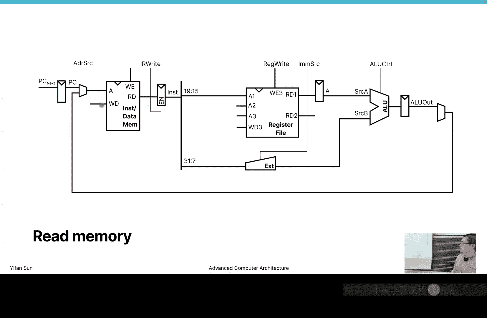

So for here now you can see there's a conflict right so previously only PC is connecting to a address this time we also want the address。

 the read address to connect to the address field Now in this case。

 we need a multixor to select which signal to go to this address field。

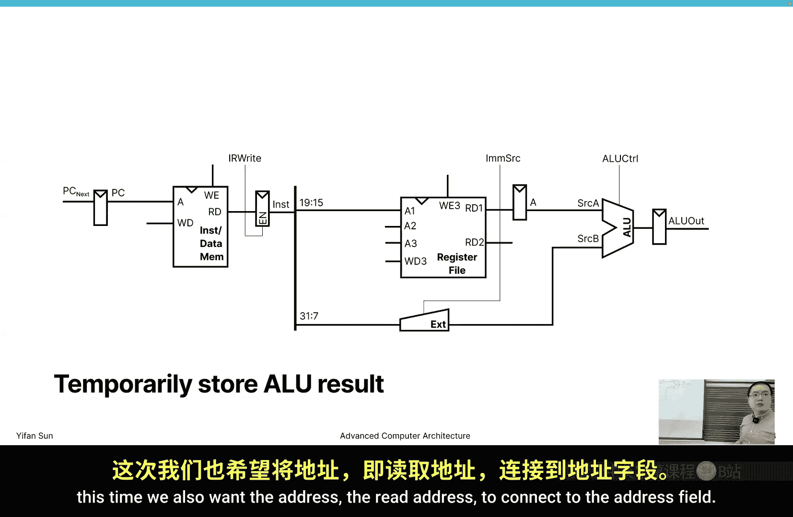

No。Here we consider store instructions。 So this can complete the full operation of the load。

 the load process。 if it's a store instruction。

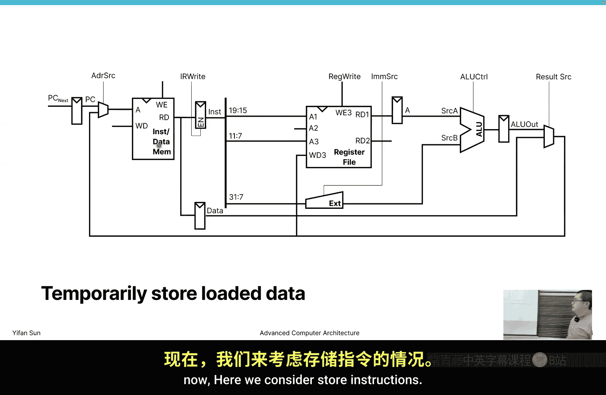

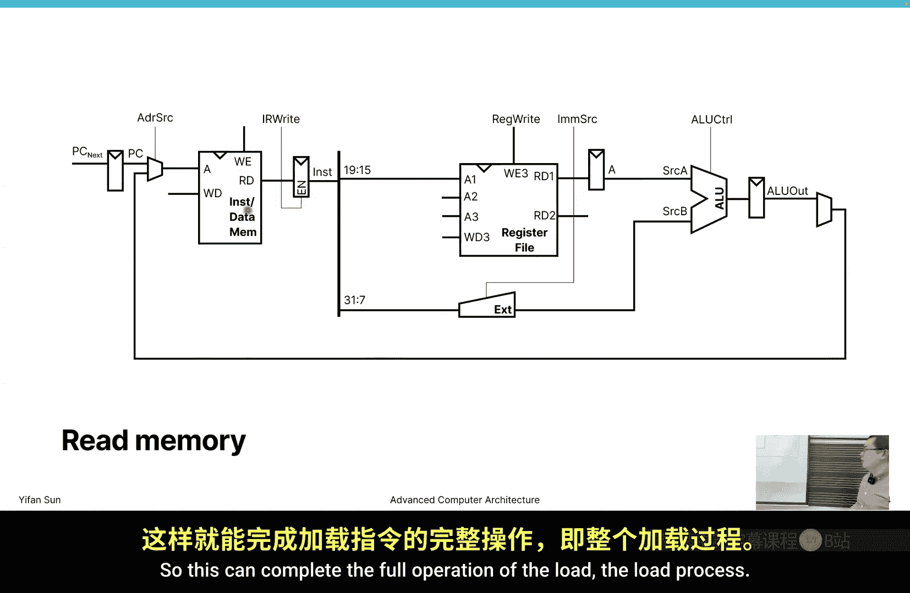

The store instruction， remember， we still need the address， right。

 We still need the address and the address connects bug。And we。One moment。ok。This is the data。

 I think if this a store operation。Now this is still a right operation do we have the data No。

 this is still a right the load operation。 So when we do load。

 we we need we need to get the data that we have loaded and we temporarily store here and this data is eventually。

 I think this should be connected here， but later on we also need to connect here。

 So this data is connected here and this data。Okay， it， it goes this way。

 So this data goes to the result again， then it looks back。

 then eventually writes into the right port。Okay， this goes back to the right port。 It's the data。

 Then we eventually need to store into a register and the path goes this way。跳。

The right data and back into the register， This completes the load operation。

So we temporarily store loaded data here。Okay， then finally， we want to write。Now finally。

 next type we want to write the data so this is store operation in store operation。

 we added this wire， read the data， and here we also store a register and this is just a combined register that stores the data from the register here and register here and it goes back to。

The data that we eventually want to write。 Okay， so。As you can see at this moment。Theresa。

There are some register in the register file， and these registers can be indexed by x something X 9 or X 10。

 those are indexable， and there are some other registers， for example。Let's don talk about PC。

 Let's talk about this register， this register， this register and this register。

 So this is a separation of different register。 When I say register the register in the register file or add something This is typically。

Architecture visible， we register， at least controllable or programmable。Register。

Then those registers are not architecture visible。 So once say architecture is the instruction side of instruction side architecture。

 it's not micro architecture。 Okay， so those are architecture invisible registers。

 Those are all only part of the。Micro architectureecture design in other microitectural design。

 those register may not even exist。Okay， so sometimes when we do research like bit flipping， right。

 So we talk about at the very beginning of this course， we store some data in the in a。

Sore some data in a register。Now because of cost wing race， then the bit can flip from a register。

 so some research will focus on architecture visible registers。

 but if this research can focus on both architecture visible registers and invisible registers。

 its another level of complexity and it's a much more difficult type of research。ok。😊，So。

I don't want to go too deep here。 Now， if you really want to connect wires。

 you can connect a lot of wires to support all these type of instructions but。I'm just going to say。

 oh， conditional branching。 there's， there need another wire and makes this this。

This register are more complex and this。Multipx are more complex。 Okay。

 so you just need to drag wires to different locations。

 And you can always think there are a ton of control signals and those control signals are basically the traffic controllers。

 and the traffic， the flag， the flag directs the traffic go this way and the traffic will will go level and the multiplexer。

 you can see why it's so important to introduce at the beginning is is constantly use the building block。

That used everywhere to control the signal in a more complex digital circuit。

Okay and the very important part， when you are dealing with computer architecture。

 you may constantly hear this terminology called opera opera gathering， So what is opera gathering。

 So ALU will take all as input right There are many different types of all there registers are there are immediate values There can be even other type of registers other type of opera right So we have a process called opera gathering。

 We gather all alls together。 Then we use the right control signal to select which can arrive at that point。

Then in a multi in a more complex design， opera gathering can be a multi process， for example。If。

For example， remember， when you talk about multiported register file and there may be register bank conflict。

 So it may take the register file to cycle to get the register we need。 So the register。

 the open gathering may take multiple cycles to。Put the right。Rise your value， open and value there。

 then eventually feed into AOU for calculation。Okay。

 and but this part is called open gathering and iss a relatively complex part in the core design when the core gets really complex。

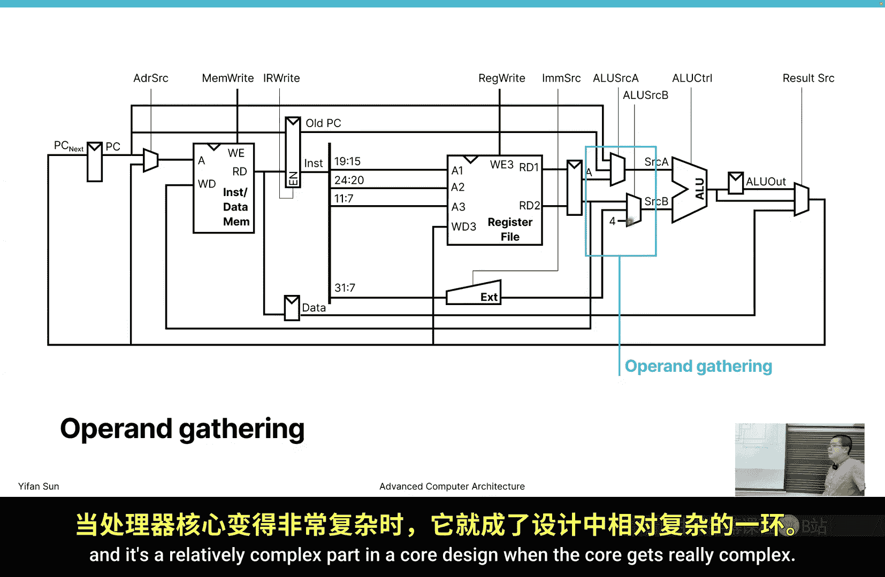

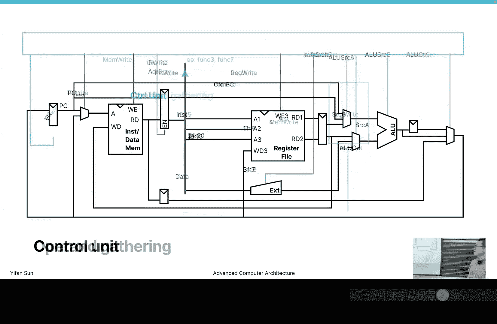

Now， eventually we set this control unit。And this control unit takes the input from the instructions。

 the ops， the function， the function 7， and generate all these control signals， including PC right。

 So at the only at the right time， we can update PC。ok。

So those those are the whole circuit design for a core then。Still， you don't need to remember this。

 but I want you to basically understand how a core is designed now from a single cycle and for until a multi cycle and what are the main components and the main steps required in a core to eventually calculate。

Instruction by instruction then if we can support many different of instructions。

 then no matter how complex your program is， we can eventually calculate the result， right？

This is the control unit。 then the control unit needs some。

It's probably the most complex part in the whole。A core design， right。

 So let's see how this control unit can be designed。 And since it's a sequential logic。

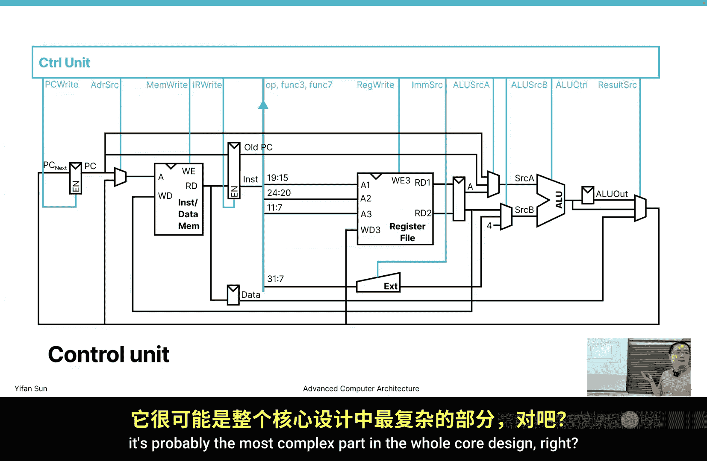

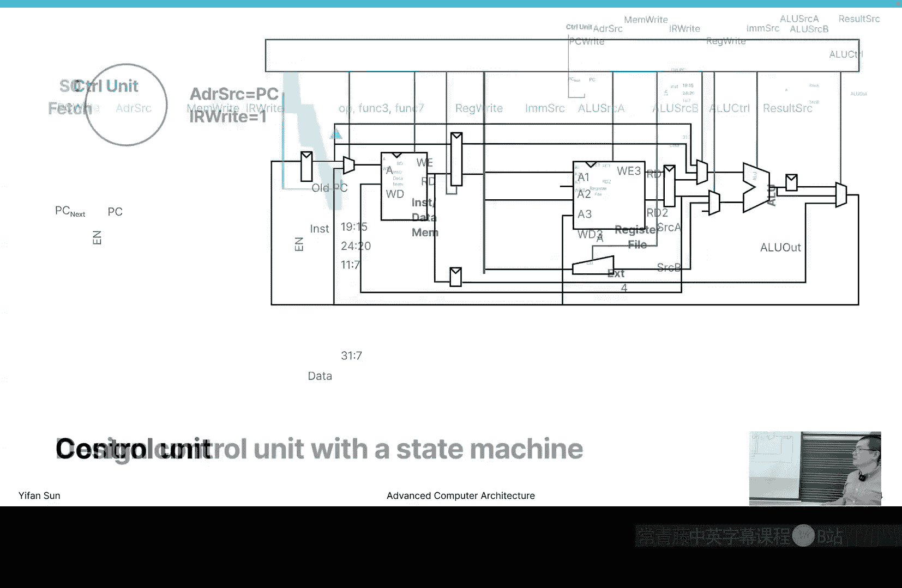

We use a。State machine to represent it。They start with state0 fetch and this is the default stage so if we reset。

 we reset to this state now when we're doing fetch。

 that means at this cycle we don't have any instruction that's being executed。We fetch in this case。

 we set the address source。Addres source to PC。So PC can pass through and can read the instruction and instruction can end at a register So remember this is a multicycl design。

 so for each cycle we want data to start from one register and end with another register。Okay。

 so in this cycle， we start from this register and we end with this register。

And did the address source controls。The data flow and also we enable the IR right， sorry。

 IR right is not here。 IRI is here。So we controlled IR rights so that the。

Instruction register can be written into。Okay， so this is the first stage then still at this cycle。

 at this stage， we don't know what instruction we're going to execute。So， we need to decode。

We need to decode so that we know the instruction that we want to exclude。Now how do theycode？

Thecode actually starts from this register now end with this register。ok。😊，And with this register。

 the start with this register。 then it on one side， it goes up to the control unit。

 So the control unit can calculate what the control signals for later。For later stages。

It goes to a control unit on the other side it's a decode stage is also a readT stage。

 so we read the data from the register file， so the read stage sends this address into the register into a register file and the register data can be generated and can be stored in this register okay then this extension unit it's okay we don't need a register to store it because in the next cycle we're still going to use it。

So once we arrive at the decode stage， we can set up all these control signals for the rest of the execution。

Now in this case， we know what instruction we're executing， right。

 we know what instruction we're executing， so let's start from one example， load instruction。

 we always start from load instruction。And we slowed instruction。We just move on， we start from here。

 we start from this register， we end with this register。

 and we call this stage memory address so we calculate a memory address and the memory when we calculate a memory address how we can set set up these signals so we need to set ALU source A。

 ALU source B， right。We need to set these signals， so for other signals we also need to update but I just don't want to show you everything will make it really complex to understand。

 but at this critical point we need to set the AOU source A to take from the register value RD1 source B to take from the immediate value Now eventually the AOU is a combination logic now we can get a value and store in the AOU out signal。

Sted in this register。Okay， so start from one register and with another register。

 also start from one register and another with another register。After the memory address。

 we know the address。 Then we can go back to the memory and to load the data。

 So the next stage is called memory read。So we basically start from this register and with this register。

Okay， we take the AOU out this address and go back here， then in this case。

 the AO A address source should select from the result and also the IR right should be0 so that we prevent override into the data。

Into the instruction， instruction buffer or instruction register。

We load the data we temporarily store in this data register。

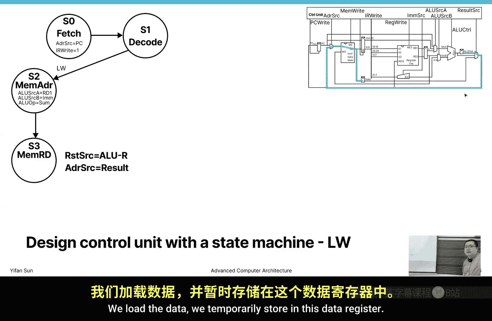

Okay， then finally， at the end， we set this called memory right back When we say right back means we want to write into the register。

How we do right back。 Then on one side， we have this， we still need the instruction value。 All right。

 new instruction value。 Then we we give the right。Sign into a3 and we store from the data and we write it into WD3。

 So start from this register and with the register in the register file。Also。

 we need the register rail to be enabled。And other fields also need to like。

The registergi source needs to be data。Or subs source source。吓。Okay。

 I think I didn't write that part here。 I didn't include even include that。Okay。

 I still make this mistake here。So it actually should go here。 the result source should be data。

 So it actually needs to go from here and go back and go here， okay。So sorry about this problem。

 so it should go from data， then go all the way here。

 then go up here and go around and go back from this point and write the data。 So that in that case。

 we need a resource source field to select to route the signal back。Okay， so in this case。

 we use five cycles。To process a load instruction， fetch， Decode， memory address， memory read。

 and memory memory write back。Then if we consider a store or at the end。

 we need to go back so that we come back to another fetch， okay。Now， in another case。

 we consider a store operation for a store operation。we。Need to process the same thing。 fetch。

 Decode， memory address。 Once we know the address， this time we go to our memory right field。

 Now starting from this point， I think you know how to set up the signals。

 So I won't tell you we I won't write down the signal configuration。

 but this is the data pass on one side， we start from this field this。This register。

 So this register is the data。 So the data rolls back to the right。

To the right W D port On the other side， the calculated address goes through this。

Pass then feed into the airport， right， So eventually we can write data。

 So we start from this register and this register and we end up with the register in the data instruction and data memory。

Okay， any question？Yeah。Yes。why we have like S。对呀。In the middle of the past。read你要落一层。你你。Read。

 I mean load and store can read the same。Okay， so the whole five cycle is describing a load instruction。

Okay， so when we say memory read we're reading from the memory， so the read the data that we read。

 for example， if this is load。Loow the word， then this is x6。-4 x 4， for example， right。

 If this is an instruction， we need to get this address and store and write it back to this register。

The right W B。Is to write the data to the register。So that's we have this path。

 so this is the destination a3 is the regular destination in this case at x6。6。

 right on the other side， just consider this data can go back and from this pass。

 Then on the other side， we pass the data to WD3。 Then we write into the L D 3 sorry。

X 6 equals to the content of this part of memory。 That's why we need a memory WB stage。

So I think there is passing。Well， the problem is the blue line should go this way。

I think the data reach from the。Instruction data set。This story。Yeah。

 the source and destination is correct， it's just a path to go the long distance。

 so it should not go this way。I I intentionally do not want to do like crossing right so every crossing should be no connection。

 otherwise this part is too confusing。Right so not a big problem。

 you can understand is data that eventually go to the register。

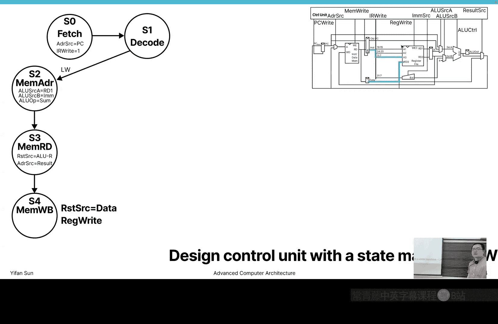

Okay， so in this case here we're store， we're dealing with a store store has the value from the register and eventually goes to the。

Memory。RightSo that means for store， we only need four cycles rather than five cycles。Okay。

 so I won't show you the host state diagram， but this is basically the host state diagram that can sufficiently exclude all the instructions from the RV32I instruction set。

So for a few different instructions， we need to in， execute this one。

 This is excuse but the source is from register。 This is excuse but the source is from immediate value and JL is a jump。

Then it says special registers。 Then eventually， we need AL U W B。

 So we calculate a result from the A L U。 Eventually， we need to write back into the register file。

 And also a B， E， Q is a conditional branching is a special。Instruction， special consideration。ok。

So in this design， we can see it's a very different design from the press one。

 and we take multiple cycles to execute this instruction。 Then the idea is。

We cannot change the instruction anyway， but we expect the second per cycle is shorter。Right。

 we expect。Reduce the duration of each cycle so that we can process only a little operation from one register。

 just only go one step forward， one step forward so that we reduce the calculation。

 reduce the time for each cycle。Then at the cost of increasing the cycle per instruction in this case。

 we can consider the cycle per instruction is three to5 we need three to five cycles So if you consider three to five which what is a good number。

 you actually need to consider your program the mixture of the instructions。

 if you have a lot of load instruction， then it takes five cycles。

 but if you have most of execute instructions， it takes four cycles。 but anyway it's。

The shortest path is three cycles， but for other times it's more like four or five cycles and most likely you are going to have more like AOU instructions rather than branch instructions。

 so the final result is towards four cycle per instruction。

So there's then it's a trade off shorter cycle， shorter second per cycle and cycle per instruction。

 Which one is more important than can you reduce the excion time， And the short answer here is。

 for most of time， you cannot use a multi cyclee design to。Beat the single cycle design。

But why this part is still important is because。

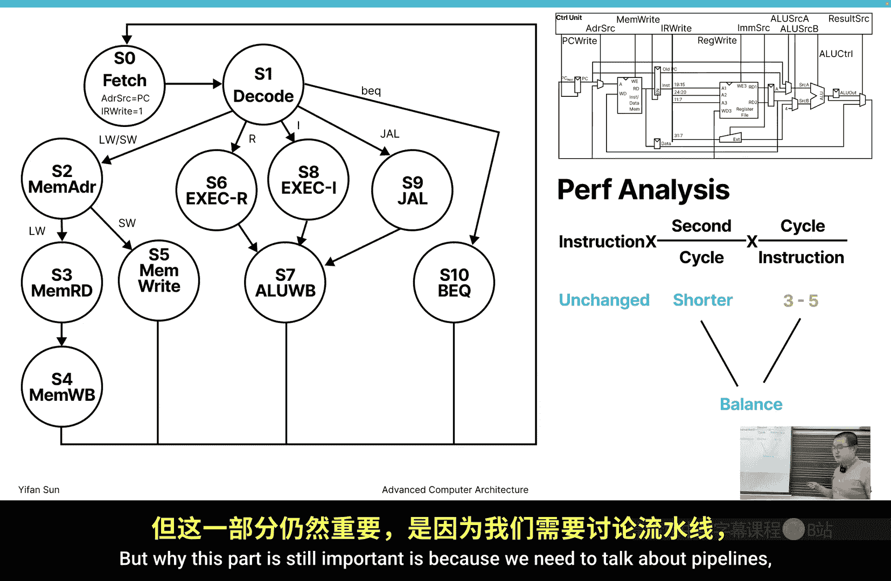

We need to talk about pipelines。The pipeline， the processor。Okay。

 so when we talk about pipeline processor， there's always an intrinsic conflict。是。

So for human understanding or for human programmer。

 if no matter if you write a C program where you write a。Assembly program。

 you want the instructions or line for code to execute to one line after another。

 one line after another， right。Then but for machine execution。

 machine is always very good at parallel because there are so many registers and so many computational logic for every combination piece of computational logic。

 they take register input and to store register output， they can perform operation in parallel。

 So theres an intrinsic complexity intrinsic difficulty So look at this pipeline design or this design Since it's a multicycle design when we are loading when are fetching the instruction。

 when fetching the instruction， the raz file is idle， the ALU is idle。Pretty much everything is idly。

 right when the IOU is idle， then the。The memory part is when the L ALU is being used。

 the memory ride is is idle， so when we calculate the efficiency of the whole program。

 we typically consider the utilization of the most scarce resources。

And remember last time we were talking about arithmetic intensity。

 so arithmetic intensity tells you there's a ratio between calculation and data to load to be loaded。

 so for most of the program it's either memory intensive or compute intensive So if it's compute intensive the ALU is the most scarces resources if it's memory intensive the memory is the most scarces resources So when we analyze a program performance we want to say that utilization。

But they say its a it takes five cycles to exclude one program。

 Now five cycles at most the two cycles are were using the memory instruction。

 and for most of the time， the memory is only a fetch because for most of instructions AOU instructions。

 Now for other instructions， the AOU is the only one it only being used in one cycle。

 So no matter what it just basically tell us it's a 20% utilization around 20% utilization。

 which is not ideal。 we want it to be to have。100% utilization， although it's impossible。

 but it's the goal that we' want to optimize。

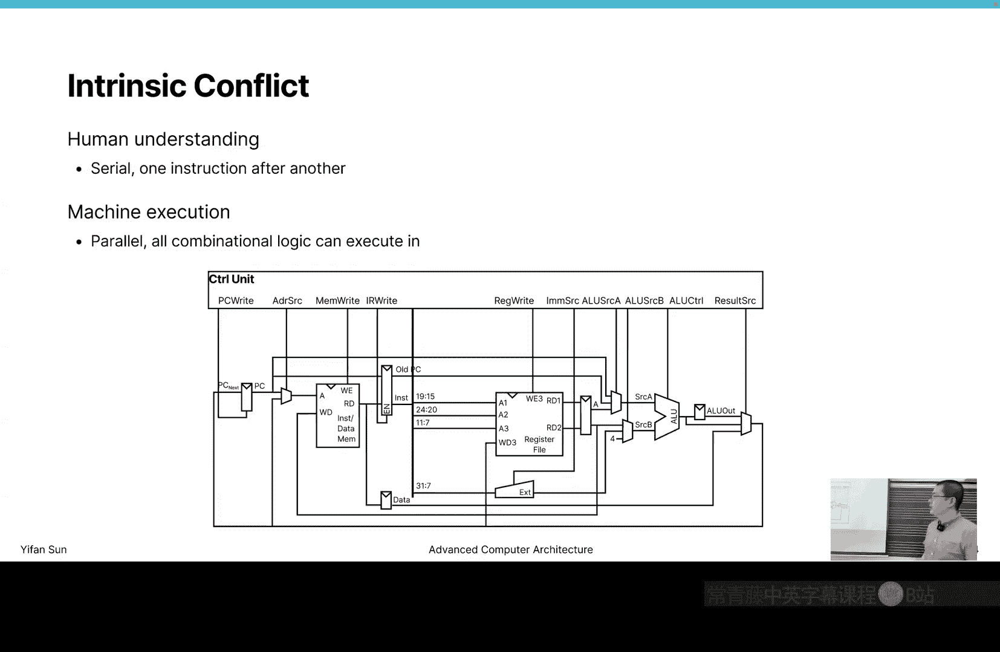

So then this is our structure of the operations， then we can slightly reorganize this structure by considering what actually they are using and what's each stage is the busy unit there。

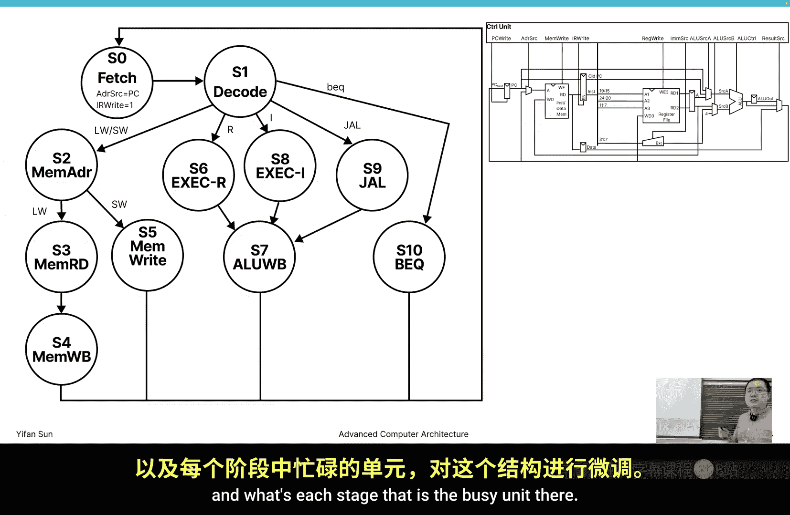

So we restructure this in this way。By aligning the similar components in one。Colum。At the beginning。

 we're doing fetch when we're doing fetch， the memory。

 the PC part is busy right we're starting from this register to risk register when decode were read from the register。

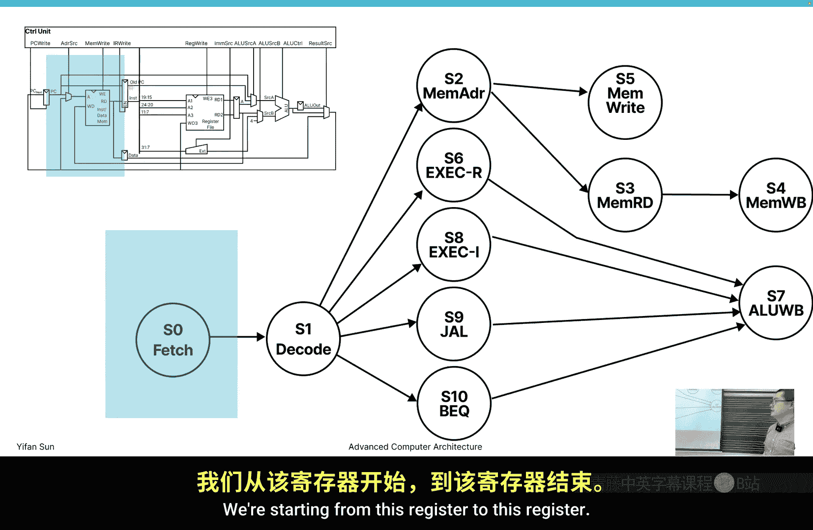

Then the register part is busy。 We keep the control unit out， okay。Then the register part is busy。

 the design sign extension is busy。 Then were dealing with all these operations。

 memory address calculation and all these operations， the AOU is busy to calculate。

 say what is the next address or what is the。Next address。 And what is the calculatedc value， right。

 So AL U is busy。 And in this stage， the memory side， the memory is busy again。

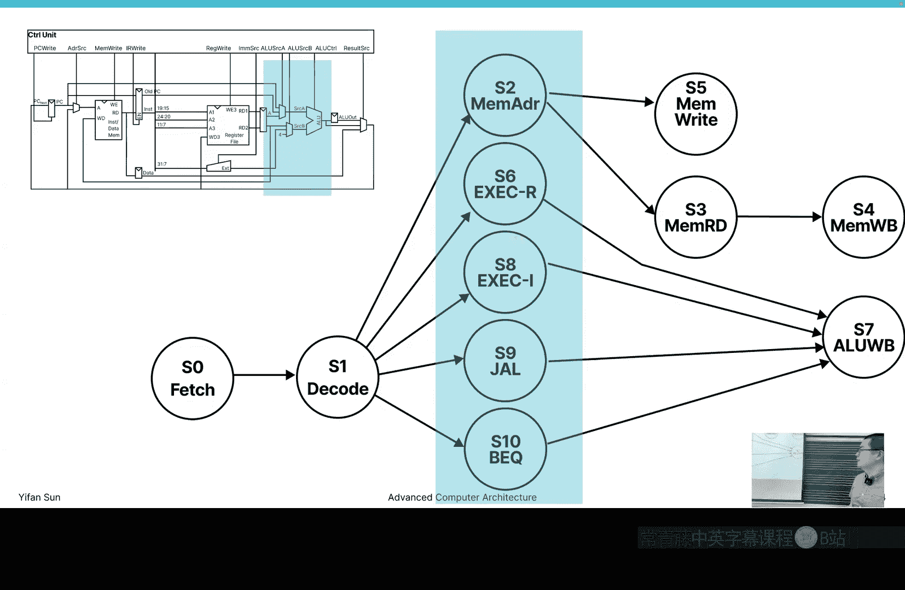

And the memory is busy again， so this part from this register until this register。

 the memory is busy。

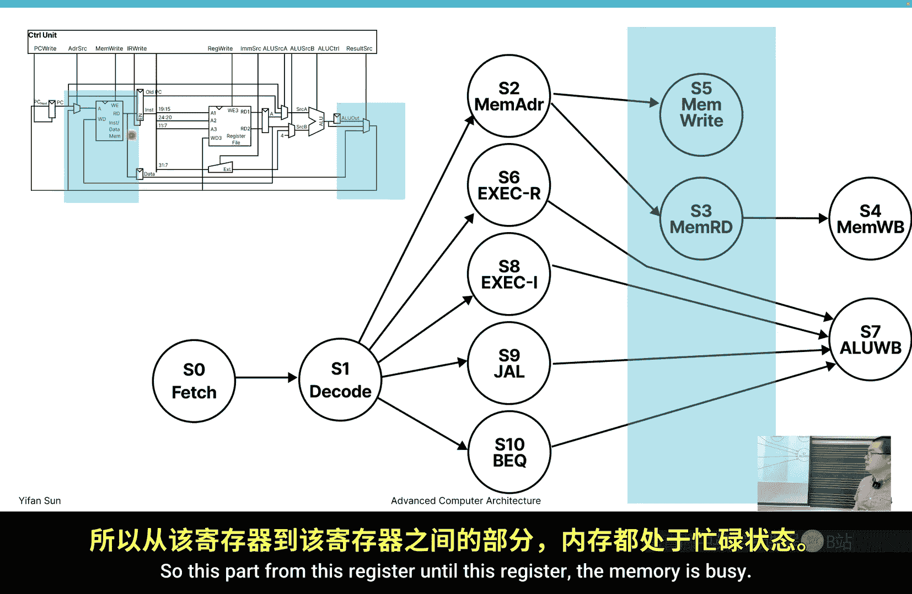

Now at the end， we have this part being busy again。So we have the data or or back from here。

 The result back from here is busy then eventually right into the register file。 As you can see。

 we can almost almost separate the。

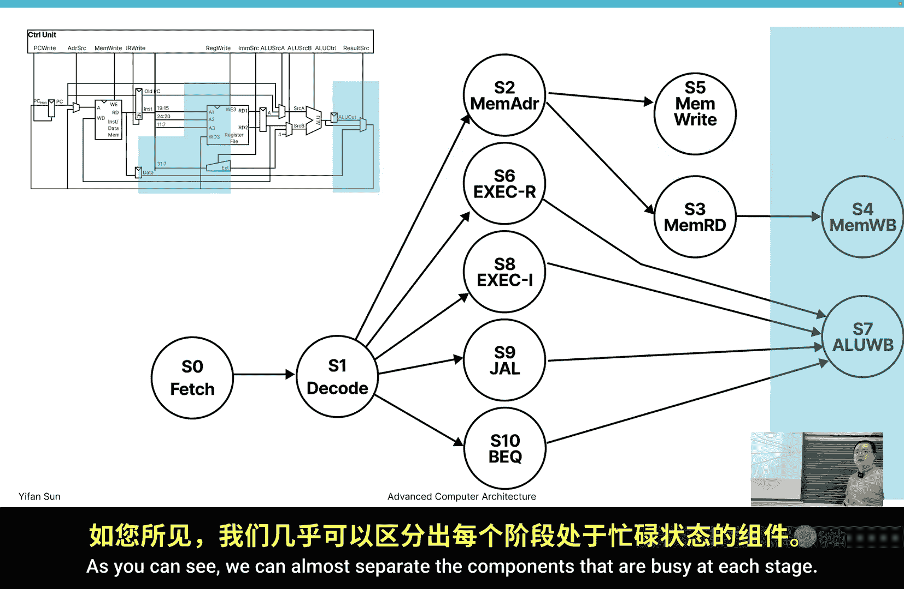

Components that are busy at each stage。That provides us understanding in a pipeline design。

 a pipeline style， they say this is the amount of time required for each stage， right？

So some stage may take longer time， some stage may take shorter time， but in a multi design。

 we may design it in this way。Now only when we stop the first instruction。

 we start the second instruction and waste a lot of opportunity for us to better utilize the pipeline。

 the AOU unit so。The solution to this conflict is we try to introduce different type of parallelism that can bridge the human understanding。

 the programmer， the programme and the machine excion。

 So here we're saying we use instruction level parallel that means we want to execute the instruction in parallel So there are many different type of parallelisms。

So instruction parallelism is here， right， This is instruction level parallel， then in。In GPU。

 the most it's always a tradeoff between what type of paradigm you want to use。

 You cannot use all the parallelms。Then in GPUs， the pipeline is much simpler oh the pipeline is basically as simple as in this one。

 but in actual CPUUus， like today's Intel CPU or I'm series CPU。

 there can be more than 20 pipeline stages so if there are more than 20 pipeline stages and there can be more than 20 instructions in flight to be executed right for GPUs typically and most five stage pipeline。

人。If you want to utilize a instruction level pipeline parallelism。

 you probably need to sacrifice some other parallelisms。

 so GPUs sacrifice instruction level parallel， but the more go on towards data level paradigm or threat level parallel。

 so we have a lot of threats and we let threats to exclude imp parallel。But CPUu。

Requires fast response for one user input needs to response super fast， so。嗯。

It needs to respond super fast。 So in this case， we want the instruction to be executed as soon as possible。

 No delay。 So we cannot。 we don't。 And for most of time， we don't really have so many。Ts to exc。

 in this case， we need to。Extensively use instruction level paradigm。 Now， of course， today。

 we have multi core CPUs。 Now， those are some sort of trial level paradigm， right so。

There's always a trade off and to what degree that you can rely on different type of instructions。So。

 anyway。We have so here we mainly talk about instruction level paradigm and using pipeline is one way of exploiting instruction level paradigm。

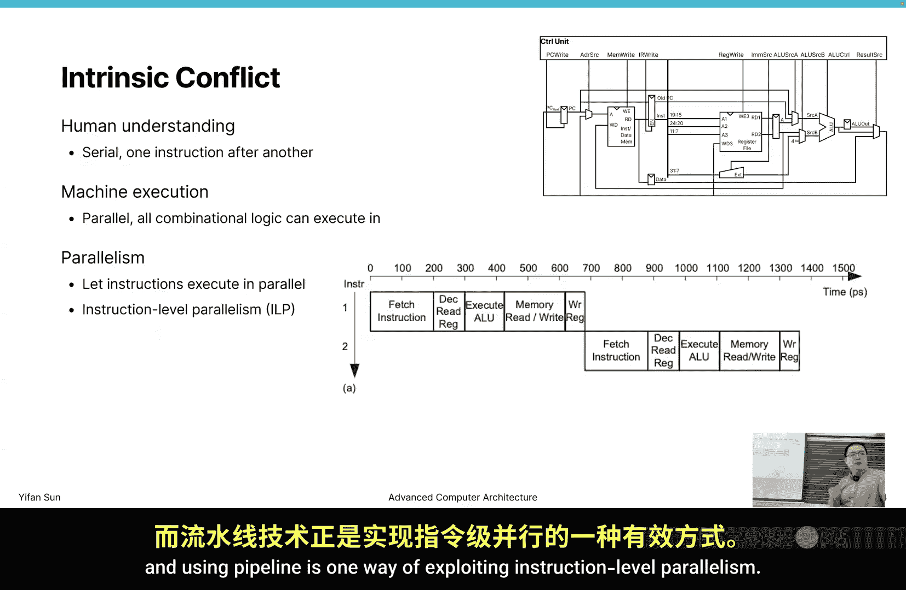

So how we can design this one then since we have been introducing this pipeline concept then this is a pipeline and let's say if our time is not the time of one stage is shorter then we just always put it to the back to the end this is a pipeline stage and this pipeline a timeline or get chart right so the first instruction start from cycle1 then we'll end at cycle5 the second one will start with cycle 2 and when we cycle6。

Then and so on。 right， So we pipeline things together。 So if you look at ALU。啊哦。

Well ALU is going towards the beginning， it's okay。

So AOU is busy at this time in the next cycle is busy。 and next cycle is busy。

 assuming all the instruction， let's just assume we have add instruction， add instruction。

 all all instruction are add instructions in that case。We can have almost 100% utilization。

 right we can allow the AOU to be utilized in every cycle。So then in this case。

 we really need to separate the fetch instructions and memory read and write instructions。

 right so that means。We cannot really use one memory。 We have to separate the memory。

 We have to have an instruction memory and a data memory so that otherwise。They're。

 they're occupying the same unit， and the unit can only serving one goal。

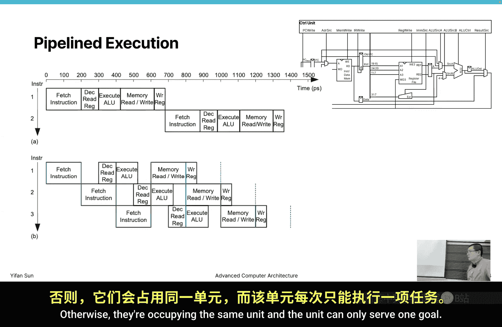

Okay， so another way to understand a pipeline。Then is to do this。 I try to draw figures on my own。

 Then at this stage， is just take too much time。 So I take screenshot from the textbook。小。

In second one， we do。This five this instruction。Yeah， this is instruction fetching。人。

This is register and decoding。And this is data memory。 This is instruction memory。 Okay。

 this is data memory。 and this is register。Its register file register file is busy at this time。

 but register file is busy is okay。 Reg have multiple port so it can handle this one。

 this register right and register read at the same time so it can totally handle so we can create a perfect pipeline in a unit of cycles so that we can。

Pipline execution。 right， So then although there's always a cost。

That we consider some instruction needs to have this data memory stage。

 but for most of the instructions， we don't have data memory。

 but just to create this perfect pipeline， we have to let some unit to wait。Okay。

 so that's why there's a wire that can bypass data memory。

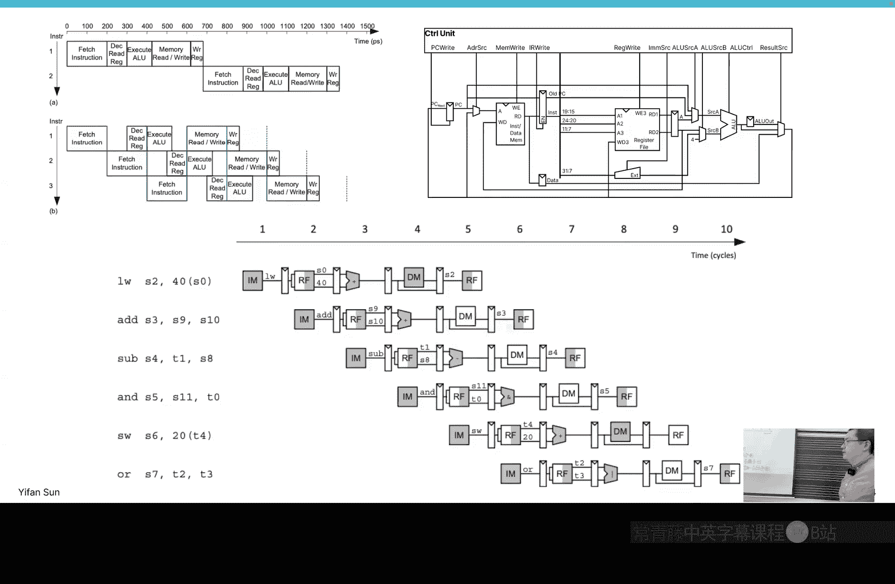

Okay， so we can create a pipeline execution。Now， what's the。Circuit looks like in pipeline execution。

Then pipeline execution， then we， this is the single cycle design， right。

 This is single cycle design。 we reuse in this figure。 Now we can divide the。

The whole data path into stages so we can divide this part is fetch。 This part is decocode。

 This part is killed。 This part is memory， and the final part is right back。

 although right back goes back to the register file。Okay， so five stages。

 then remember if we want stage， we always want to want data to come from one register and to end up with another register stay to come from one register and to end up with another register。

 so we just need the registers to log the data between the stages。

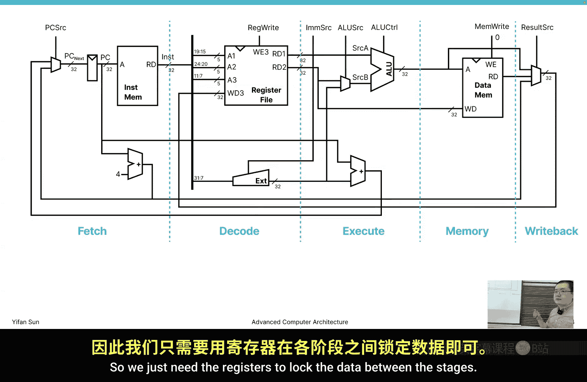

So we can write a big register here。Just to log whatever the data。ok。So that you can， well。

 if you consider this plus is part of the ALU， this plus can be really part of the ALU。

RightSo it's at this part。 and then the extension we can consider is here。 And when we get out。

 it's just being locked at here， at here。Okay this image source image sorry this I immediate source I am source should actually go before this register。

 it doesn't need to be locked at this register， but we set for group of registers so that we separate five stages。

Okay， so that each stage is a you can consider this a combination logic that takes from one set register and output from another set register。

Now you can always consider here how we can enable this register file to to operate between these two cycles is we can。

Invert the cock。Did't enjoy it part。 This is a clock signal。 We can always add a not gate to it。

 So for the rest of the program。It always update when the clock clock edge go up。

 only the register file and the PC will update when it goes down。

Then that allows everything to be completed in one cycle， even。嗯。

If you consider register our and register anyway， we can still complete in one cycle。ok。嗯。

So there's only one minor problem。This a3 is a right back data， right。When we load the data。

Or when calculate address， we load the initial address stored in the register。

It's still a few cycles away from being written back。

 it's three or four cycles away from being written back， right？

So what we need to do is rather than directly input the data from here， we make a big circle。

So we actually use these registers to create a three cycle delay。

So this data is first being lo and this register pass to this register。

 passed to this register and eventually looks back to a3。

 three cycles later that's the exact cycle that we need to。Write data。Here。Yes。ok。😊，啊。

Any questionsions。So for the register between the edge。

It's a Q or has some logic control which because there are lots of32 base data in the So how to make it just。

G it's just a few% per dollar。So your question is， are these register queues？They're not queues。

There， or you can consider， there's a single。Unice kill。One slot buffer。

So they just temporarily lock the data。There's no queue。You don't want to create a queuees。

 You don't want to create a delay。 intentionally create a delay in the execution。 It's not a queue。

Sometimes when the。Pipeline becomes super complex at certain cases we may add Q。for example。Later on。

 we will add issue instruction。So I can tell you that。So sometimes if we want to add another。嗯。

So in some core design， there may be two set of AL use。

And two instructions can be excluded at the the same time and its add the logic complexity。

 right in that case， they typically have an issue either before the deco or after De。

 it really depends on how it's designed。 They say the issue is here in this case。

The fetch data is typically weighted in a queue to be issued out。 So in that case， there's a queue。

 But for a simple design， you don't want to intentionally add delay to always wanting them to。

Working like like all at the same time。 move forward， all at the same time。

 So they just temporary store whatever the wire passed through。

 So say this wire path through So will log this PC value。For one cycle。Okay。

 to only one slide register in this simple design。ok。Every delay in this case is a。

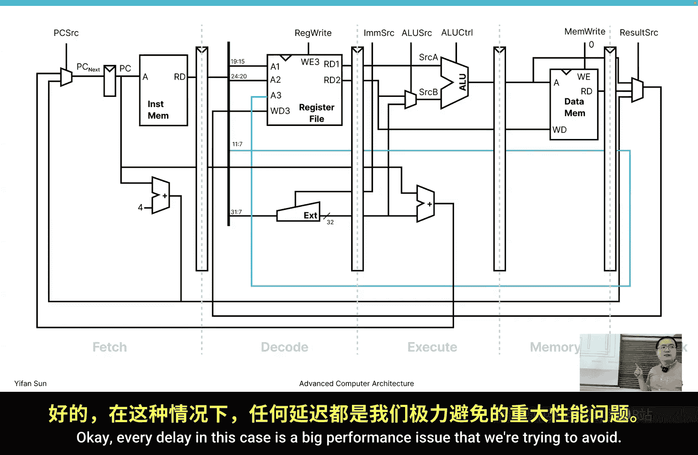

Big performance issue that we're trying to avoid。So quick performance analysis。人。

This time is all good thing for p second per cycle is shorter and for cycle per instruction。Ideally。

 in a pipeline， we can always finish one instruction per cycle。Okay， so this is CPI。

 Sometimes we also call it IPC。 So instruction per cycle is just the other way around。

 So IPC is the higher the better CPI is the lower the better。Okay。

 so CPI is one and second per cycle is shorter okay， so in this case。

 we have a single cycle design then takes a longer second per cycle， but it can achieve one CPI。

For a multi cycle， then we have a short cycle per second per cycle。

 but may take three per to five cycles to exclude each instruction。

 Piline combines the advantage of both of them can achieve a single cycle design。

 So that's why pretty much how。Mature complex course like。Moving it into a pipeline design is a must。

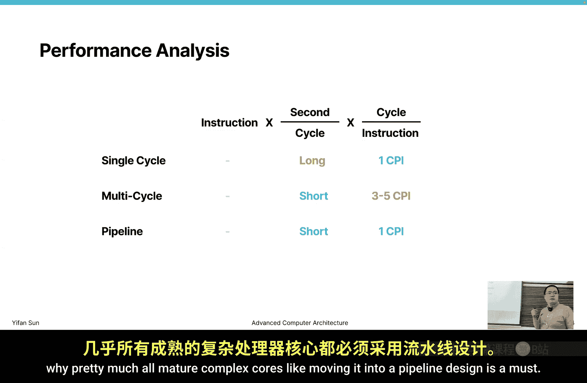

Then at what cost。The cost is the control。Just just consider。

 we never talk about how the control unit control signals are generated。 right。

 There may be even more control signals in this case。So in that case。

To generate a control signal at a right cycle is much more complex。

 and there are a lot of extra registers。Registers and control logic are die size or energy consumption。

 we're consuming more energy。And where consuming more energy and we're using larger die sitess。

 that means more expensive chip。 So more expensive chip， more energy。But at。

 but we can achieve a higher performance。 So that's a pipeline design， so。And actually。

 that's the only simple part。 That's the most ideal， the easiest part about pipeline design。

 There are a lot of problems with a pipeline design。For example。If have instruction， load。

X 6 with an address I don't want I don't need to say the address now we have an addd。X 7。X 8。X 6。

So at what cycle we need this value to get out。We can get this value。The last cycle， right？

At what cycle we can get this value。We need to use this value。So basically at the second cycle。

 at the decode of this instruction。So if you consider globally， that's the third cycle。

So this is a load and the result is x6 and add instruction need Xs X x6 as an input register。

So if you consider globally at the cycle five， we have this value written into the。

Reister file and cycle three， we need to read it。Okay。

 how to prevent these things from happening is something we're going to talk in Thursday's class。ok。

But still， I was thinking I may probably need two days to finish this lecture。

 but eventually I only used the one day， but that's okay。 So most of part is。You。

 you can forget this design， but these a few terms is something that I should remember。

 fetch thecode exclude memory right back。 No sorry common。 So sometimes。This， they called it read。

 and sometimes they consider memory to be outside this pipeline， so。They are different core design。

 They have different pipeline stages。 but like whenever people say， oh， we use a typical five stage。

Pipeline design， now， you know， that's basic in these five stages。Okay。

 and you know how a core needs to do a cycle by cycle to process the data。

And that's the goal of today's lecture in third lecture， we're going to deal with not。

 and we're going to make the core more complex and see how we can continue to improve performance。

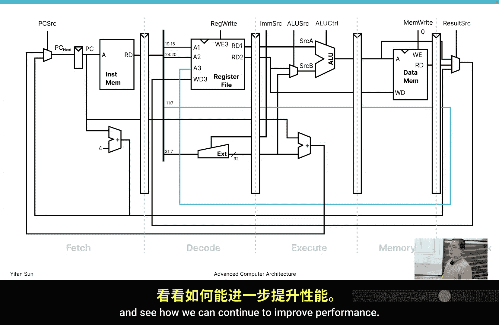