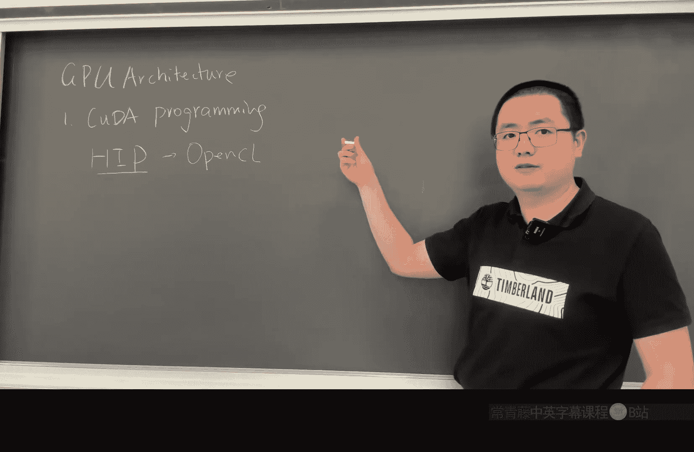
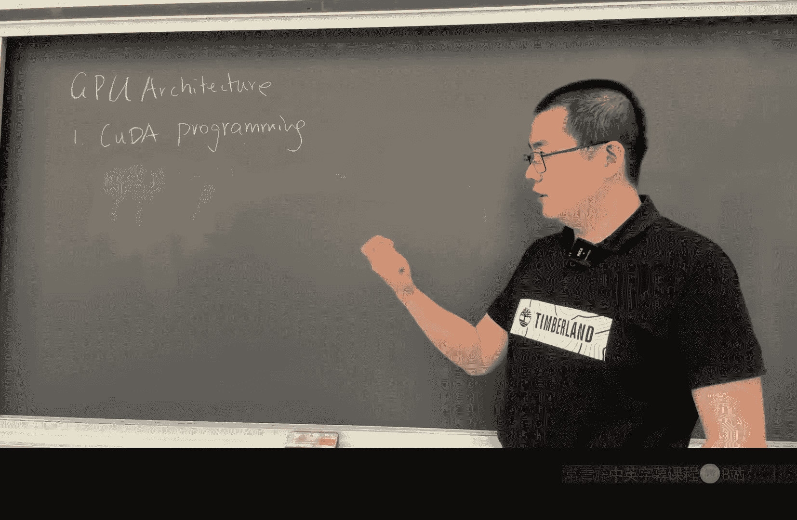
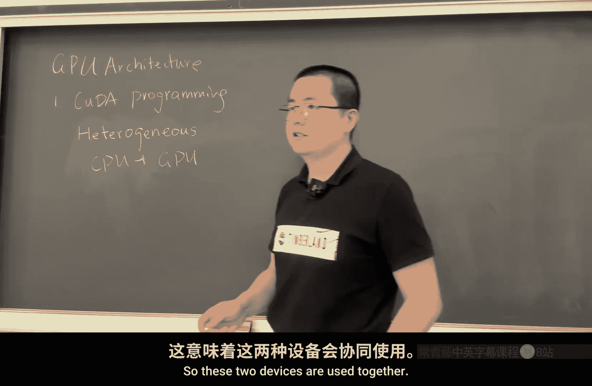
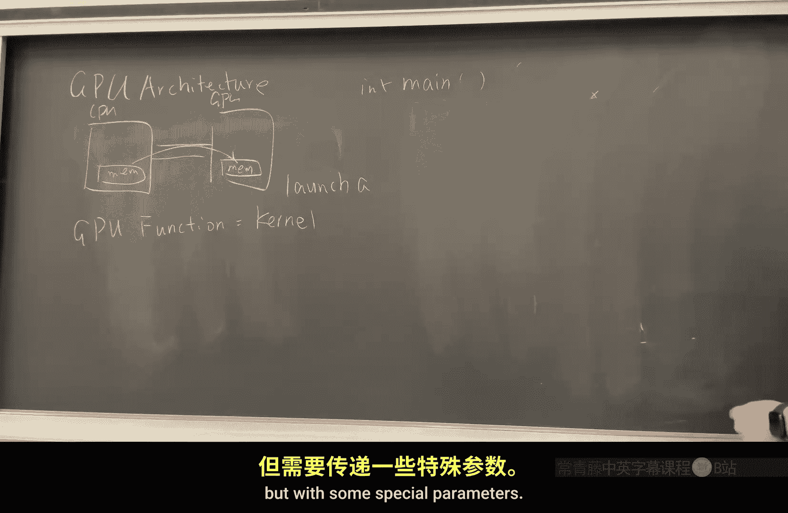

# 威廉玛丽学院【中英⚡高级计算机体系结构｜CSCI654 Spring 2025, Advanced Computer Architecture】 p14 P14 GPU 架构 1 -BV1evfwBVEUG_p14-

So I'm going to talk about GPU architecture okay so let's start from the GPU programming and GPU assembly and GPU core design although we're not going towards that lowlevel detail for like to a circuit level but I will just use block diagram to show you how GPU works internally I'm more familiar with AMD architecture。

 but I will also bring up something I know about NVDdia architecture。

 then it's not very different the core idea are pretty much the same but the detail of the design are different then we'll talk about their differences。

Now I would use two two three lectures or even four lectures for the rest of the semester。

To cover GPU architecture， I don't know how many I need， but I will teach as then as we go。

 So how many of you have written GPU programs on your own。3，4，5， kuda programs， right。

 when I say GPU program is coa programs。 Now， you basically know how ka programs work。 So。

 but many of you have never written a ka program。 So let's start with this big part called GPU architecture。

But start the first part with a kuda。Programming。

Then for co programming， you may also ask since we teaching AMD architecture。

 why I'm teaching coa programming， because Ka programming is mainly for GPUs， right。

 then iss for Nvidia GPUs。 So AM D starts with a programming framework called open sale。

 Now open C is open。Standard that every vendor can implement。

 Then it's a trademark that actually belongs to Apple。 Then Apple is now we using open sale。

 AM M D is not using open cell。 Then Open sale is not very popular these days。

 Not lot of people are using Open cell。 Then as since I said， AM M D is not not using open sale。

 Then what AM M D is transfer transferring to is a program language called H to replace open sale。

And the I design idea behind H is to make it as close to Kuda as possible。 So basically。

 there they even AM MD provides this software called Hie P。

HPfi is a software that can automatically convert kuda program into a hip program that is pretty much we 99% of the work can be done with the search and replace find kuda and replace with H。

 then the program should work。 Okay so whenever you learn Kuda， you know he hip programming。

 So for AMD architecture。 I'm not going to teach too deep into ka programming。

 but basically let you know the basic principles out how to write a GPO program and see how this program is designed to fit their architecture and how it map。

 how the software and hardware maps together。 Now kuda programming is include two parts。

 since we're talking about this thing called heterogeneous。

Hedrogeneous programming。 then when we say heterogeneous programming。

 we say two different devices or different devices work together for a very。

 very long time when people say heterogeneous programming， it equals to CPU。Plus， GPU programming。

So these two devices are used together。 and today， when we're talking about heterogeneous。

 we may talk about other accerators， but for a long time， we only refer to GPU programming。

 So whenever we say GPU programming， it pretty much equals to heterogeneous programming because GPUus cannot work on its own。

 it has there has to be a CPU that controls the GP so then in this case。

 we need we have two devices So we need actually two languages to program both the CPU and GPU so that they can run in different way because they have different nature of their hardware design。

 So one single set of program cannot control both of them So then it can be divided into two parts。

 one is one part is called host part。

One is called the device part。When we say device is the GPU， when we say the host is the CPU。

 So two parts of the program that we need to write both of these two parts。Okay。

 so then let's see how we can write this type of program。

Then a Kuda program is basically nothing special but the regular or slightly modified C or C plus pass program。

 Okay it's a extension for C and C plus pass language definition so as。At the beginning， I will。

 I will skip the include part。 Okay， so then we can write in main。A main program。

Now in this main program， now we start to execute here。 So in this main program， what do we do。

 Let's， let's write a very simple vector add example。 Okay， in this vector add example。

 we can start by doing a float。诶。So by the way， when I say vector add， I'm saying element wise add。

 Okay， so if this is one vector， this is another vector， then we're doing。

We're doing this type of like index 1， index0， index 0， then。

Sum them together and store it to index 0 of。是 ok k 。So we start with a float pointer。

 then we start with flow pointer A。诶 a。Pointer B。And pointer C。 Okay。

 so treat my code as pseudo code。 Don't trade it。Don't think it can be gramamly correct。 Okay。

 it's just in the idea， this is how GPO program works。 So we have A and B And C。

 So here when we have a floating point， when we have a float。

St A and B And C werere not saying if it's on the GPPU side or GPPU side。 We don't know。Okay。

 then GPU strongly prefers floating points number。 So there are different type of floating point number。

 we had talk about float 34， and theres a double precision that's float 64。

 So GPU strongly prefers float float 32 and CPUU strongly prefers 64， double precision。

 So if we're writing a GPU program， very likely we write float okay。So float A and B and C。

 then also we likely to develop。Define a D A。D b。And Dc。

Now this is a convention that we start with a D。 that means buffer this buffer or memory this part of memory is going to be allocated on the GPU side。

Okay， then sometimes you may see H A， H， B，H C， but it's just if we want to follow that convention or not。

 it's really you can define these variables as whatever you want。Then for A and B and C。

 we write something like a equals melo。Then my what， let's say site， O。Multiply by size of。呃Float。

Okay， we malllog something。 Now when you say malllog。

 this is a memory allocation that is on the he and is stored in the CPU memory。Right， now。

If we want to allocate into the GP PU memory， what we do， we do this。 Of course。

 we need to allocate B and C。 Okay， we do D A equals kta。Mlock。你 size。Multiplily by size。Of float。

Nothing special， but here we use a coda meoc。Now coulda melo is a cooler。Runtime。API。Okay。

 so it actually， this is a library call that is being executed。

To late calling a function implemented by Nvidia。 Now Nvidia。

 the Qa library provide the implementation of Qa analoglo。

 And what it will do is allocate part of a memory on the GPU side。 Now it will return。

address to be stored in D A O and similar to D B and D C。Okay， then in this case。

 this is the way using Kuda runtime API is how we can write a hostel program。

 This is nothing special but the regular C program only to call Kuda programs。ok。No。

Assume DB and D are also allocated， and also we set the we use a for loopbe to set a's value and B's value。

 right， Just assume there are some values there。 then to make it work。

 we need to copy the data from the CPU to the GP side。Right so CPU and GPU are two different devices。

 and they're connected using something like PCIE network。 So we have a， this is the CPU。

And this is the GPU。And they're connected with some sort of networks。 Now， CPU has its own memory。

And GPU has its own memory。And until somewhere like 2016。

 then there are some support for GPUs to directly access CPUs memory， like using unified memory。

 however， is still it's not a mainstream， it still suffers from performance penalties like if you access the GP memory is still not as high performance accessing the memory accessing local memory。

 so what we do is we need to explicitly copy the data from here to here。Okay。

 from the CPU side to the GP side。 in this case， we do a coa。M me copy。And as we know。

 memory copy typically have this type of convention that it starts with the destination。

 in this case， that is D A。Right， now we copy。From a， right， then。Side。

 I will just write size multip by 4， okay。So that is size。 And also。

 we need to tell what's the direction were copyied。

 because Ka cannot really easily tell if this is a device pointer or a host a pointer。 In this case。

 we need to provide another parameter called Ka ma。Copy。H2D。Host to device。Okay， this is a。

 There's a constant value just tells this API。 what is the direction that we're copying this memory。

Then could a memory copy H2 D。 Then there are two other， two other directions， right， There's a a。

D2 H， and there's a D2 D。I don't think you will need H2 H H2 H。

 you can use the regular C standard library and do memory copy。

 So here they provide these three the as the basic could part provide these three directions。O。

 so after then we copy， we need to copy D A， and we also need to copy D B。Right。Now。

 we copy the D A and D， B after this point， we need to。We have the data ready。

 We can let the GPU to do the calculation。 Okay， so to let the GPU do the calculation is basically by calling a GPU function and calling a GPU function。

 in this case， this GPU function is called a kernel。It's called a GPU kernel。 Now。

 when we say so not all the GPU functions are GPU kernels。

 It's only the function that you you were call from the CPU side are called kernels。 Okay。

 and a a specific term here is not calling a kernel， but to launch a kernel。

So we start a kernel on the GPU side。 Now， how do we。

 how do we start a kernel Its basically in the same way of copying memory of calling a function。

 but with some special。

Parameterters。So how we call this one， Let's say if our kernel is called back at。 Okay。

 then we just do back。啊。Now here we need to provide some extra information。

 and this actual information is provided in this three special。Angular bracketett。Then， after that。

 we provide the arguments。 So what's the argument iss a， sorry， It's not A Its D， A， D， B， D， C。D a。

滴 b。D c。O， then what else。And the site。How many in， how many elements that we need to copy into the。

Like we need to do the addd operation and to store in the destination。And this is a vector at。

So before we talk about the parameter here。Let's see let's see how this GPU function is written。ok。嗯。

And the GPU function。It's written in this way。Need to check a reference。Okay。

 the GPU code is written in this way。It typically starts with a。胳萝卜。It's preamble。Now it this is a。

GPU GPU kernel program to be compiled into GPU format。No， we can do。Avoid。It cannot return anything。

 A GPU kernel cannot return anything。 Then all the all the return value has to be contained in a memory so that later on。

 you can copy back to the CPU side。Then avoid， then we can call it vector add。Okay。

 then there's nothing special here， we write。呃 floatat。I will， I will write into the next slide。Yeah。

Float。Star a。Flow star。B。Flod star C。And site。ok。😊，A list of parameters。 So nothing so special。

 but just as if you are writing a CPU program。 So the the GPU compiler， the compiler will just tell。

 okay， it's check。 that's a global。 right， If it's a global that it has the potential to be run on both the CPU side and the GP side。

And if it's a device， then it can only be run on the GPU side。

 so it will only generate a copy of the binary that is for the GPU。 Now in this case。

 we need to run this part of the program。So the key point for GPU program is say you write one function and this function is only for one thread is to run on the GPU side。

So then you need to consider what is the responsibility of this GPU thread， right。

 So what do you want this GPU thread to do， Then an easy way to consider this problem since we have a vector add example。

能。We are adding these numbers together， right？We're adding these numbers together。

 So there's no interference to calculate this part and this part。 So they're totally independent。

 right， In this case， we call it an embarrassingly。Embarrassing。李 parallel。Patttern。

 so this pattern is called embarrassingly parallel because it's just so easy to make a parallel。

 Then almost there's no need to do any optimization or any special type of work。

 Then we can make it special work。 It's a basic element wise operation。 right In this case。

 the simplest way to write this program is to let each thread to be responsible for。1。Number。

 one output number， right。So even for more complex GPU program。

 a very straightforward to think about how you one can organize this thread is to consider each thread is responsible for one。

Region or one piece of output。 Okay， then in that way。

 you can make them like the calculation as independent as possible because you don't want threads to communicate。

 Any communication or synchronization is a perform， has a performance penalty。Okay。

 so then we say we have defined。 So thread 0 will do this。 thread 1 will do this。

 thread 2 will do this and so on， right。So in this case， if we have an element。

 then we need n total threat， right。So when we write this GPU program here， we need to consider。

This thread needs to know what's my index， who am I， then I can do the right task。 I know， oh。

 I need to add these particular numbers right so the GPO needs to know what's the number。

 So in this case we will typically first to identify itself。And。是。In this case， we have a。

Would start typically start with knowing my own Id。And I call it G I D。Global I D。 No。

 which part is not global。 We'll talk about that later。那GID it needs a lower calculation。

So what's the calculation is basically in this way。Lock。index IDX到X。Plus。Block them。

Dimmenion到 x multiplly by。So this is not plus， this is multiplication here。No plus。Thread ID X。

Thread index到 X。ok。So a quick way that you can think about this problem is。

There are two dimensions here。One dimension is block。 One dimension is thread。

 A block is a group of threads。So you can consider this way say a block may have 256 thread， right。

 So my， my local thread I D is one is 3，0，1，2， and so on the end with 2，5，5。Right， then the next one。

 I， the next lock also has in this。Theread ID starts from 0，1 and 255。

So what is my global I that my local I is 0，1，2， right？My local I D is 0，1，2，2，2，55。

 Now what is my global I D is basically by knowing my block I D。 So this is my block I D 0。

 block I D 1， block I D 2， and so on。Right， so to multiply by the block theme， block theme is 2，56。

The block dimension。2 three six， done。By using by multiplying this number with 256 plus the local I。

 we know my global position in the whole kernel right like the thread I within the whole kernel。

 So this is my global I。Then， okay， with this global I。

 I know which element we need to process in the。诶。In the vector， right。

 now we need to do the calculation。 In this case， we simply do a C。So I break it。c g i d。Equals a。

G i d。Plus B。GRE。ok。😊，Then， of course， you need a little bit safeguard so that what if your。Size。

 what is what if your kernel size number of thread is larger than this size。

What do you do is simply do a if。GID。Is greater than。诶。There should be another。

Like another way to calculate the kernel size， I will simply write kernel size here。

If he's greater than the kernel size。No， not kernel size， not really kernel size。

 It's only this size。 It's the vector size。If the G ID is greater than the vector size。

 So if this is the vector， we're accessing somewhere here， Some like passing the end。

 we simply return， we don't。Don't do the calculation。O， otherwise， we do the calculation。Okay。

 just a safeguard to prevent us from accessing the like passing the end of the boundary of the vector。

ok。So then at the end， we return or we just sign them to return。

 that's the very simple kernel that we can write。Then as you may notice that there's a block ID D X and block dim X and the thread index X。

 right， So for most of time， we write one dimensional kernels。

 but sometimes if we're dealing with matrix or 3D volumes。

Then it's more convenient to have three dimensions of this kernel of this thread。 In that case。

 we can do。嗯。We can have three dimensions。Of this kernel， in that case。

 we have block index Y a block the Y right， I D Y。えそ啊。ok。No？This is a kernelel。

It comes to this part as how we call this kernel， how we launch this kernel。

We say a kernel is written for one thread。 then it's the host program's responsibility to determine how many threads are there。

Now how， how can we do is we need to provide two numbers。 The first number is the。

We call it the kernel size。Then the second one is block size。

And kernel size is in terms of how many blocks are there。Okay， so roughly speaking， we can say。

Colonnal size。Equals to N。Divided by block size。O， then however， you need to do roundup。ok。

You need to do a roundup so that we never have some leftover。 Let's say， if your block side。Is 2，56。

Then if your N is 300， right， then you always want the leftover 44 to be taken care of。 In that case。

 you always want to round up。 in that， you won't have two blocks。 One block is not enough。

 One block can only process。256。啊。Numbers。Okay， so， of course。

 these two lines of code needs to be called before vector at。 Okay， now here we just need to write。

All right， is simple。blocks。Sorry， kernel size。And the block size。Okay。

 just to specify how many threads you want to launch。Okay， then for block size。Typically。

 we do somewhere between 64。就。1024， but and we typically do a multiple of 64。

 or very likely we do a size of。P a power of two。Okay， is 254， or 512 or 1024。

 and it sometimes matters a lot for the performance。

 but at this stage we're not diving that deep into GPU performance optimization。

 because just want to say you can just 256 or 64 are probably the most common numbers that we take。

Okay。Then at this point， we can return。We， we， we know we're running this program and this program in cota definition is a asynchronous call。

 That means when after calling this function， we immediately return without waiting for is to waiting for is to complete。

 In that case， we can let the CPU to do something else while the GPU is running。

In so how we can make sure this one is completed。 In this case， we call a ka。dice。Synchronize。

And we call this function to guarantee that we wait for this kernel to be fully completed。

 Then at the end， we can do quoa。Maam copy。Now we copy into C from DC。

And we a size multiply by4 and the direction of kuda。Mam copy。And this time is device to host。Okay。

 so now we copy the result back。 and for the rest of the program。

 you can just use it whatever however you want。Okay， it's a GPU program。

 How a GPU program is written。 So no matter how complex GPU program that you are right。

 you are writing， it's basically this way。 Co memory， that GPU to compute， then copy the data back。

 Then all the way， it can goes up to。KGBT in this level of program is our start with these padic things。

Okay， so this is a general way of how we write a GPU program。

 I think the most important part is the thread are written in a way that。诶。

That each thread is responsible to calculate one piece of output and threads are rarely communicated with each other and。

There' is a strong limitation in the GPU how the threads can communicate with each other。ok。😊，Yeah。

So this is not a GPU programming course。 So I want to quickly go through this part and then jump to the GPU assembly and let's see how the GPU assembly is different from the CPUU assembly。

能 want就 show有问。Even simpler program。是。Okay， this program。嗯。A we raise this part。And I call it。呃。

ShiSed copy。Yes。And takes。Float。嗯。😊，And out。2 arguments。 Okay， and its super simple that in。G I d。

Equals to。Eals to a thing that we write before。 Okay， then out。G ID。Equals to in。GID。Plus 4。

The smallest program right， so I just to want to show you how this program is compiled into a GPU assembly and what the GP assembly looks like。

It doesn't have a safeguard here， so well just show it the ailation。

Then the GPU is different from the CPU。 CPU needs to set up the memory at the beginning to set up the environment so that the core can pick up from the memory。

 the GPU because you have the GP you have the CPU to control and CPU send this task to GPU side So GP internally will have circuit to help up set the context and the GPU try to avoid the memory access and only if something can be in the register is better to be in the register so the GPU will typically have some register initial register layout set up so that it's being stored there。

 So in this case the first line of code。Is like this S。Load。Dward。By 4。人。S 0，3。As。4 or 5。And0。ok。

So we need to look at this。Instruction。Load is load。 It's still the load that we're familiar with。

Okay， we load from memory and store it into a register。Now， what is us here。

So S is a term for only for AMD GPU and media doesn't really have it。

 then S here represents for Scalar。And the on the other side is a vector。Okay， so in this case。

 it's a scalar。So GPU programs worked in this way。 remember， we're talking about blocks， right。

 so a kernel。This is a kernelel。And a kernel can be divided into a few layers of different things。

The first layer is block。Within block， we have verbs。WARP。Okay， within block， we have verbs。

 several verbs。 Now within verp， we have thread。Those are all。Ths within each verb。 we have threads。

 So there are several layers of organization。 When when have this organization。

 there is some meaning of this organization， why we want to organize in this way。Okay， so。

 but I want to give you a typical number。A warp。Equals to 32。Yeah。Threat。In a media。In NVdia GPU。

 then it equals to 64 thread in AMD。c d n a 。Architecture and also equals to 32 thread in A M D。

2DNA architecture。Okay， then。So AMD has different standards and RDA is mainly for graphics and CA is only for mainly for compute right。

 So by the way， when we talk about GPU architecture here， we're only talking about GP GPU。

 general purpose GPU computing iss not talking about rendering graphics and these type of things。

 It's only for calculation。So verb is this number， right？ Now remember when we talk about block。

Is typically 32 to1，1024。Threats。Okay， then a block is 3，32 to 1024， right。

 That means it equals to from  one to， I says， if it's 32。32 by how many is 1024。呃。32 by 32 is 1024。

Okay， so。Now， a warp is。This number， right？So a block equals to from 1 to 32 works。

 that's a typical range。Then one level up a kernel。Equals how many blocks。能。Typically。

 I would say this is unlimited blocks。Right， remember， last time we're doing a vector at example。

 then the number of threads is equals to the number of element in the vector。

 So it can work if it's one element。 So in one gig by element。That's a lot of threats， right。

 and your kernel can still run。So this number is a rather flexible number。

 the number of blocks in a kernel is a rather flexible number。

 so you can see when we launch a kernel， how many threads we start。Like。

 we can start 1 billion threads。 No problem， cheapp you can handle that。Now， of course。

 it cannot handle it like run them all at the same time。

 So there's one way to run them in different ways。So 난？

Why workp is so important here then when we program， we only program blocks and threads， right？

We only know， like the two numbers we give like the kernel size is the kernel size in terms of number blocks and the block size is the block size in terms of number threads。

 Then， but this idea of verb is recently added at this stage， only at this stage。 So verb is not a。

I would say now the architecture were something that a programmer should be constantly aware of and is only at the microitecture level or the implementation level。

No， it's not that pure at the implementation level。

 Sometimes programmer needs to avoid it for performance tuning。

 but it's not that important at when you write a program。

 So why is work important is because the GPU runs in a very special way GPU runs program。In the。

We call it a C D style。A C D style is for single instruction， multiple data。ok。Single instruction。

 multiple data， then。What does that mean， I can write the next instruction。

 You will know what is single instruction multiple data。 This is a V。 So it's a vector， right。

 It's a vector。 And what do we do is shift the left。s l。Is logic shift left。REV。

You can ignore this R UV。 This RV allows the。The the opera print to be written in the other way。

N B 64。So this is a 64 B operation。 Okay， then what's the register is V。2， three。2。两 we。Two， three。

Okay， this is the operation。So first of all， what is V2。V2 is a so V anything。It's a 32 bit register。

 okay。So when we say V2，3。Its a 64 bit register combined by two registers。

So it's a number that is connected into two adjacent registers， so this is 6 to4 bit。

Then this is shift the left， so basically is the value that is stored in v23 and shift by 2 and store back to v23。

O， shift the， shift the left by two digits， that's multiply by4。Right， so it's a multi for operation。

But how many multiply by four operation that we actually calculated？Whenever this line is executed。

Since you S the instruction， a single instruction， this is a single。Instruction。Now。

 when talk about V 2 or V 2，3。能。Within a warp。It can you have t thread1， thread， thread 0， thread 1。

 and so on。 and thread 31 right So this one may have a value that is 2。

 This man may have a value of 6， This man have a value 8 and 13 for some， for example。

 okay so every thread within this verp may have different values。And they have different values。

 right？It's a， it's the same。 It's a just we call it the V too， but。No， even in the CPU program。

 a different thread， the same name， the razor with the same name stored in different values because they run in different course。

Right， so we too have different value for different。嗯。For different thread。In this case。

 when we do shift the left。Then the end of V2 value will be 4。12，1626， and so on。ok。😊。

So that's what is called single instruction， multiple data。Okay。

 so this is why GPU is super powerful because it takes this thing called data level。Paralym。Okay。

 so that we can calculate all this data at the same time。So whenever we calculate a shift the left。

 we calculate all 32 threads。At the same time。 So consider in CPU， we run fetch， run decode。

 Now after fetch and decode。And we execute one instruction。 We can't do one calculation。

Then we write back one value right in GPU design is in this way。 We fetch one instruction。

 We decode one instruction。We do 64 or 32 or 64 calculations depend on the website。Right。

So that the average cost for decoding control and for fetching instruction is much lower because you。

You fetch once， you decode once and it applies to 32 numbers for per number per calculation。

 your fetch and decode cost is much lower。 That's why GPU can really put a lot of resources only on compute and can make the control flow really simple。

ok。Then other than C D， then you can think all four different combinations， right。

 So you have SIS SD。You have M， I M D。Now， you have。Am I。SD。Okay， multiple instruction， single data。

 And this is possible。 Then we want to， like， say， one piece of data。

 Then in one cycle we want to process multiple operations and then。All these things are possible。

 Okay， then S I SD， a typical CPU architecture is considered S I SD。 Then MI I SD。

 if you consider multi coursese or S I MD。ok。Right multicore。

 so different each core is running different instructions and they're processing different data。

 so they are not the instruction on data are not related。Then other than this term。

 if you read papers， you may also see other papers saying GPU is something called a same T。

In same tea。Structure the T here means single instruction， multiple thread。Okay。

 so because we have multiple threads。 And then in theory。

 this is more suitable for the A VX instruction set。

 If you know what is A Vf A Vx instruction set Yes， this is CPUU extension for vectorized operation。

 and GPU is more same T style because each each instruction is controlling multiple thread。

 but I don't want to tell very different。 Like if you say GPU is a same same architecture。

 everyone will agree with that。 Okay， just someone will use this term， someone will use this term。我去。

O。😊，So then what is a vector and scalar come back to this point。

 a vector is really a sameD instruction。So。We really are doing 32 or 64 operations。

Within one instruction。But sometimes all the threads are doing the same operation， for example。

 load in this case， we can load the same thing。We， we are really only loading the same thing。

 And what is loading here is actually loading。I think he's loading this thing if I'm right。Yeah。

 it's loading these， these things。So its loading the in pointer and out pointer in this case。

 we have a scalar instruction in this scalar instruction we use a special scalar unit to say， oh。

 I only want to run one operation for the whole 64 thread。And that comes to this as registers。

 So as registers are shared within a warp。Okay， are shared within a verp。

 not a block are shared within a verp， So they say。Here， we say。Within a work。人。

I need to change here for S 2。ok。T 1， you are storing value 2， T 2， you are also storing value 2。

 and they are all value 2。 Okay， they must store the same value。 And actually in hardware。

 there's only one register。 So it's a shared register space like everyone can use。Okay。

 let's search scatter operation in this case what we're doing。

 So you see we start with accessing S 4 or 5。And as S 4，5 is。Kind of hard coded at this moment。

 because we know the。Hardware will start this thread with a register value already set。

What is storing， I think is storing a pointer to this region of memory that is called Col。Argument。

And it's basically using4 byte or8 byte to store to this pointer and8 byte to store this register and see here GPU wants to do parallel operation right in risk five。

 we load one word。Now here， we're loading。Double word， wise4。

Well that's why I say I hate the term of word。 then in risk 5。

 when you say word is 32 bit in GPU in AMD GPU a word is 16 bit。 So double 16 bit。

 So D word double word is a 32 bit value。 So we're loading four registers。

At the same time with one instruction。 then basically well end up with S 1，2 with 0。

1 is flowed in and as1，2 is flowed out is okay， So load all them together。

 optimization rather than using two instructions to load them。O。😊，So， I can。

I think I can skip some instructions and directly jump to the most important part。Wait， let me。

 let me introduce this one。 I think this one is important。 The next one is an S weight。Cot。

CN T wait count。 O， iss waiting for a counter。And I really hate this name。LGKM。CNT。0ero。

This AMD assembly， okay。So what does it mean？And let me write down the next one。SADD。Okay。

 this finally something that we're familiar with， right， U 32。Esther。16。S 0。S ADDC。U32。S one。0 S 1。

ok。😊，So you can see there is a dependency。 What is a dependency is here， this value。

And is being used at here。 right， So there is a dependency here。Right and。

The lecture that we should talk about today is to talk about the dependency in CPU architectures。

 but here in GPUs we also have this dependency and there's no dependency in this line of code V23 or V23 and they can just do it on their own right so V23。

M by by4 has no dependency within this line of code。So how AMD GPU is handling this one is。

This instruction is executed， and when it's executed will send some request into the memory system。

So GPU memory system is much more slower than the CPU memory system。

 and you cannot really set the memory as one cycle as one pipeline stage。

 it has to send some requests out and wait for some time until the result will come back。Okay。

 so in that case。This instruction may take very long time， hundreds of cycles。Possible。난。

We may have some opportunity to execute the next instruction。

We may have the opportunity before this data to return， we can start to execute this line of code。

Then we we run this line of code while waiting for this to return。Okay。

 but if we execute this line of code。Before this data return， we may use some garbage data。

In that case， we have to make sure that this data is returned。

 So when we send out a load instruction， when we send out a load read request to the memory system。

 we add this counter by one。O， now when this data returns， we reduce this counter by one。

So waiting to be0 means we wait until this counter to fall at 0 or below  zero and of of course。

 for 0， it cannot be below  zero， but if it's a real number， it can be below that number。ok。

So in this case， this is a compiler added synchronization。

 say at this point we have to wait the prior memory access to return， Then we can continue。

 So this is a synchronization。Okay， so with this synchronization was So so by the way。

 what it does is basically S0。1 plus 16。 And store back to S 0 and1。

Right so ADD do not consider carry AD DDC， consider carry from the previous instruction。

Then it's adding zero is only for the carry， just in case the carry is non0。Okay。

 so these two instructions an add is the 64 B add instruction to use two instructions to mimic a  64 bit operation。

ok。呢。Let's keep going。嗯。Let's assume， we have all the。Addresses calculate。

 We know the addresses that we need to calculate。 So the next thing is we need to load the data。

 In that case， AD uses something called global。Load。Then in earlier version。

 you may also see something like flat load， but let's just use global load here。Globe load Dor。

And where we'reing， we're storing in V4 and our input is V0 and1。No of that。Then， you see。

If it's an S instruction， it can only use S register if it's a V instruction。

 it can use both S and V register。In that case， although it's not saying if it's a V or S instruction。

 since it's used a V register， it's a vector load。O， vector load means。Every thread。

May have a different address。Now， if this is a war of 32。32 thread。

 we may be issuing 32 memory reader requests to the memory system and wait for 32 piece of data to return。

O， you see the amount of memory transaction that GPU loads a lot of memory and calculates a lot of data and store a lot of data back to the memory system。

Okay， so and eventually the result is stored in V4。Then the interesting thing happens here is。

There is a big move。There's a V A D A D D， and there's a V A DDC。I would not。

 I would not write the full instruction， but I can tell you this is a calculating the output address。

ok。Then。These instructions， since we're calculating the output address。

 they have nothing to do with V4。Before is the data that we loaded， so we can。

Before this one returns， we can just do the calculation。RightThere's no dependency。

Then here we do S weight count。In this case， we're waiting for discount counter called VMCN T。

So VM is for vector memory。LGKM is for local， global constant memory。

So they share this different memory system shares。One counter。

So you can consider this way S load uses this counter。 V load uses that counter。Okay。

 so different counters。啊。Then。We don't need to do calculation。 Eventually， we do a global。Store。

Remember， this is a simple。This is a simple。Like a data movement kernel， right。

 so we can do a global store。D word。V4。And we，0， and1。So V01 stores the new new address。

 the destination address， and before is from here。So we you his store。ok。

So then we're done with this program at the end。We always add an instruction。

 a skillar instruction called and。Program。ok。That's basically how this table kernel is implemented。

Okay， any question。So I think the most important part is。

The difference between vector and S instructions。And。

The use of S weight count and Y S weight count is used here。Right， and question。这。Yeah。

So a media doesn't have scalar and vector instruction。

 just consider all the instructions or vector instructions。

 so they don't mind to just do it for six to four times。

They think a simpler core design is probably more important than this。Clever optimization。

 So they just。Do it first 32 times， it's probably not that bad。ok。嗯。

And I'm not even not sure that a video has something like S weight count。就。嗯。

This needs some work to understand how NVDo do this and I never dive that deep into NVD micro architecture。

 so I don't know how they handle memory access synchronization。Okay。

 so S and V and Y we count is added is the important part for GPU architecture。

 and especially the difference， is especially the concept of S instruction is the most important thing that you need to remember。

な？Let's do this。Just make this program slightly more complex。Now， I know what you're thinking about。

 how we can handle conditions and how we can handle loops， right so。Loops are easier。

 Conditions are more difficult。 Let's consider this kernel called。Condition copy。Okay。

 then condition copy， we still have a in。And out。And in my example， I'm using double here。

 then although it's probably not that important。 then still， I have an int。G， I， D。

 global I D that is calculated by that expression。And here we want to write if。嗯。GI d。Greater than0。

能 out。GID。Equals to。因质而已。嗯。If we know the output is initialized to be 0。

 this is pretty much a re implementation， right。嗯。曹德斯。How this one is implemented。Okay。

 so we will skip this part at the beginning is's the same。 Okay。

 we'll skip this part to calculate the address。 Let's directly jump to it here。YeahYeah。Yes。

So here let's see we start with a global load。In this case， since in my example， I'm using double。

 let's do D word。Mody by by too。So， that's a double number。Okay， you can do Dor Web 3 D mark Web4。

 So GPU is really providing the flexibility that with one instruction， you can load a lot of data。

Then it's stored to V 4 or 5。From V01。ok。The destination is stored in V 5。 Now here。

 we need to do a comparison。Now， of course， before we do the comparison， we need as weight count。

After the data is there， we can do a comparison。 Now here， a comparison is S V。CMP compare。Less done。

Now here we have a type that is X F 64， so a double precision comparison。And comparison。

We store the result into a special register called VCC。VCC is only 64 bit。Okay。

 so assuming one verp is 64 threads in this case。If it's less done， this bit will store to be 1。

 this speed， if it smaller or equal to 0， this bit will be 0。

 So it's a basically bit mask to store the comparison result。So the destination is VCC。

 and we have 0， and we。And V4 or five。Just to make the comparison， okay。是。Okay， then next thing。

 the interesting thing is here。This instruction is called S and。save e x意思。B，64。S。4。five。v c c。Okay。

 I'll explain this。Ignore the end for now。And probably for the cause。Just look at E X E。

EXEC is a special register。Then it's equals to the website。 So in AM M D。

 inian architectureure is a 64 bit。In N video is 32 B。Register。Okay， so here。You know。

 last time we're talking about this runs in a SD execution style， right。

 So that means we just assume this is one instruction。

 then if this is our one instruction or few instructions。If one one thread needs to execute it。

If one thread that needs to be exclude。All other 32 threads。

 all other 31 thread are also executing it at the same time。But we don't want these things to happen。

 right， we don't want the other 313 to really take effect if they take effect。

 they will get will get a wrong result。so what we do is we use an execution mask。

So for it this exc mask is a mask， let's just make a 32 thread and you can have some ones there and some zeros in this exc mask。

ok。Then this one is mapped to thread0， thread1， thread2， and so on， thread to 31。Okay。

 if this bit is1， we make that instruction take effect。If is zero。Well。

 just skip the memory part and the right back part so that the evil。

Not take effect will now impact the experiment result。OK， will not impact the result。In this case。

 what we are doing is we're saving the execution mask。Temporarily into S 4，5， and actually is。

There's an end operation the。Excusion mask is stored here， is stored here。

 the nurse and operation that the current execution mask will do an end with VCC。

Why we do end is basically just consider nested if。Right， we already have something that we say is0。

 Now we will do and well mask out some some other cases。 So that's why it's an and save exclusion。

 but。What I can say here， just make it simple we。Store the VCC value into expression mask。ok。

Westore net value into executionion mask。做。Then this one becomes a value dependent excuse mask。

 there may be some one some0， some1， some0， some1， some0。 No， it really depends on the value， right。

Then there's a chance that all of them are 0。 If all of them are0。

 we don't need to load and we need to store。 We can just quickly。 We don't need to store。

 which you can just quickly jump out， right， So then we can do a quick。

Conditional branch and it's also an S instruction。The S C branch。S C branch。E XECZ。O， now means。

When the executionion mask is all zero， we take this branch。Okay， there is only one opprint。

 and this opprint is B， B 0 underscore 2。 Okay， it's a basic block。0 dash 2，0 underscore 2。 Okay。

 so this is AMD compiler always generate these type of labels So use basic block labeling。

Willll write the label later。Yeah。Okay， so here we're done with this part。 Then we do。Remove。We add。

We add C。Those are not that important to calculate the destination address， right。 Then eventually。

 we do global。Store， and its not important， also。D word。 Why is the word。I think it's d by two。

Now we store the result back， right， and I'm not showing the open print。 It's easy It's trivial。

And also， just be careful， when we talk about store， there's no wait count。系。

Just consider we're sending our stores and we won't care anymore。So there's no synchronization。

 just theyre in a buffer in the queue and。Probably even the next kernel started。 the white。

 the right is not completed yet。So give your tries to。Optimize for every optimization opportunity。

 So in this case， the store there's no synchronization。Okay， now here we have finally have this PB02。

能。There's an as or。b识 b。64。And what is it is EXEC。E xEC c。S four or five。

And also don't think too much EXEC is mus， right， and we store the previous EXEC in S45。

We do an or operation is basically recovering the execution mask right before the condition。

So that we can， if there are some instructions， we'll continue the execution。ok。

some instruction will continue the exc。 So we just restore the execution mask。 In this case。

 we just set it to all onces。That's why it's an or operation。Bitwise oral operation。Then， at the end。

We say us， and。PGM program。Okay， then that's the whole program。 So I want to tell you that。

GPUus uses an excion mask。To run a predicated。Excusion， which is predicated。

 Predicated is the execution style that uses one bit 0 and1 to decide if this one instruction will take effect or not。

 and this is not only used in CPU is also only in GP is also used in CPU。

 So sometimes it's just for compiler simplicity you can simply set this bit to zero。

 so this instruction isner， but we don't want it to take effect。Its called predicated exclusion。

 GPU uses these masks and predicated exclusion to handle。啊。Branches。ok。So in GPU。

 there's a very special。新的呃 situationation。Or consideration for performance analysis that is called threat divergence。

Okay， what is threat divergence？Is not。嗯。四。They say if we only have 64 threads in a war。 Okay。

 in a kernel。 Now if we write something like if T ID is smaller than。one。Okay， in this case。

 one out of。32。Thres are effective。But the other 31 will still take the computational power。

 will still take time。Okay， and it's a totally bad thing。This we'll talk about how it works。

 why it cannot be easily。Optimized out then newer media GPU has some way to allow different threads。

 say some thread is running one branch， some thread is running on other branch。 AMD GPPU still today。

 as far as I know， do not have that technology。Now， in this case。

 if our computing power is something large， then we only have one over its like to have somewhere like 3% of utilization。

Right， in that part。Now you have something like if。TID。Is smaller than 16。

Then we have 16 over 32 that is available。 In that case， we have 50%。Of utilization。

So threat divergence means the threads within a verp is going on different routes。

Which is considered a bad thing for GPU because we're underut the GPU capability。

 So if we can avoid that and to somehow ask GPU to。

Let the GPU to run on the same path without dirging。It's always a good thing。Okay。

 so thread divergence is a big performance issue for GPU， and there are many different optimizations。

 especially in the compiler world， to reduce threat divergence。 Okay。

 so probably say one verb is say half a verp is going this way， half verp is going that way。

 But for next verb， half a verp is going this way half of that in that way。

 So can you combine this half verp and they half verp together in that case。

 we avoid a thread divergence。 So there are many。like。

Academic research that is doing this type of optimization。 and for industry。

There's always a problem that we really know very little about how media GPU works internally。

 there may be some optimization， maybe not。 no we don't know。

 I pretty much sure this is a s classicastic issue then theres some optimization in it。In IV GPU。

 Okay， now hope you like this type of。Blackboard based teaching， than。

For GPU I'm pretty much like I hope for the next of few Thursdays。

 we will try to in this way to teach GPU programming okay。All right。

 I think that's all for today's lecture。