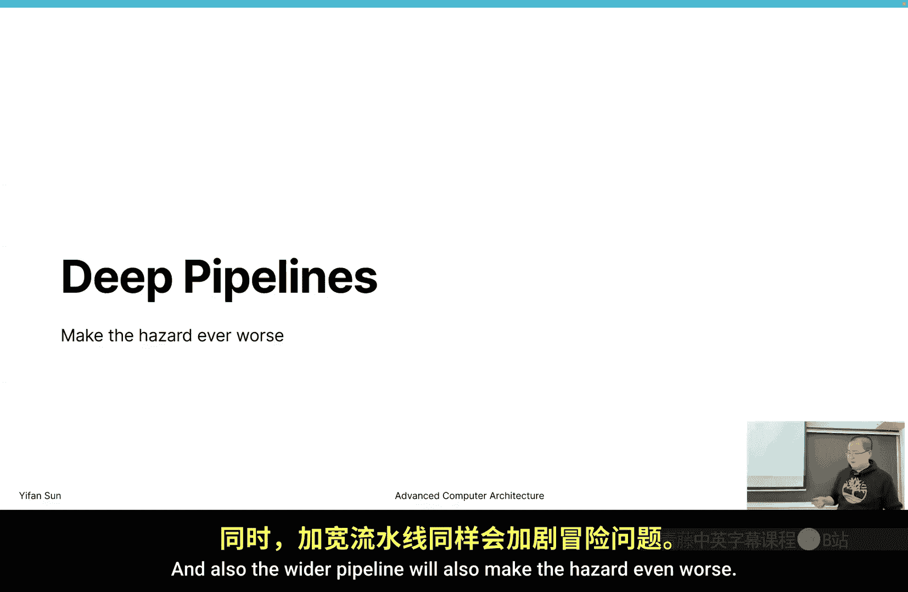
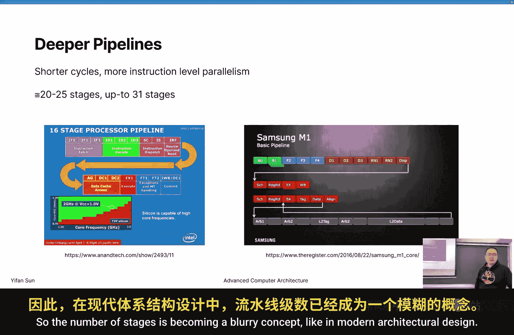
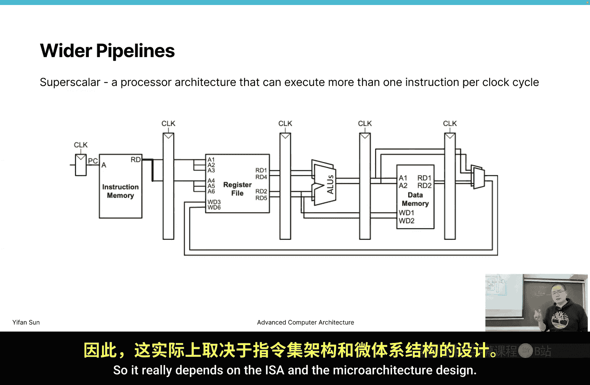
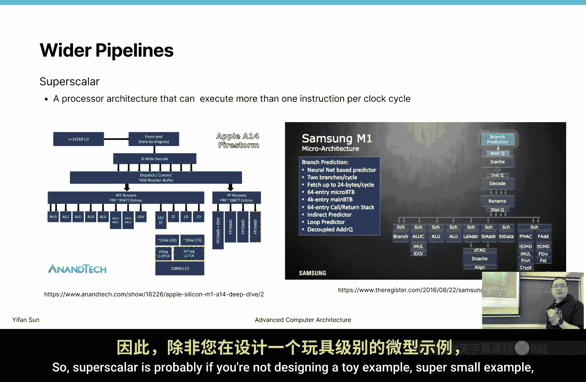
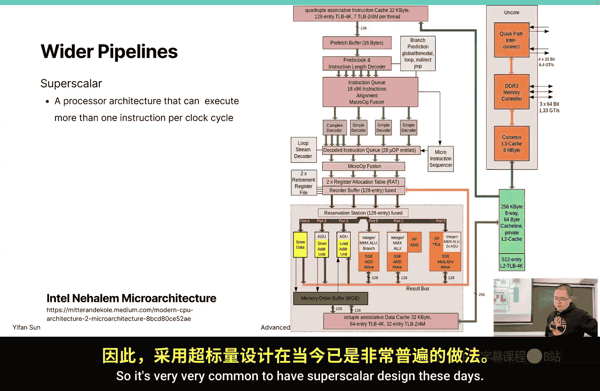
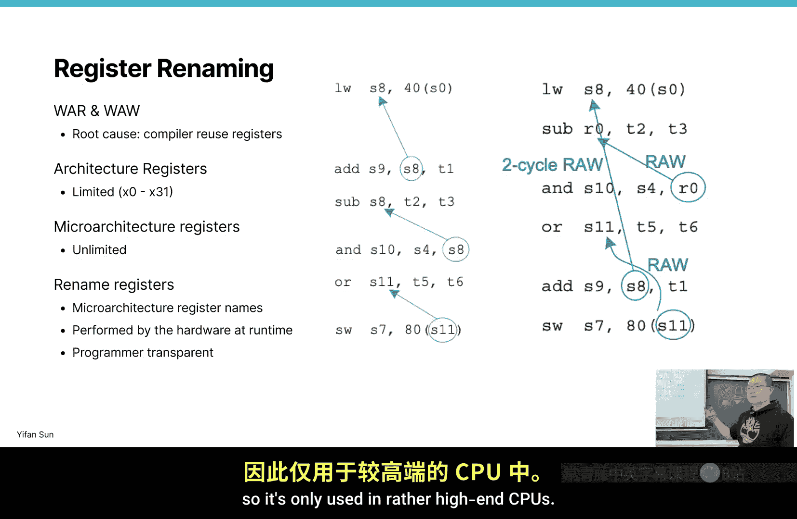

# 威廉玛丽学院【中英⚡高级计算机体系结构｜CSCI654 Spring 2025, Advanced Computer Architecture】 p15 P15 高级 CPU 核心架构 -BV1evfwBVEUG_p15-

In today's class we're going to start talking about advanced core design。

 So if you have taken the full theories of course， like if you start with an undergraduate course of digital design computer organization Comp architecture。

 then advanced computer architecture to probably advanced the computer architecture should start at this point。

 then five stage pipeline or single single stage single instruction。

 data path should be the assumption for a regular computer architecture course and starting from this point。

It's more about advanced Comp architecture， but since we're already in April and we're'm just going to talk very briefly and touch every topic a little bit in today's lecture so this Thursday I'm going to talk more on GPU architecture so it's the GPU core design then on next Tuesday I'm going to move to the memory system。

 especially talk about the cache design。Now next the Thursday and the Tuesday after we're going to have two guest lectures to give two lectures to talk about some。

Like the。Most state of the art research topics that they are working on。

 one is talking about machine learning systems， the other one is talking about quantum computing。

So give you some feeling about something new that is not like when the algorithm we were talking about was 1960s。

 but research today is 2020 something， so everything changed a lot and they see what people are researching in today's。

Research field then after that we are going to come back and we're going to talk about the memory system for GPUs then see that probably close to the end of April and see what we can do probably talk more on cache coherency memory consistency or the D structure or the network on chip structure and that's probably we have World more2 lectures that can summarize the whole semester。

Okay， so in today's lecture， we're going to continue with the five stage pipeline design。

 and we're going to talk about some more advanced core design topics。 And especially today。

 we're going to focus on dealing with hazard when pipeline cannot。Go perfectly。 Okay。

 so what is Heer。 So as the starting point， we were talking about five stage pipeline。

 then in a regular five stage pipeline， we start with fetch Decode Decode sometimes its also like people also include the reading the register file。

 And in some type of design。 they also have a read stage。 And then excuse stage。

 memory stage and write back stage。 So those are the typical pipeline structure。Now， if we have a。

Perfect execution like these three instructions。 Now we may be able to execute in this way。

 So starting from this point， this type of representation will be our standard representation now because it's going too complex now it's really hard for me to draw the circuit for you and to reason about what exactly in every cycle how data flows one from one register to another register Now we're going to go towards a higher level to leave the circuit level but go to a higher level so that we understand to abstract a concept of how things work。

 So this is a typical pipeline diagram and on the X axis we have time and in the unit of number of cycles in the y axis we have the instructions and see how these instructions relate to each other。

Then this is an example。 We have this add instruction。

 sub instruction or instruction and an instruction。

 and there are some other some registers they are working on。

And we assume that these pipelines works in a perfect way。笨。You may notice some problem here。

 right So what's the problem is actually by this particular time。

 we write a data back and we what do we write， we write back S 8。

 then S 8 is available is written in the first half of the fifth cycle。Then in the next cycle。

 in the next instruction， we need to read it。When we need to read it， if we a。Pipe executionion。

 If we force a pipeline executionion， we actually need in the third cycle。

RightWe need to decode Decode is also reading the register If we take this register。

 we read from this register， well read some garbage data is from the previous instructions and result we're expecting when we consider program order so program order means we always execute this instructions line by line as if we're executing one after another but because of performance optimization we are actually executing them in some sort of parallel So in that case there's a problem that this S8 will read some garbage data then we。

Well generate a run result eventually S 2。 And this is something we don't want。

And also in the third instruction。We also have this problem that this S8 will get some garbage data because this result is only written at cycle5 then only at this time we can get a correct result so at the first half of psycho5 we right to the register and at the end of at the second half of the cycle 5 we can read from this register and this end instruction can get a correct result and this definitely not okay we need to guarantee that no matter how we design our macro architectureitecture。

 we can still exclude the result as if we're excluding one instruction of another without breaking the order so what can be the solutions and this is called a hitard because this is hazardard that heater is defined as a situation that prevents an instruction pipeline from generating the correct result。

Without interrupting the pipeline execution， So if we have still have the perfect pipeline execution。

 if we have no special treatment， well get a wrong result， and this creates a hazarder。

And what type of header that we have， so this is a big category of header that we call it a data header because there are data dependencies between the values within the registers。

And what can be the data hazard， then every time people ask me what kind of the data hazard there can be。

 then always we think these four cases。Read after read。

 read after write and write after read and write after read， right。

And only one hazard is not valid because if you read， no matter how many times from one register。

 you can still get the right value。 So read after read is typically not considered the hazard。

 but read after write right after read and write after write or considered different type of hazard okay and。

I will require you to tell the different type of heater according to a program。And for now。

 we can see this is a particular hazard that is called。R AW， read after write， raw hiter。

 What is a read after write， We try to read this S 8 after the previous instruction， write S 8。

 right， So this is a read after write。 Then this header happens because this write cannot happen fast enough。

Now， because it can have happened fast enough， we cannot really get the correct value at this instruction。

Then if there's a headard， we must take some solutions to these solutions。

 we can either use two different ways。Or three different ways。 If you are really smart。

 you can find a way that you don't have complex circuit and you don't sacrifice performance。

 But this is really hard then。Now， you may now know the other two methods， right。

 So one method is to make the performance slower。 Just draw back。

 come back to the original multi cycle executionion style。The in multis experience style。

 we definitely can go back to the。Correct the execution pattern。 And that is sacrificing performance。

 The second way is to add the circuit add complexity to make sure that we can solve this problem。

 Then sometimes this second， the third way may not be even possible because there are some constraints Now you have to really make the decision and really make the right behavior in  one to。

2 cycle time。 And one to，2 cycle is。Like1 to2 nanosecond or even smaller than1 nanosecond if you say。

 oh， I want a neural network to solve this problem， it's very。

 very unlikely because you don't really have the time and the overhead of a neural network is too large。

 too high， so you really need some really， really super simple algorithms and design to make this really works Okay so what are the really cheap solutions。

So chip solutions is。To addnob operations。你好片。Which is not operations。 Not operation is a special。

Opcode。And it's designed to not do anything， but it's just a pipeline filler。

 So we fill two instructions so that we actually delay the start of these sub instructions。

Now we add two instructions and these instructions。

 you know although we're not really doing anything， we still need to go through this pipeline。

 now if we still need to fetch instruction decoded， executed， although no ALU result is selected。

 no memory is is doing anything no memory action and no write back but we still take this five stage pipelines。

 inting2nob operations were postponing the execution of this instruction so that we only execute the deco stage at cycle5 then in this case we can always get the correct result in the third in this instruction in the sub instruction。

Okay， simple solution by the words。 So what's the advantage and disadvantage。

 The advantage is really simple。🤧，And it's pure software based。

 So when you say it's pure software based， It's mainly compiler based， right so。

If we have a solution that can either modify the software or can modify the hardware。

We definitely want to select the option that only modified a software why。

 because designing sound feature in the hardware takes much longer cycle like more people need to get involved and harder to debug it takes longer cycle and more likely they can produce some error and if this feature is built into a hardware it's much much more difficult to change it in the future If it's in the compiler then it's a problem of GCC 6。

3 versus 6。3。1 it just release a path release a patch you can solve this problem。

So if the solution is within the realm of software， it's much。

 much easier to change it and is much more flexible。

 So the advantage is is actually very simple and is a pure software solution。

 but it also has disadvantage with the disadvantage has low performance because we're delaying the execution and we're occupying two pipeline stages with instructions that are not doing anything。

 So those instructions are pure overhead。And another actually a bigger problem is we're actually mixing architecture with micro architecture。

 why， Because this five line pipeline stage is a micro architecture thing。

Now you may design a6 pipeline stage or 20 pipeline stage or one or two pipeline stage。

 micro architectureure。Then in this type of thing if you are suddenly say， oh。

 I'm changing from a five pipeline pipeline design to a 20 pipeline stage。

You have to modify your design to add 19 knobs， right I'm just making up this number。

 but this number of knobs is a micro architectureiture thing。But remember。

 if it's micro architectureecture， it should be done by hardware， if it's architecture。

 it should be done on either side， but it can be done on the software side。

Then this software actually have an assumption that we're working on a micro architectureiture that is a pipeline stage and this five pipeline stage and this5 pipeline stage are these five pipeline stages。

那。So basically， we're saying， oh， these two knobs requirement are defined by the architecture。

Not the micro architecture。 So it puts more constraint to the micro architecture design。

 If this is the architecture level definition， we basically have no way to。

Define a 20 pipeline stage instruction。 If we design a 20 stage pipeline pipeline design。

 then this optimization will not work。Okay， so this problem。

This design mixed architecture with micro architectureitecture and limits the flexibility of designing microacitectures。

 so we really want to have a clean minimum architecture design so that we can keep the compiler flexible and boost the compiler and the micro architectureecture flexible。

Okay， so those are the problems of knob then just following that this idea。

 if this knob is a micro architectureitecture concept。

 can we really do it in a micro architectureitecture domain and yes。

 we can solve it in a pure micro architectureitecture way and do not let the compiler to get involved。

In this case， we don't。We want this pattern of execution without in instructions。

 but we still want this decode to execute at this line of code， right， So what we can do。

We can add here。 I can add actual deco stage。Then this。

 I'm saying there's a decocode stage is basically say oh， it tries to decode。

 then we detect a problem。 we prevent it move moving forward。 The next cycle is still doing decode。

 Now if we detect a problem then in the next cycle， we still let to decode until this decode is okay。

 then we get really get a safe data。 Now we know this data is the right data。 then we can move on。

Now in this case， where sometimes like people will write Decode here。

 sometimes people will write an empty box or X here， just say。

 oh we're not doing really doing the useful thing at this stage。

 then this can be achieved in the in the hardware by adding enable enable pin to the register so if we decide say oh we cannot allow it to update。

 we set enable pin enable to false so that this pipeline is now moving forward。In this case。

 we're actually adding two pipeline bubbles here， two stages that were not doing anything。

Now we're not， we're adding two pipeline bubbles， and this is determined by only by the hardware。

 and the micro architectureiture determines， oh， we need a my bubble here so what delay the execution。

Now this is a much better design。Because it's pure micro architectureiture。

 and it nothing prevents you from like developing your 20s。Pipline stage， 20th stage pipeline。

Because your new design just add new bubbles， no matter how many bubbles。

 how many pipeline bubbles now you actually need， you just add them， right， add in the hardware。Then。

 but， okay， the disadvantage is still the performance is still slow and is as slow as addingopps is the same performance。

 We end at the same cycle。Now it requires extra hardware because we really need the hardware detection to say。

 oh， can we really move forward， Can we really move forward So at every cycle。

 every instruction we need to make this determine that we can move forward or not so the hard extra hardware will consume more energy will will consume more energy and will reduce the die size to be used for something more useful As you can see。

 starting from this type of design， the design is getting really complex and where the CPU is actually spend a lot of die size and energy on this type of determine the right right execution path so that it can limit the。

Size that's really for AOU the unit。 and can do the calculation。

So GPU is going towards the other direction， it tries to make the pipeline the control stage super。

 super simple and so that we can have a lot of stages to a lot of dies。

 a major dies dedicated to compute okay so let's design the philosophy difference between a CPU design and a GPU design。

CPU has complex control， but GPU has simple control。

 but more die size on the AOU unit that can provide more compute power。Okay， then this is one design。

 This is a stop pipeline is a slightly better design。

 but can we get an even better design orre going towards the more complex direction and see if we can make it even faster。

So we can look at this problem again。Here。We assume that we pass this data through the registers right。

 so we write about the register so that we can read from the register。

 but when exactly we get the result。So actually， after the execution stage。

At the end of the execution stage， at end of the cycle 3， we already have the result。

And when we need a result。Of this sub cyclee。We only need it at the beginning of the four cycle。

 right？We produced the result。We progenrate a result at the end of the third cycle。

 and we only need use the result at the beginning of the four cycle。

So the problem is there's no real conflict and the conflict comes from the assumption that we only use the register to pass the data around。

And that is not very efficient because we need one stage to write back and another stage to read from it。

 So if we can use something else， if we can use directly use a wire to pass from one stage to another stage。

Then the performance will be much higher， and there's no need to add bubbles in this case。

So this design。Is called value forwarding。 So what is value forwarding is we add extra wires between pipelines。

Once we get， this is AOU， right， This is an AO U performed execution stage。 then the AO U。

You can think there's a like a lock in register between these two stages。

 And right after this register， we can have a through wire that go back from the fourth stage and。

Connect back to the beginning of the AluU Now of course we need whenever we have more selections。

 we need more complex multiplexers and the control signals to select which exact data we want to use are we going to use the data that is read from this decocode stage or are we going to use data from this through wires the loop by wires。

 So more multiplexers and more control signals and the more complex decocode stage and more die size。

 more energy consumption。But at least if we have a through wire。

 we can actually connect back and immediately we have the S data and we can directly use it。Right。

 no babo needed in this case is the same。 We need S8。

 and we can actually have a through wire back from the fifth stage to the third stage， Another wire。

 more complex multixer， more energy consumption and more control signal。

But at least we can directly get this result here。So that we can get the。Execution。

 we can just perform the execution without delay and finally。

 these we can through registers we can have we can we already analyzed in this part。

 there's no problem that we can write here and read from here and we can get the correct result so this is the regular path In this case。

 we you through wires and through registers we can say there's actually no real dependencies and by making the circuit more complex we can have even higher performance。

Then okay， so what's the advantage of value forwarding is it's really fast。

 It's pure micro architecture。And the disadvantage is， it's complex。

 It requires more circuit and more logic and。And sometimes in some cases， we still need starss。

 we still need one cycle stop in this case。But in this particular example。

 we don't have this problem。Okay， for example， when we need a star is if the first instruction is a load instruction。

 if the first instruction is a load instruction， we can only resolve the result after the memory stage in if we can only get to the result after the memory stage。

 now we still need a star or a no up here so that we can get。

We can get this execution result in the fifth cycle。 Okay， so in that case， we still need stars。Okay。

 so those are three simple methods that can help us reduce raw hazard。

Then in this case you may ask then in what how we can get a Heer that related to the start with a w star with a write。

 So what is what are the right after read and what are the right after right stage right after right Heer can we even have something like right after right Now if there's a right after right。

 then this right there another right， there's always a certain order and they always say。

 oh this one overrites the previous right， there's no problem right。

So then the quick answer is if you have a very simple five stage pipeline。There's no such problem。

There's no right after， there's no right after read W or W AW right after write。's。

 it's impossible to have those。嗯。Hazard in this type of design， only read after write。

 the raw hazard can happen。Okay， but we're going to make the pipeline more complex because we want more performance。

And so in that case， you will see the heater， the different type of heater will appear。

 So this is a problem that say， oh， you originally designing a five stage pipeline and you can get a correct result already。

 Then this will take 3 millm square and 1 w power。 Now one day your manager tell you that oh we have more budget。

 and we have like we are reducing from 7 nanom to 3 nm。

 Now we have more transistor that we can use and we save energy。 So actually。

 we have more energies than we can use， more energy budget。 Now in that case。

You need to find a way that can really use the dieize budget and to use the energy budget to convert the to convert the improved energy and dieize budget to higher performance。

 So how we can do that and definitely one way is to add more core。

 but can we make one the single core more single core faster， because in many cases。

You cannot really rely on multiple cores。 Some programs are written in a single single core。

 a single thread style， or sometimes if youre responding to user input。

 you really wantt say if user click on something。 you can get the result really quick。 In that case。

 you really want your single core to run faster than this simple pipeline stage design。

So in that case， we want this。Or core design to be more complex and to get higher performance。

So there are generally two directions， we can either make the pipeline deeper。

Where we can make the pipeline wider。Okay， so they start with deeper pipelines then which make the heater even worse and also the wider pipeline will also make the heater even worse。

 okay what are deeper pipelines than deeper pipelines because people wants to have shorter cycles。

 faster clock cycles and more like from turning from one gigahHz to3 gigahHz so that can run faster。

 Now remember， like a perfect running pipeline is always one IPc right one instruction per cycle or one cycle per instruction。

Then， the shorter cycle means。Faster throughput， right， higher performance。 In that case。

 people always reduce shorter cycles so that we can。

Explore the exploit to the instruction level paradigm better。

So more than design is typically like 20 to 25 stages。 and sometimes I I even see even more stages。

 then CPU design can go up to 31 stages。 That is I think the record is a pre core like the core is a Intel trademark right。

 the preco era like when。When Intel is pursuing higher and higher a clockg frequency。

Its up to 31 stages then。 but this high number only exists in that year in。Like early 2，2000。

 something。Or 2010 something or very likely to be around 205 or something。 Now after that。

 they realize， oh， it's impossible to keep going towards higher and higher frequency They start to go with multi corere design。

So today， a typical high performance core is 20 to 25 stages。 And by the way， you know in。

Today is either phone or your laptop。 There are typically two different type of course。

Then there's an efficient core。 An efficient core has really small die size， and really。

L energy consumption。 So when is not running， not some， not performance。

Some task that is not very performance critical。 It will select the。

Efficient core to save battery battery and save save battery and save energy。

 But to when there's a huge massive workload comes in。

 it will start to transit to the efficient core so。It will change to the performance core。

 an efficient core can have like five stages， six stages now may not use the optimization that will introduce in the rest of today's lecture。

 but the efficient core will definitely go towards a super high stage and a super deep deep pipeline and a super wide pipeline okay。

Theres different ways that we can find different trade offs to achieve the best performance。

 So we can see this is an example of an Intel architecture that takes a 16 stage process。

Processor design。 and Samsung M1 actually don't really know what is something Samsung M1 is where it is used。

 I it using in a laptop or is it using in a phone that I don't know。

 So there are so many stages that like even fetch is not the first stage。 fetch before this。

 I think its a branch prediction stage and so on。 There are so many stages and even include L2 data to be part of the stage。

 So like it's even hard to say how many stages are there in this pipeline。

Because it's different branches than going through different routes， right。

 So the number of stages is becoming a blurry concept， like in modern architecture design。

So what's the problem of a deeper pipeline stages then in a5 pipeline。

 we start with a5 pipeline stage and think this previously we're talking about with value forwarding。

 this runs perfectly fine and no problem and there's no need to have bubbles。

But what if we add a BEQ？B， EQ is a branch。RightSo the branch can have taken or not taken options。

So it can either go back to somewhere or go keep going forward right So in this case。

 if we're still excluding a perfect pipeline， we're excluding in this way。

But how can we know this instruction can be executed， right。

 We can only know this instruction like even the earliest time is at the end of the fourth cycle。

Right， the end of the four cycle， then we know it's a branch taken or not taken。Okay。

 so excuse in this way will definitely cause some problem because we're wasting the cycles to excuse something that we may not even needed。

ok。So how can we solve this problem。And the quick and easy way to solve this problem or the efficient core way to solve this problem is to do this。

Right。Just move it back and we wait until the result will come back。

 Then we probably don't need to wait until at this point， we can start as early as cycle 4。 right。

 So it indoors actual bubbles to consider this branch。Excusion。So in a five pipeline stage。

 it's probably not a big problem， it's only add two cycle three cycle or four cycle bubbles。

 but if you consider that it's a 20 cycle or 30 cycle pipeline even with some memory access。

Then this can be a big problem because we're wasting a lot of time。Every cycle matters because this。

Program will be executed again and again。 right， It's a small for loop。 then small for loop。

 There are not only not a few instructions or maybe a four loop is only 10 instructions。

Now for every 10 instruction， you are wasting you're inting 10 bubbles in the pipeline。

 so that's a big penalty for the execution， right？In that case。

 this is a problem actually caused by deeper pipelines and。This is also called a control header。

 So previously， we're talking about RW AR W AW or W AR。 We consider those as。Data hazard。

 in this case， we call it control hazard。 And there's one more type of hazard that we're not going to explicit right here is structure hazard。

 That means I say。Sometimes if we want to use， we want to calculate sub and end at the same time。

But they occupy the same。Logic， then if you're occupying the same logic。

Now we cannot let them to exclude at the same time。

 and this is considered a structure heat their conflict in the hardware resources。But anyway。

 here we have a control header， right， this is a control header and we have to add bubbles so that we can get a correct result。

Now how this problem can be executed， can be solved。Yes。We can just go ahead and execute it， right。

 we can just move forward and execute it。 Probably we make the right guess right if we make the guess right guess。

Then there's good。 We just can continue executing it。 No problem。Right。做。Just move forward。

 And as if it's a perfect pipeline and there's no， no problem。 So that in this case。

 we don't need to add bubbles。And time saved。呢。At this time branches then so what if we make the wrong speculation so this is called specul execution that means we guess it will be taken or not taken so we move forward just assume that we guess it correctly so what if at this stage at the end of cycle 4 we realize oh we know the branch is taken or branch is not taken。

 we make the wrong guess。What we do is we stop here。

 we stop here and we call it we squashed the pipeline。 So for any effect that is already taken。

 we need to remove it。Now for for a5 pipeline stage。

 this seems simple because we probably only need a few set signals。

 reset signals to reset a few set of registers。不。There are many， many color cases。

What if you have already written back an instruction。Right。

Sometimes that can happen when we talk about wider pipelines。

What if you have issued a memory request that is。I'm going into the memory system。

Do you call it back or do you just。Wait until it to return， and just。Ignore return data， right。

 And also because this thing is so complex。能。There's a you you must have heard of the specter and the meltdown vulnerability。

 right。So what is the spectrum and meltdown vulnerability， I want to go too deep。

 but it's basically because we predict it well execute this way。

 So we issue some instruction into the memory system。

It's very likely to be a cachemi at the beginning， right。

 but it's already issued to the memory system， and we cannot call it back。

 So well go on to the L2 cache to the memory and bring it to L1 cache。In this case。

 if we swipe another thread， we will change to another thread， another context。

We can actually somehow detect if this cache line is there or not by measuring the time。

You can if we know oh it returns really quick， no the cache line is there， it returns really slow。

 we know the cache line is not there。 So this is something called a cover channel。

 a covered channel means we're using some way to pass data from one thread， one context。

 one user's application to another user's application。Do you think。

If I'm running Chrome and typing my password， and there's another。mic。

Bad application is running in the background can use in this method to detect your password。

 So like your operating system and your hardware should protect should have perfect protection to。

Should have perfect protection so that prevents data flow from one application to another。

 And in that case。The speculative execution in some corner cases can trigger this problem and actually speculative execution was't there since 1917s。

 1980s。Then in 9 in 2020， about 2020， I think you started before that。We realized。

 oh there's some security problem there for 40 years， nobody detected that problem。

 it's really because this mechanism is super complex and can have so many corner cases that can eventually be exploitd by people。

In a later time。Okay， so this is， you think here squash the pipeline is just that a few set a few registers。

 but if you consider the core is getting complex and are so many current cases， is a really。

 really complex really complex thing， really complex mechanism and requires a lot of extra circuit to perform this operation circuit logic and。

Well， if you want to add security patch what's the best way to do security patch is to go back to this design right。

 that's why patching Maldown and patching specter is actually making the CPU so much slower because it's going back to a really bad design and there's no really no good ways to patch it。

ok。😊，But here， I think the most important thing to learn is that we squashed the pipeline and we kind of roll back if we make the wrong guess。

Okay， now we roll back to the cache line， and in this case， we already know the branch is taken。

 Now we'll go back to label L1 and we start to do fetch again。ok。Now， in this case。

 these two cycles are wasted， but in a very deep pipeline。

 then many many instructions are being wasted。Right。And。So。Now， we talk about spec execution。

 and we only talk about specul execution in the。Not taken away， right。

 Just keep moving moving forward， so。Which way is more likely to happen。

Then it really depends on your how your compiler is written。

 Then your compiler may write say the branch， the B EQ。

 the conditional branch at the beginning of your loop。Right。

 so if you are going to jump out of this loop， you jump out。 then only at the end。

 you execute a jump so that you can come back to the original beginning point and B E Q and go back if it's the condition like condition hold。

 then we go out of the loop。 Another way is to wait until the end of the loop。 then do the。Check。

 then jump back to the original place。 So it's really hard to say which one is more likely taken。

 It's really a compiler issue。Okay， so in this case， we want some better way to say， oh。

 if we can predict if it's taken or not taken。If we can predict if it's taken or not taken。

 we can probably make a better decision so probably if we know iss a taken。

 we can directly go back to this F we can directly say。

 oh we predict this line will happen then we directly fill the pipeline with this F by fetching this instruction so in this case we actually don't need to know this execution result because either it's taken or not taken it's very likely going back to the original place so if you have executed this instruction。

Like taken once， you know where is jumping back。 You can store that address somewhere， right。

 You can store that address in an extra micro architectureural level register so you can directly come with fetching this instruction。

 So we predict its taken。And what is a good branch predictor。

 Then this is the the most ancient way of making a branch predictor。 So we basically say。

We start with， we assume it's not taken。 Okay， we start from this point。Now。

 if were current in this state。Then we predict the we predict is not taken， so well keep going。

But if we get it wrong， we know it's taken， then we take this route to put it into this taken state。

In this taken， we just simply predict， taken。 Now we go that way。 Now if we predict wrong。

 we go back the other way， okay。So because we are very， very likely to be executing in a loop。

 So very likely that we can get。Correct， result。ok， but。So think about loop。

 then some loops execute three to five times， but in a real real performance critical program your loop may execute thousands of millions of time。

 That's really common right So in this case， branch prediction is very effective。This1 bit per PC。

 What is per PC is v by each branch conditional branch instruction。 We have one branch predictor。

 Okay， so like some branch prediction we predict to take some we predict is not taken。

Then the minor problem with this one is is。eaasily interrupted by noise if it's like say it's in some loop then suddenly for one time it just goes out。

 then it will go back to a not taken then it will cause a wrong result and it's very easily to ping pong back and forth between taken and not taken so that will not stay stable in one stay stable in one state。

So， a slightly。Complex changing from 1 B to 2 B state is to make it a full state stay machine。

So we start from a weak not taken state。Now， if it's not taken， then we go to strong not taken。

 then we'll stay here if it's not taken again。So， it takes two。Taken。So we know， oh。

 the pattern changes。 if then in that case， we know the pattern changes。

 we start to go with the taken pattern。 So it's more resilient to noises and less likely to get ping pong back and forth between thes。

 And this is the classical way。 and is。Very productive。 And actually， in your designs。

 there are much more complex branch predictors， and branch predictors can be。

Like can be a career of a whole researcherser whole lifetime or can be at least a few PhDs to work on it iss very normal so very complex topics。

 so even today CPUs like AMD CPU start to be the first one to commercialize a neural network based branch predictor。

 although I don't know how they can make the prediction that quick， but they really commercialize it。

Before that， if you write say in a paper， say we develop a neural network based predictor reviewer will say that's not practical。

 but see it's commercialized then after that we write a paper say use a neural network based predictor and say。

 okay it's possible because AMD has proved it's possible。Okay。

 so we talk about meltter and spec meltdown and specter vulnerabilities。

 And those are rooted in spectralul execution and branch prediction。ok。

So that's the problem caused by the deeper pipelines。 Then think about this thing。

 What's the cost of making the pipeline really deep， Then if it， is it worth it or not。

 then it's definitely worth it， but it's always。With。

It must happen with your within your constraint in your budget。

 right the die size budget and the energy budget and。As the core is designed more and more complex。

 now you need more and more control signals and control logic to consider different corner cases。

 eventually。Adding more circuit is actually slowing down right so people are not going towards very deep pipelines like the deepest pipelines today I see is 25 cycles or something。

 Then they're going towards the wide pipelines and white pipelines are so commonly used that even efficient course may use some sort of wide pipelines。

 What is the white pipelines and typically wide pipelines is。

Another is a description of this technology called Superscalear。

Previously we're talking about the architecture that is called single Sar when single Sar is we only have one data path。

 one ALU， so we generate a result， one result per cycle， one instruction per cycle。

 super scar means we can have multiple AOUs。Right。We can have multiple a use then to execute one。

To execute one program， we may execute two instructions at a time at the same time so that we can generate two instructions at the。

Two instructions in one cycle。 So we're reducing one CPI to 0。5 CPI。

 or we're increasing from one IPC to2 IPC。Right， so two instruction per cycle。No。

 the more A O use we have， the more I PCCs we can have。 Then later on， we can talk。

 we can calculate what the GPS IP PCC is a。Huge number。Okay。

 so we really want to execute more than one instructions per clock cycle right so we in that case。

 we can put more than one AO use， sometimes we put four or five AO use。

 So sometimes we can quickly decide describe a core to be say something like a six issue。6ix issue。

25 stage。Coour。O， these are typically the most。Important。Non commercial terminology。

 Com terminology is 3 point。G个 hertz。你 sir。Commercial terminology， non commercialci terminologies。

 you say oh where we have a six issue，25 stage pipelines。 So what is six issue。

 That means we have six set of a use that we can issue six instructions at one cycle。Now， also。

 when we talk about issue。That some， some pipelines may have a dedicated issue stage。 In this case。

 you can consider issue stage right here。Right， we get the instruction memory。

 we get the instruction。 Then we're doing issuing two instructions into the register file。

 So this is an implicit issue。嗯。Issue a stage。 So sometimes we need to determine if one instruction can be issued or not。

Then which instruction can be issued。 So it's actually a very complex logic there。

So it's an issue stage。 Now， with an issue stage， we naturally split a core。

 a CPU core into two parts。 We say everything before the issue stage。

To be the front end is basically responsible for。Loading the instructions into a set of registers。

 a pool or queue or。buffer or something right After that， after the issue。

 we call it the back end of the core。 So the back end of the core is the part that is taking the task and to calculate the result。

 So this part is called the back end of the core。 And by the way issue if issue is a stage。

 then sometimes decode is before the issue stage， sometimes decode is after the issue stage。

 So it really depends on the Ia and my micro architectureure design。

Okay， so superscaler， what are the superscaler that we can see today。

 So this is an example of the Apple a 14。 So a 14 is a。风。😡，Chip， right， How many A Us are there。

 A L U， A L U， A U， A O U at least four A U still， well， I cannot see it clearly。

 They are specialized A L U， A L U M， U L， right。And what's this one？BRO， this is a branch。

This is a branch， and this is load store， store， load load so。

You can see at most in one cycle how many instructions，1，2，3，4，5，6，7，8，9，10，1112，13，14，1516。

 So I don't know if there's any constraints， but if all of them are working at the same time。

15 instructions can be executedd at the same in one cycle。

There's a lot of instructions then but they don't do something like AOU unit they don't have AOU unit for everything because very。

 very unlikely they will execute the same type of instructions in like same type of instructions for 15 of them So what they do is say this one is a branch instruction right only take care of branch instruction then you have AOUs。

 I guess this by the way these are integer parts。 these are integer parts these are floating floating point parts。

So we have these are integer L use and we only have one division unit and is dedicated to division operations。

 it takes a rather large die size， and only these two can calculate multiplication。

These are probably others or shifters。Four of them and can take care of low store unit。

 and four of them can calculate floating point operations。 So this is the design on this side。

 you can see this is the Samta M1。 then it takes a。Sly simpler design， but there's a branch。

 There's a A O U， A O U， A O U load address， store address， store address， F Mac。

 F add Mac is multiply and accumulate， so basically can perform multiplication and accumulate at in one cycle。

So three three alls， A multi by B plus E， then complete in one cycle time。Okay。

 so these are the Samsung M1。 So superscaler is。Probably if you are not designing a toy example。

 super small example， you're going to design something that is super scalealar。

Okay， now also， this is a very classic diagram that is a X rather early stage X 86。

 Intel design is probably the first of you generation of。Intel core design。 I don't。 I don't。

 I cannot really match this code name wither generations。 But here you can see there's a store data。

 A G U is a load load address， load address unit， integer integer floating point add floating modification。

Then those are different units。 So it's not as wide as Apple chips。

 but this probably has their own design philosophy there。Okay， so it's very， very common to。

Have superscalear design these days。So what are the opportunity enabled by a superscaler。

 This consider this program。 Now here we load S 7， right， and we calculate S 8。

 There's no conflict in these two instruction。There's no dependency。When there's no dependency。

 we just go through。 then these two can exclude at the same time。 Now in the next group。

 two instructions。Two instructions we exclude at the same time in parallel。

 and they go through without any problem。 So if we run this type of ideal program。

 we can actually in increase the IPC from one to 2， so。Double the execution， and。

If a program is defined by the extra number of instruction。

 like we need to respond to user input with many， many instructions。

 we can reduce the latency by half。So which is a very good thing。But sometimes there's problems。

That for the previous program， theres no problem is there's no dependency。

 but if we slightly change it， we can see this type of program。

Let's read this program a little bit so because we need to use this an example again and again。

So here refers a allow data into S8。 the in next cycle， we need to take S 8 then to calculate S 9。

Then here again， we're actually done with S8， right， so we're reusing S8 for another variable。

 so we sub T2 with T3 and store into S8 and theres another dependency that we put S8 there。And。

Then we're starting to calculate something totally irrelevant。 Now we get S 11。

 Then we eventually store it as the result and using the address of S 11 and store it back to S 7。

St value in S 7 back to the memory。O， so there are some dependencies here。

And to support this type of instruction。Then to。Basically。

 this is a like so consider a single scalar exc if I have some cars that's running in this way。

 so for example a1 and a2 are a team and they have to run in this order but B1 is another totally independent car so can run can drive faster if a1 and a2 are slow cars and if there's only one lane there's no ways to pass them but superscalealr provides an opportunity to have multiple lanes so that if there's some slow cars in front of it it can actually go faster right。

In this case， we can actually re reorder these instructions in this way that will。

Explain to you what's going on here。So， in the first cycle。Or we get this load word， right。

 We get this load word can definitely exclude because we're not excluding anything anyway。

 We check this one。 We have an essay dependency。 We check this one。 We have an essay dependency。

 We cannot do it。Now here we check， we have an S 8 dependency again。And here here， we have， oh。

 there's no problem。 there's no dependency so we can execute this load and or at the same time。

RightNow remember at the beginning， we say this this load and this end because this load has an S8 and this and also needs an8。

 So there's a read after right dependency this is a read after right dependency and because it's rooted from a load instruction。

 we cannot immediately excuse this one in the next cycle。 we have to add a bubble。One star。

 one cycle star right we have to add a bubble， so this one can only exclude in the third cycle。

 but in this cycle we can already exclude this one because we have already we say。

 oh there's no real dependency we can do forwarding to getting this value， right。

Because the execution stage dependency。 So we at the second cycle were execute store。

In the third cycle， we can execute these two。And there's a write after read。Right after read hazard。

So what's going on is Lisa， we are writing this S 8。Result， right。

 So if we're not taking care of this one properly。Proly。

 we will actually write this essay before we're reading this essay， although in this order。

 there's no problem。 But if we're not doing the right thing。

We may get the the wrong thing that we may overwrite right if we exclude this one early， there's。

 so that's， that's a right after read。Hazard。NoBut it's okay if we don't need this S8 result anymore。

Because we， we don't need it anyway。Then in cycle 4， eventually we execute this end instruction。

 So it takes us。One， two， three， four cycles to exclude the whole program and originally there are one。

2， three，4， five，6，6 instructions， right？So we're making it run faster， but not ideal。 idealdeally。

 we want to run only three cycles。3 groups。So since here we're talking about WAR Heer。

 there's another type of header that can happen that is W AW。What is W AW W AW happens when the。

Different data paths。 So， for example， like you see the previous example。

 There are some paths doing the floating point operation。

 There are some path doing integer operation。Then if we're doing integer operation is likely to be faster than the floating point operation。

 it takes fewer cycles。 In this case， what is happening is。This should。L L2 should overrite a one。

 right。In this case， L 2 should override L1。 You can imagine there are some other instructions in between。

 So we're still using L1。 Okay， in this case， L2 should overwride L1。

 But because there are different path and one path is going faster and one fast is going。Slower。Then。

 we may end up with。Like the one that is issued later to be right back， to be committed earlier。

 In that case， this is a right after right issue， Heher and。It's a problem。

So we need to address this problem。 So how we can address this problem is basically by using this method called register renaming。

Before that， at least you know， the opportunity of reordering， right。

 if we detect there's no dependency， we can bring to earlier time。

 So although this or instruction is executed is written at a later time。

 So internal of program order is later， but we can execute at earlier time。

So that we our execution result is exactly the same as if we're executing one instruction by one instruction right so this is reorder execution。

 so you may write a program but how this program is actually executed in your hardware is unknown because your CPU may reorder instructions in different ways。

ok， so。To solve this type of W AW and W AR。嗯。Heard， we need to understand the root cause。

 The root cause is the compiler is trying to reuse the registers。 We have a very。

 very limited architecture register space。 So in risk 5， we only have 32 registers。

 So this enables us to have to write a super simple core that is like take a really small dieide and energy very few very small energy consumption。

So in this case， we our program may have many， many registers。 So sorry our program may have many。

 many variables。 In that case， we have to。Reuse the registers。

 If we arere done with the we have our done with the variable。

 we can reuse the register to do something else。RightSo these are architecture registers。

 we only have 32 of them if we want to compile a program to follow the architecture definition。

 we have to reuse them。But for auto order execution。

So in for confirm from the perspective of the compiler， we have to reuse S， right。

 but your micro architecture may actually。have more register because you are free to design a really high end chip。

Right， you can have a lot of extra registers。 that can be。Used there， right。

 can stay there to be used。 In that case， by doing some analysis， your hardware can figure out， okay。

 this S 8 is not this S 8。RightTheyre they're both called essay， but it's just a Reg use。

 So if this essay is not that essay， then it's totally okay if we can rename it to something R 0。

 R 0 is not architecture。It's not the architecture level register。 So programmer can see it， right。

 but your hardware can see this problem and can。Rename it at runtime。 So what is register rename， so。

We rename。Micro architectureure register names。We rename architecture register names to micro architectureure register names。

Okay， to reassign these registers at a runtime。Then we can perform by hardware at runtime so that this program is purely this mechanism is purely programmer transparent。

 so programmer doesn't really know anything。 This is a pure performance optimization Now they write the same program they don't need to do anything extra。

 They get free performance improvement。Okay， so registertry naming， if we can register naming。

 we can actually convert this program from two independent chain of。Instructions。

 so what is the one chain。1 chain is this load， this add， this sub and this end， all of them use S。

 right。This is one chain。 The second chain is this or and store。

We can convert from two chain of execution into three。Into three chains of execution。

 we know if we rename this as r 0， we know load end is one chain of execution。

 Subend is another chain of execution。 or and store is another chain of execution。 In that case。

 we can actually。Rerite this way。Reorder it in a better way so that we have more flexibility to reorder。

 we can reduce a four cycle executionion back to a three cycle execution。

 three groups of programs and reduce the execution time。Okay。

 so this is registergistry naming and still registertry naming is a rather advanced technology that it actually require a lot of extra。

Die size and energy consumption。 So it's only used in rather high end。

CPs。