# 美国贝鲁特大学《GPU计算｜CMPS 297S396AA - GPU Computing - Spring 2021》（豆包翻译 - P10：-10-Lecture 10 - Reduction.zh_en - GPT中英字幕课程资源 - BV1bw4m1k7a1

Hello everyone and welcome Le 10 of GPU computing。 Today we're going to talk about a new parallel pattern。

 which is reduction。Last time we spoke about stencil computations and we saw how stencil computation is a computation where you have a grid and in this grid're trying to compute a value at some point in the grid and the value at that point in the grid is going to become dependent on the point in that grid as well as the neighbors of of that point and the typical way that we this over here was an example of a 2D stencil and we saw how with with a 2D stencil we store typically our grid points as a 2D array。

 so here you can see how for each of these points output values the result is going to be based on the input values of the corresponding input point and the grid points neighboring it。

Okay we also saw we also looked at 3D stencil in fact we implemented 3D stencil so this was our first experience with using 3 dimensional grids。

 so 3D scil is the same except that rather than just having neighbors in the X and Y dimension you also use the neighbors in these z dimension and we said that a straightforward way of paralyzing stencil is by simply assigning a thread to every output element and we can do that by using3 dimensional grids of thread。

So we implemented a version of stencil that did this。

 but then we observed that stencil actually has quite a bit of data reused right if I have a thread block that's responsible for these output elements over here。

 then this threadb collectively uses these input elements and you'll notice that some of these input elements are used by multiple output element so for example。

 this input element is going to be used for computing this output element and this output element and this output element and then also this output element over again。

😊，And because of this data reus stencil， the way we usually dealt with data reuse this through shared memory timing。

 so we saw how we can load our input tile into shared memory and then use it in order for us to compute the output elements。

😊，Next we analyzed compute memory ratio and we saw how with tiling we were able to improve the compute memory ratio and we also saw how the more we increase the tile size。

 the better the compute memory ratio is so what we wanted to do is we wanted to go from the small tile size that we were using to a larger tile size and the intuition was that with a larger tile size。

 we have a larger amount of input elements relative to the boundary elements and with tensil the boundary elements are not really reused。

 unlike convolution where you do have some reused with the boundary elements。

So so the larger tile size allowed us to have fewer boundary elements and more internal elements。

 hence more data reading。 Now， the problem of increasing the tile size like this。

 especially that this is a three dimensional block is that we quickly exceed the maximum number of threads per block needed to load the input tile and also compute the output tile。

 And also the we quickly exceed the amount of shared memory that's that's available to us to store the entire input tile。

 And even if we don't exceed the amount of shared memory we might end up using too much shared memory。

 which would hurt our occupancy。 So the way we dealt with this is to be able to process and a larger output tile without increasing the number of threads。

 what we did is we use thread coing。 So we said rather than launching a 3D block。😊。

To process this entire cube what we're going to do is we're going to launch a 2D grid of threads。

 a 2D block of threads and what this block is going to do is that it's going to look sequentially through the code sorry through through the cube and each of these steps it only needs three planes from the input tile So what this does is that it reduces the number of threads that we have through horseing。

 but then also we reduce the amount of shared memory that we need because we only need to store three planes at any point in time So and this allows us to be able to process a bigger output block so that we have more data reuse but without exceeding our thread and shared memory limit then the final observation we made was that。

At any point in time， when we are using these three planes， the previous plane。

 the current plane and the output plane， only the elements in the current plane are actually shared across the threads computing different output。

 But if you look closely， the elements in the next plane and the previous plane are only used by the thread that loads them。

 So for example， this output element over here， which corresponds to this input element over here。

 this is the only element that's going to use these neighboring elements in the Z dimension。

 no other output values in this plane will use these neighbors in the Z dimension。

 So based on this observation， what we said is rather than storing all three planes in shared memory。

 what we would do is we load the next plane into a register and then when it becomes the current plane。

 we move the register to shared memory and then when when the current plane becomes the previous plane。

 we move that shared memory back to a register。 So kind of to illustrate that better。😊，Over here。

 this element over here is only used。😊，It is only used with this input value so this element is placed in a register on the next iteration it becomes in the current plane so we move it to shared memory because now it is not just used by this and with this input element it's also used with this input element and with this input element and then on the next iteration it becomes in the previous plane and in the previous plane it's only going to be used with this input element so we can go and put it back inside of your register。

And we called this register tiling this ability to this idea of storing a tile in registers as opposed to storing it in shared memory。

 we called it register tiling， and we said that we had actually seen register tiling before because we were applying register tiling to our output tiles with matrix multiplication and with convolution all the time。

 we just never it was just not apparent to us but here with the stencil it became more apparent this idea of register tiling because sometimes the same tile was in shared memory and sometimes it was in registers Okay。

 so this was a quick overview for what we covered last time any questions。😊。

Is everything clear to everyone？Profesor， just about the register tiling。

 It seems like we have no control。好て。What do you mean we have no control on？Yeah。

 and know if the code will allow you to do and if the algorithm is。

willll use a lot of register tiling， it will use it as if not it won't。

 it's not something that we can initiate or something like that。

So any optimization you apply is going to depend on the algorithm and whether the algorithm lends itself to that optimization or not。

 but you actually make a good point in the sense that so here the reason we were able to do register tiling is that the previous the next elements are not used except by the current element。

But if this was a 3D convolution for example， and we were applying the same5 for a 3D convolution。

 we actually would not be able to apply registered talent and the reason is that in a 3D convolution。

 this element， this input element will actually be used with this input element and this input element and this。

So this is one of the distinctions between convolution and stencil is that with convolution。

 we use the more of the surrounding input algorithm， but with sten。

 we use fewer of them so there's less data reuse， and theres also but there's also this opportunity to apply registered time。

So thank you for that question， reminded me to make that point that I maybe forgot to stress。Okay。

 so with that said， today we're going to talk about a new parallel pattern， which is reduction。

So what do I mean by what is a reduction， A reduction is an operation that reduces a set of input values to one output values。

 so we have a set of input values and we reduce them to one output value and the reduction operation could be a sum。

 it could be a product it could be a minimum it could be a maximum in general。

 the reduction operation is an associative operation and it is a commutative operation and also has a welldefined identity value so all of these sum product index these are all associative and commutative and also they all have welldefined identity value so an identity value for some identity value is basically kind of the initial value of accumulator or it's basically the value that you get when there are no element to reduce so in sum to identity zero and product identity value is one and minimum identity value is the absolute maximum and maximum identity value cap。

😊，So what we will do in this lecture is we will use thumb as an example。For reduction， however。

 everything we're going to talk about applies equally to other forms of production， such as product。

 minimum and max。ok。😊，By the way， sometimes people also call reduction full actually fold is a little more general than reduction。

 but if you're familiar with what folds are， a reduction is basically a fold。Okay， so to start with。

 let's look at how we would implement a sequential reduction。😊。

So if I were to implement a sequential reduction， what I would do is I would simply have a loop。

Right， I would initialize my if I want to do a sequential reduction for sum。

 I initialize the sum to 0， and then I loop from I equals0 to n where n is the number of elements in my input。

 and I do sum plus equals the Okay so this is how I will do a sequential reduction for sum in general。

 the way the whatever function looks like is that you have some accumulator you initialize that accumulator to an identity。

 And then you loop through the elements off the array and you apply some operation F。

 which is my which is my associative and commutative operation to the accumulator and the input in order to get the new value of the。

😊，ok。😊，So as you can see， reduction is quite sequential， right， We have this loop。

 and we have a loop carried dependence。 So it's not like vector addition where all the loop iterations were independent。

 Here we have a dependence across these loop iteration。 So the question is。

 how can we parallelize something like this。😊，Any ideas？We can divide it and have。

Several threads compute several parts of it and then add them up， for instance， for the sum。Right。

 so we can divide it up， have each thread maybe sum up apart。

 but then at some point each thread is going to have one part one partial sum and we need to combine them together right so how can we combine them assuming each thread maybe takes one element。

Right somebody somebody saying trees exactly so we can we can have some kind of tree structure。

 so a parallel reduction can can be done as follows if I have an array with these eight elements。

Okay， what I can do is I can say that every thread is going to add two elements at each step。

 So here if I have eight elements， I'm going to create four threads。And these four threads。

 each of these four threads is going to add two elements in parallel。

And now what I've done is I've reduced the number of elements that I need to sum in half。Okay。

 so now I have four elements。So with four elements， now I can launch two threads。

Or I can use two threads in order to add these four elements in parallel。

 I now I have two partial songss。And then finally， I can use one thread to add these two elements in parallel in order for me to get a final rhythm。

ok。😊，So this we call this a reduction tree， we call this a reduction tree sort。Right。

 it's a bit like the。When you sort。I think you're thinking of binary search trees well。

 I mean it is a binary tree right， but we're not using this we're not we're not you know building a binary search tree here we're just using a tree structure to this is kind of a logical tree structure we're not actually building a tree data structure and memory's this tree is more of the the computation pattern pattern of the computation resembles a tree。

Okay， so you'll notice that every thread adds two elements at each step， so if I have n elements。

 how many steps would I need to reduce it in parallel endlessously？And loger them。 We use log。Right。

 it's going to be logarithmic exactly because I start with n elements。

 and then I have n over two partial sums， and then I have n over four partial sums。

 and then I have n over 8。 and I keep going until I'm done。 So I divide by two every time。

 So if I have n elements， it's going take log n steps and every step half the threads are going drop out。

 So if I have n elements， the first step I'm gonna have n over two threads。

 The next step I'm going to have n over four threads。

 The next step I'm gonna to have n over8 threads if。😊，Okay。

 so half the tests are going to drop out every step and again this pattern is called a reduction tree。

Now， one thing you might notice is that when we reduce elements in this way。Okay。

 over here when these two threads when this thread does a reduction to get this element and this thread does a reduction get to get this element。

 right， I cannot start this reduction before making sure that these two。

 I cannot start the thread is going to do this edition。

 cannot start until it makes sure that these two additions are done。Okay。

 and what that means is I need to be able to synchronize across threads。😡，Okay。

 so before we use synchronization in order for threads that we're loading stuff from shared memory to wait for each other for everybody to load before they start using the data。

 so here we're using we're seeing a different use of shared memory where you have threads where here a thread is kind of dependent on two values so they need to wait for each other to make sure these values are available it's kind of similar to shared memory but kind of a slightly different content。

So here here， the way we typically do something like this is we will have these all these threads in parallel do these reductions and then we will do a synchronization across them and then we will have these threads do these threads for these two elements do a reduction and then we do a synchronization across them and then we have you know next step threads do a reduction then we do synchronization so there's a synchronization every step。

😊，ok。😊，Now what do we know about synchronization on the GPU？

What threads can synchronize with each other and what threads cannot synchronize with each other。

Threads in the same block can synchronize。Right， exactly so threads in the same block can synchronize。

 but threads in different blocks cannot synchronize so I am able to do this if I'm doing the reduction within a single block。

 but doing a reduction tree across multiple blocks is kind of a little bit more tricky So the way we usually do reduction on the GPU is we do something called a segmented reduction。

😊，So because threads must synchronize between steps and we cannot synchronize threads across blocks。

 what we will do is we will have a segmented reduction where every thread is going to reduce a segment of the input to produce a partial stump。

 and then later on， we're going to reduce the partial stumps together。Okay， so in other words。

 if I have my input， what I do is I break up my input into segments。

 every thread block is going to do a reduction tree on that segment because this reduction tree requires synchronization and then when the thread block is done each thread block will have a partial sum。

 the thread blocks will store their partial sums at the sum array and then I will reduce the partial I will then high reduction to the partial sum。

Okay。😊，Now， there are different ways I can apply production to the partial sums。

 Usually the partial the partial sum array is much smaller than my big input array。 Okay。

 there's multiple ways I can reduce the partial thumb。 I can actually。

 I can launch a new reduction kernel。Okay， so I can launch a new reduction kernel that takes the partial sum array and applies all of this to it。

 and I keep doing that until my partial sum array is one thread block in which case I have one final partial sum。

 which is my total sum Another way to do it is to use something called atomic operations to accumulate these partial sums into one accumulator atomically and we will look at atomic operations later on。

And then one third way to do it is to simply add them on the seatp。

Right these partial sums are small enough， so you know maybe it's not worth paralyzing the addition of the partial sums。

 but maybe we can just add them on the。And these are three valid ways of fundamentalism， okay。

So having said this， now let's what we will focus on today is this reduction tree。

 we will focus on how to perform a reduction tree within a single thread block and then the rest of this other stuff is stuff that we take care of on the hook。

Okay， so reduction tree per block， how can we implement a reduction tree in inside of a single thread block well if I have this is my segment that the block is responsible for Okay。

 when one way I can do it is I can assign a thread for every other element。En this input。

And that each of these threads is going to add its value to the value that's next to it。

 That's the first step。 And now my values are reduced in half。ok。😊，Now， in the next step。

 what I need to do is I need to add this element and this element together。

 and I need to add this element and this element together。

 and I need to add this element and this element together and this element and this element together。

 So I only need one thread to add this element and this element together。

 So this thread over here is no longer needed。 So it's going to drop out。Okay。

 so I've going to use this thread to add these two elements together。

 and I'm going to this thread is just not going to do any。

And I'll use this thread to add these two elements together。

 And then this thread is not going to do any。 Hey， et cetera。

 So this is what I will do in the next step。And now I'll see that I only I need to add these two elements together。

 I need to add these two elements together。 So on this step I'm just gonna use this thread to add these two elements together and these three remaining threads are not going do anything and I'll use this thread to add these two elements together and these three remaining threads are not gonna do any。

 so I keep doing this and then in the final final step。

 I have two more values to add to only one thread add these together and the remaining threads don't do any okay so this is how this is one way to implement the reduction tree on the GPU and let's go and implement this okay now obviously when these threads are adding right this thread cannot proceed to add these two elements together and produce this element until this thread is done adding these two elements that provide this element for this thread to you So all we will do is we will have the threads do add two elements and then we will do a sync threads and then we're gonna add two elements and we do a sync threads and we add。

😊，I then we do a think threads， et cetera， okay？So let's now go and implement this encode。

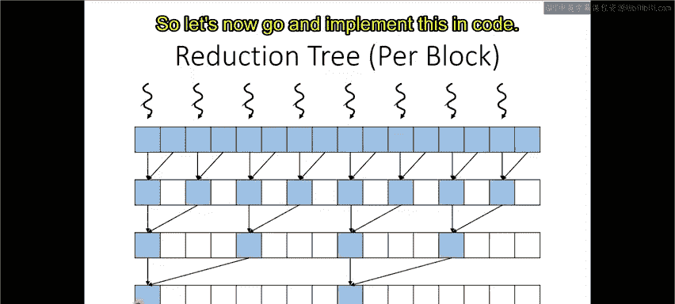

Over here， does someone have a question？Yes， towards the end of the tree。

 aren't our trade utilization so low that。

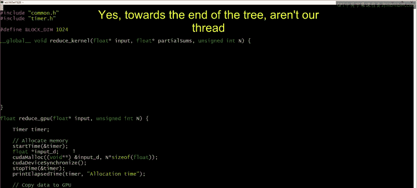

You shouldn't。 You're wasting a lot of resources。Yeah。

 so you're absolutely right when these threads are not doing anything and only some of the times are adding。

 we're wasting compute resources and we will take a look later on at some things we can do to further optimize this okay but for now let's go with this most intuitive approach despite the inefficiencies that it has。

😊，Okay， so let's go and implement。

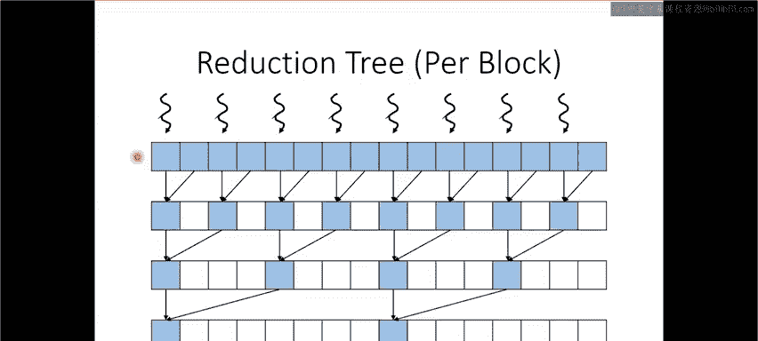

So I have this reduction to this sub function on the GPU that calls this function in CPUU that calls this GPU kernel that we're about to implement just a quick look this function is allocating the I have an input and size N。

 I allocate this input on the GPU， and then I copy it to the GPU and then I also allocate a partial sums array on the GPU in order for me to restore the partial sums and then I'm calling the reduction kernel and then after I call the reduction kernel。

I need to I copy back the partial sums。 And then when I copy back the partial sums。

 I'm here reducing the partial sums on this CPU for simplicity。

 and then I free the partial sums and I free the partial sums arrays and the input array Okay。

 so this is kind of what the host code is doing。 Now what we want to do is we' going to write this kernel that does the reduction within a single block。

 Okay， now the first step is for each thread block to identify the segment that it is responsible for。

 Now one thing you notice here is that the number of elements that a thread Google block is responsible for is actually twice the number of threat。

😊。

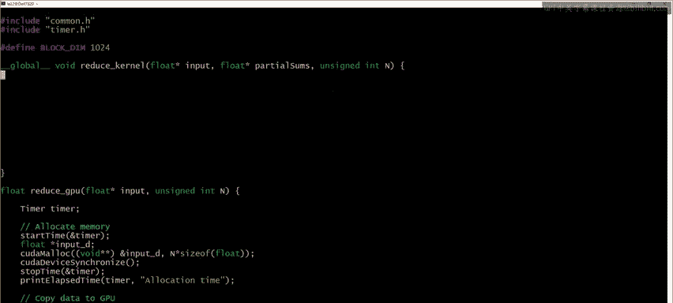

Okay， the number of elements is's responsible for is twice the number of threads。

 because in the first iteration， every thread is going add two elements。 Okay， so I want。

 I don't want to launch a thread for every element the block is responsible for because then half of them will not do anything from the very beginning end。

ok。😊，So for me to find the segment that the front block is responsible for。

 I need I to skip over two times the number of threads for each thread block， okay。

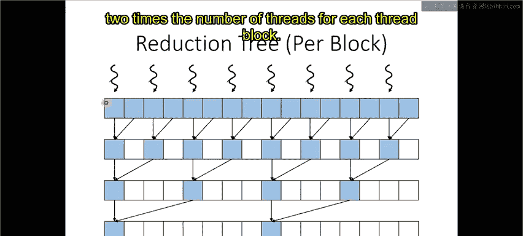

Here， I'm going to write。Unsigned and segment segment here is going to be the first the index of the first element that third is responsible for。

 and it's going to be blocked。Inex dot x。It's going to be block index dot x times the number of elements that the thread block is responsible for。

 and that number is going to be block dim dot x times 2。

 going to be block dimm dot x times two because every thread block is responsible for twice as many elements as it has。

Next what I want to do is I want each of these threads to determine what element it's responsible for inside of this segment。

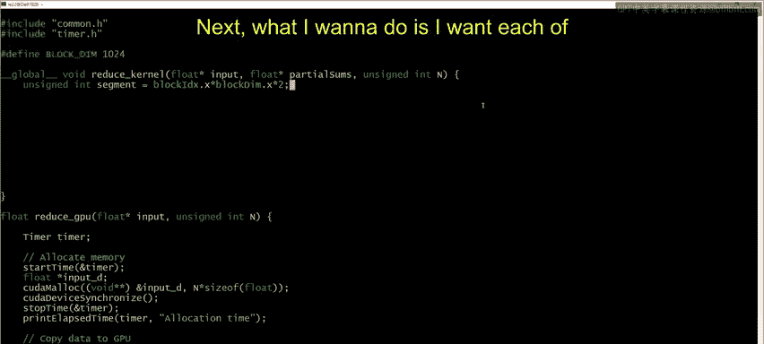

Okay。😊，So here thread zero is going to be responsible for element zero。

 thread1 is going to be responsible for element 2， thread2 for element4， thread3 for element 6。

 thread4 for element8， et cetera， so in general the thread that has index thread index。

 x is going to be responsible for the element two times thread indexd do x within the block。😊。

The absolute index。I find it I I is going to be the index of the element that the threat is responsible for in the global array。

 That's going to be the beginning of the segment plus threat index dot x times 2。Okay。

 because the threads are distributed to every other element。ok。😊。

Now that each thread knows what element it's responsible before in the input。

 what we would like to do is we would like to have a loop that iterates over these steps in order for me to do my reduction tree。

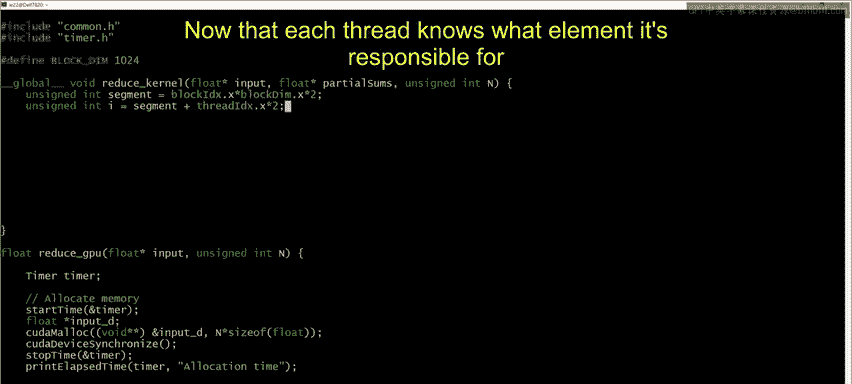

Now， what can I use as a loop counter here？ What's a convenient loop counter to you。We。

 we can use the thread I D modo to to the I with I increasing。Right。

 so we can use the spread ID mod or something to decide what threads going we're going to eliminate each luiteration。

 but what is going to be， how many luiterations do I need？You're gonna need the lock to a。

We're going to need log two of the size of this input。Right， so1。

 one convenient loop variable to use is actually the stride in which we add。

 You notice over here in the first step。What distinguishes this step is that every thread adds the element that is plus one to the right。

In this step， every thread has the element that's closed。To the right And this step。

 every thread adds the element that's plus4 to the right and in this step。

 every thread adds the element that's plus8 to the right and so on。 Okay。

 so actually the the convenient block index to you the loop index to use is the strip。

 the stride starts at one and then it doubles every iteration until it reaches the block dimension。

 So here in the last iteration， the stride is8， which is the number of threads that I have because it's half this8 over here is half the size of the total array。

 which is basically the number of threads that we have the block dimension。Okay。😊，So， my little。

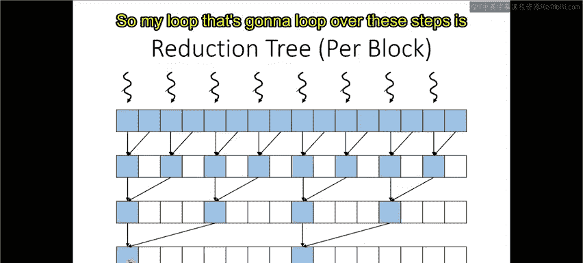

Now that's going to loop over these steps is going to I'm going to use the stride as the。

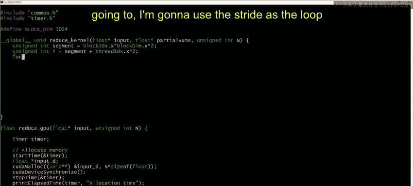

As the loop index and the stride is going to start at one so here the offset is one。

 I'm going to start at one and the stride is going to keep going until it reaches block dim。

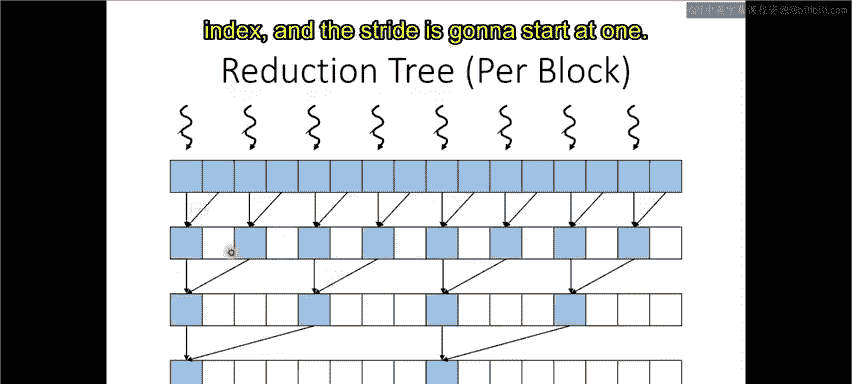

Okay。😊，So here I'm going to have stride as less than or equal to。Logged in， okay。

 and what do I do with the strip ofiteration？😡。

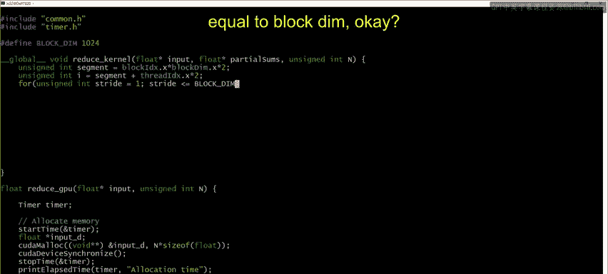

Here it's 1。 here it's2。 Here it's 4。 Here's 8。 What I do with it every rate。

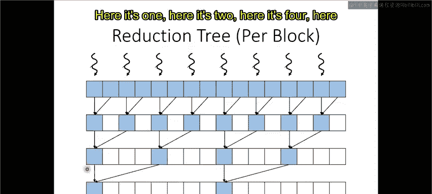

I multiply it by2。ok。😊，So this is going to be my。Okay， so now that I have this problem。

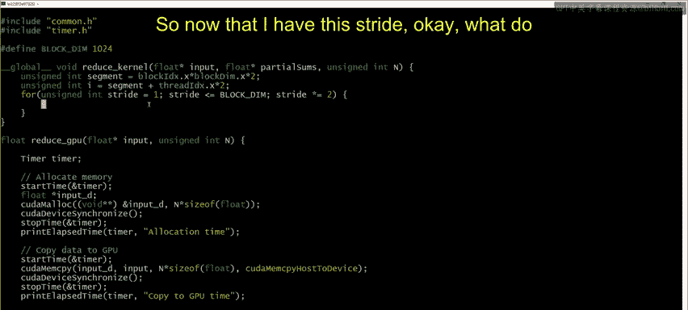

Okay， what do I need to do each iteration Well every。

 every thread is going to add the element add to its element。

 the element that it owns the element that is tried to the right of it。 Okay。

 so in this in the first iteration， every thread adds its element to the element that is one to the right every in a second。

 every thread adds the element to the element that's two to the right。 So in general。

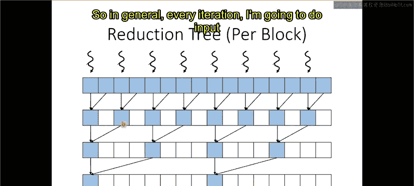

Every iteration， I'm going to do input of I。Plus， equals。And put up I plus。Strike。Okay。

 so every iteration， every thread will add its element to the element that is stride to the right Okay。

 however， we need to be careful here， not every thread is going to do this edition on every iteration。

And。

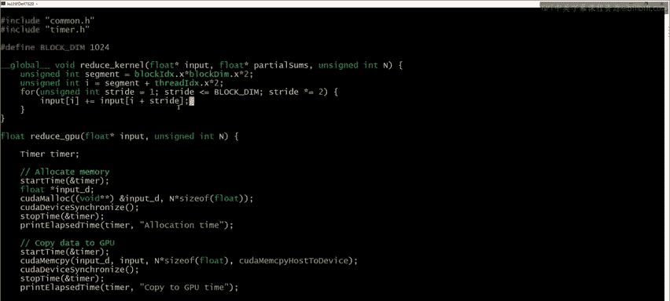

When the stride is one， every thread is going to do it when the stride is two。

 every other thread is going to do it， so thread  zero will do it， thread two will do it。

 thread4 will do it， thread six will do it。RightWhen a stride is four。

 every fourth thread is going to do it， stride  zero will do it and thread4 will do it。

 the other is one。Okay， when the threat is 8， only thread 0 will do it。Okay， so in general。

How do do I based on the stride， how would I identify which thread is supposed to compute？😡。

Those that have congruence，0 modular2 to the2。 So in simple terms。

 those are that are a multiple of the strip。 when the stride is one。

 all threads are all indice are multiple of one。 So they all compute。 when the stride is 2。

 only threads 0，2，4 and 6 are going to be computing。 So only the threads are multiple of two。 it's 4。

 only threads are multiple4 in general， the threads are the。

 the threads whose indice are multiple of the stride are the ones that will compute So have a guard that says if。

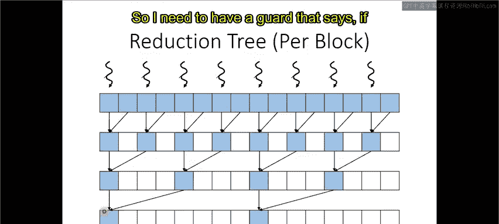

Td indexdex dot x。Mulo stride is equal to 0。咧。I will do that。ok。😊，Okay。

 so now that every reiteration my I will add the element that is dried to my right Okay。

 so what am I still missing in this loop after I do this edition。

 I make sure that all the thread that's supposed to add is doing doing the addition and I do the actual edition Do I need to do anything else in this loop We need to store it in shared memory for next time for next iteration We don't have to right we could but right now we're not doing that right now we're just using global memory。

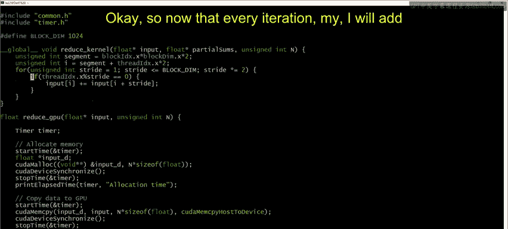

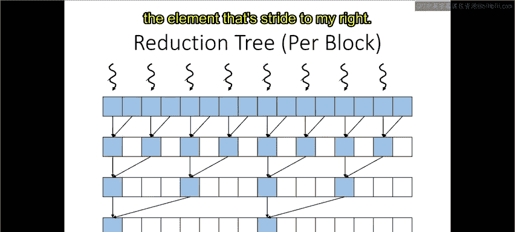

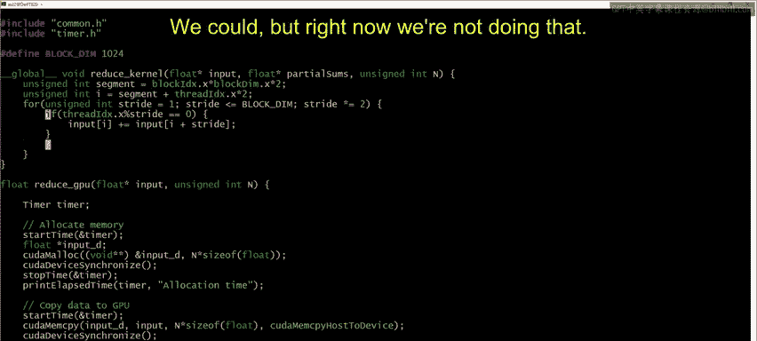

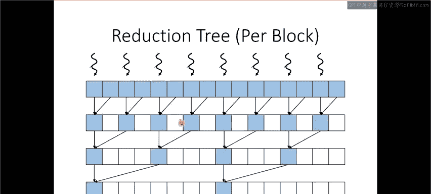

Okay， but that's a good optimization， so hold on to that thought and maybe we'll apply the optimization later on。

Okay， but we're doing things one step at a time。Orange destroying the array。

 the input array that's way by doing。 Yes， I'm modifying the input array here， but that's okay。

 That's okay。 I don't mind modifying the input。

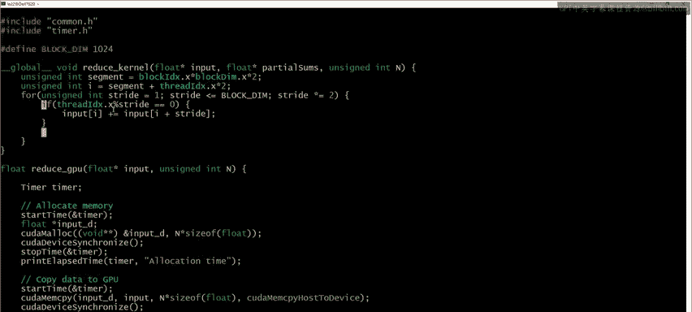

But there's one thing I need to remember， what do I do is after all these threads do the first edition once the thread is done can I simply proceed to the next edition。

We need to think Right， exactlyact。 We need to wait for all the threats to finish before proceeding to the next iteration and how do we do that。

Sk through。Right，对。Bs。Okay， so now that when you do this now we do sync threads。

 now each thread block is going to do a complete production tree。

 And at the end of of this at the end of this stage， every thread block will have a partial sum。

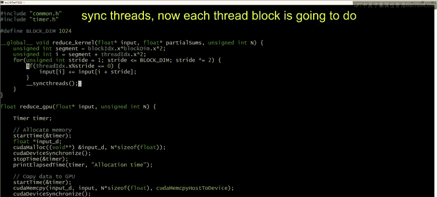

Add the position of thread，0 in the block。Okay， every thread will have a partial sum at the position of thread0 in the block。

 So now what we can do is we can have thread 0 and only thread 0 store its result in the partial sum array。

 So here I'm going to write if。

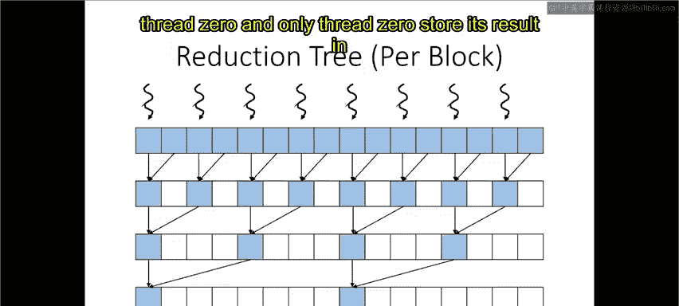

Right thank next。Is equal to0。Then I'm going to store the partial sum of the block。😡，Okay。

 I going store input of。To the partial sum of the block， excuse my typo。

 and here the partial sums array is going to have one element for every thread block。

So what do I use to endex the partial summary？😡，If thread block zero stores to partial subs of zero。

segmentment。block I。Right， exactly。 block index dot x。

 I'm going to use block index dot x because thread0 block 0 stores to partial sum of 0。

 block one stores the partial sums of one， et cetera。Okay， so this is our reduction code。

 any questions？A professor maybe in the condition of the foryeb。

 maybe it should be tried less than block in and not less than or equal。That is not the case。

 and the reason is， again， that the input， the array that a segment that the block is processing is going to be twice block them。

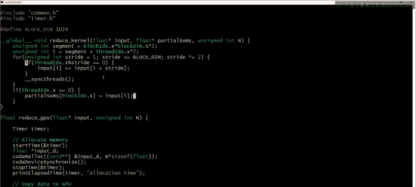

Okay， so here in this case， my input array is 16。So my block then is going to be eight。😡，And here。

 in my last iteration， the stride is going to be8。Oh， I see。 Okay， okay。 Thank you。 Okay。

 So that is why。 So here， block them as。

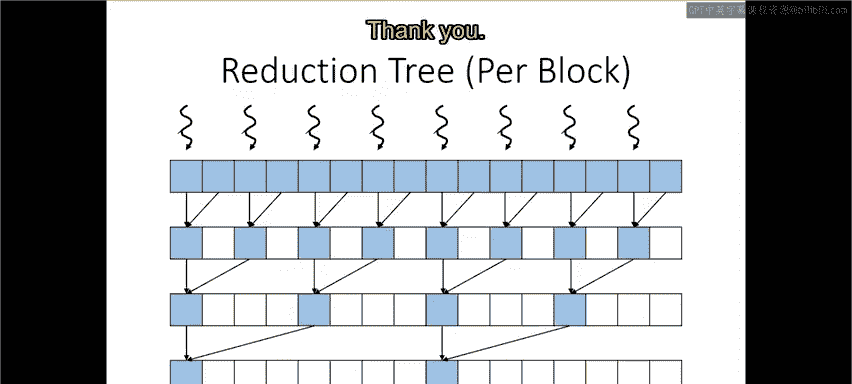

The size of the array that we're reducing， it's the size of a block。For the size of the array。

 then yes， we would have less than the size of the array。Would be two times block。Okay。

 so let's run this code。Let's compile。And let's run and see the performance that we get。Okay。

 so on the CPUU it took 21 milliseconds on the GPU it took 3。8 milliseconds。

 but if you include all the copy time， it's actually almost the same between the CPUU and the GP this is a sequential operation it's not embarrassingly parallel like matrix multiplication and convolution and stem so we don't expect to get as much performance improvement for reduction compared to CPUU because of the sequential nature of reduction。

 however， we still to get a fair amount of for performance improvement so if your data was already on the GPU。

 then it's actually quite worth it to do your reduction on the GP。

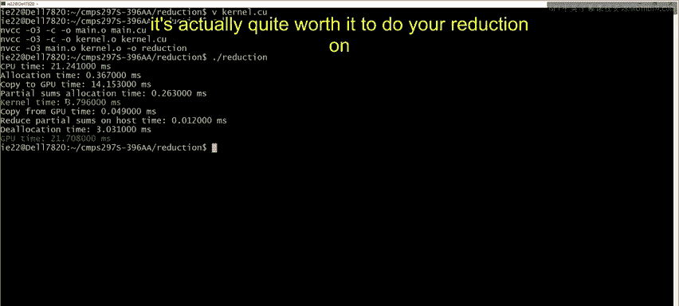

Okay so this is our basic code and now what we this is the code we wrote together。

 but now what we would like to do is we would like to optimize it okay let's talk about what is not optimal about this code that we just wrote and how can we optimize it further？

😊，Lots of memory aes， every night。So lots of memory accesses sure， yes。

 so we're repeatedly accessing memory， okay。What else is not up。

The number of threads that you're using in a block are like decreasing by two。Right。

 so the threads are dropping out， right， The threads keep dropping out。Okay。

 now if the threads are dropping out， but I have enough enough other threads to do other stuff。

 that's fine I I can just fill those cycles with something else。

 but there's something else that's problematic about these threads dropping out， what is it？

preserving the execution units for the warps and for the full warp， as where not we're using like。

Less threads than the full war that can be handled。 exactlyactly。 So if you remember。

 we said that these threads are bound together by Cindy。

 which means if a thread is not executing a particular branch of control， control branch。

 But another thread in the same world is executing it。

 that thread is kind of bound to the to the thread that's executing。

 So here when this and in the second iteration， when this thread is not computing。Okay。

 but it's bound to this other thread that is computing because of S。Okay。

 because they have the warp executes following the7D model。 So because of that。

 this thread is just going to be idle。 It's going to consume execution resources， right。

 but it's not going to be doing anything。Okay， so I have control divergence that's another problem that's another problem so so control divergence is a problem here and there's even there's there's also another problem。

 what is it。What can I say about access pattern here。

Do you guys remember how we spoke about memory coalescing？

We said that we want threads in the same work to access data from global memory that is kind of adjacent to each other in order for us to be able to coalesce those memory aes。

 right？Yes and they一定。They are quite away from each other。 So theyre not。Right。

 so my threads are not my memory a are not coalesce。 If you take a look。

 these threads are going to access every other element together。Okay。

 and then they're going to come back and access the element to the right together。ok。

So my aceseees are not coalesced and it gets worse and worse as I go down the street。😡，Okay。

 but we can solve that easily， right。how can we solve that？Yes， you are to solve that。

 So how do you propose to solve that？We just instead of doing of saving it in two steps or four steps ahead。

 we save it next to each other。So what you're saying is you want this thread， for example。

 when it does this addition to store the result here。第二。Okay。

 so we're going to do something along the lines of that， but we're also going to fix the diverges。

Okay， so let's let's see the problem with with well。

 actually what you said is along the lines of what we're going。

 so let me let me go ahead and see that。Show you how we can further up。Okay。

 so we said the problems are if access fees to input are not coalescce， so the access to input。

 the access is not coalescce。Okay， and you can easily observe that by the way。

 when everyone know if can access so less CFfD access varies according to the trend and next node。

In our case over here， stride is the same for all the threads。

 but I is actually train extract axis multiplied by two。Okay。

 so this automatically shows you that the index that that this area access is not called。Okay。

 so the the control diversion problem is as followed。 at the first iteration。

 I if this was my thread block， right， my thread block is divided into warped。 Okay。

 and in my first iteration， all these threads are active and the next iteration。

 half of them drop out。😊，Yes I have all these trendss that are inactive。

 so now the utilization of my warps is 50%。Okay， in the following iteration， they drop out。

 more of them drop out， so now the utilization of these workss is 25%。

And then the next iteration you know these wars drop out。

 but now you know Warp one and Warp  three are no longer have any threat so War one and War  three are gone。

 so now I don't have to worry about divergence for Warp one and Warp 3。

 they just want me to get book， but I still have divergence in Wars zero and wars 2。

And then then the last step， War I drops out and I have divergence in War0。

So what can I do to minimize this control divergence， but what we can do is the following。

We can rather than assigning threads to every other element of the array。

 we can assign the eight threads in this block to the first the initial elements in the array。

And then in the first iteration， they will all get add these eight elements to these eight elements and store the result here。

Okay， so now when these threads access the left element。

 the axis is coalesced because all of these are next to each other and when they access the right element。

 the axis is also coalesced because the elements are next to each other in the next step these the top half of the threads drop out the bottom half of the threads remain active and they do the addition this way and in the next step we do this and in the next step we do this。

诶。So this solves both the coalescing and the diverg problem at the same time。

And the reason is that now whenever the threads are accessing data at the same time。

 that data is nearby， and then also rather than the threads in the middle dropping out。

The threads only at the end are dropping out。😡，RightSo if these first four threads were a warp。

 wars actually 32， but here for illustration we're showing them as smaller。

 if these first four threads were a warp and these remaining four threads were a warp。

 then after the first iteration， these four threads will all drop out together。

So either but and then these four threads will compute。

 so either the whole warp is computing or the whole warp has dropped out， there's no control div。

Okay， so let's go and implement this approach over here。So when I come to this code。

I'm going to go back to my reduction code and I'll modify this code to implement this tree over here。

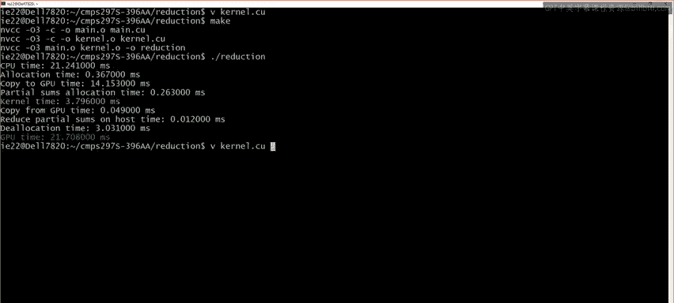

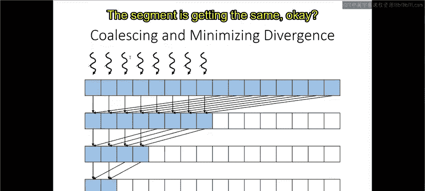

死。😊，Okay， every thread log is still taking two times the number of threads in the blog， however。

 this time rather than the thread owning the element that is segment plus two times thread index away from it。

 here each thread is going to own the element that is here thread thread zero is going to own the element zero thread one is going to own the element one thread two is going to own the element two etc。

 so rather than doing segment plus thread index times two。

 we're just going to do segment plus thread index button。

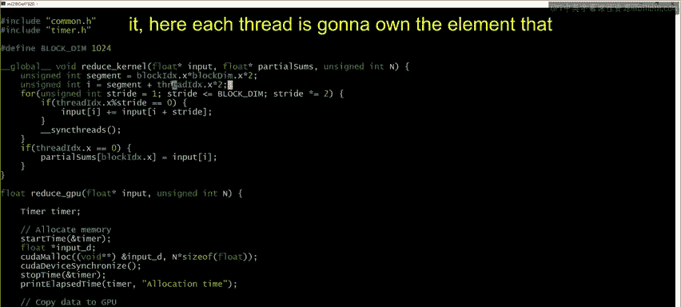

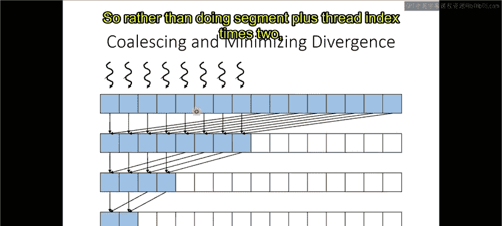

ok。😊，Now， for my loop。

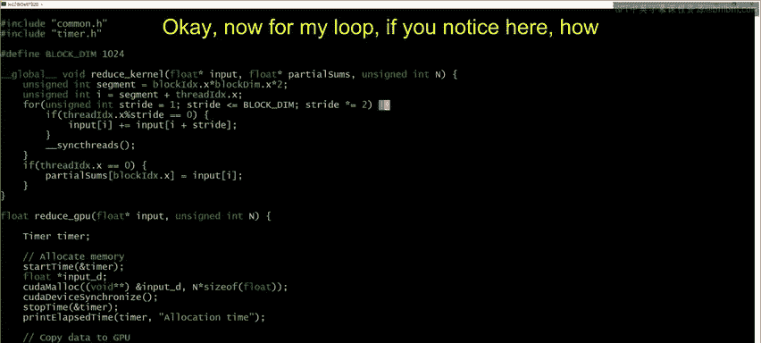

If you notice here， how is my stride changing？So this time， my stride starts at block dim dot x。

 So here my stride starts at 8， and then it becomes 4 in the next generationeration。

2 in the next generationeration， one in the next generationeration。

 So now my loop bound is not gonna go from one to block dim and multiples of two or in powers of two。

 It's gonna go from block dim down to one。 Okay， I'm going write if stride is equal to block dim。

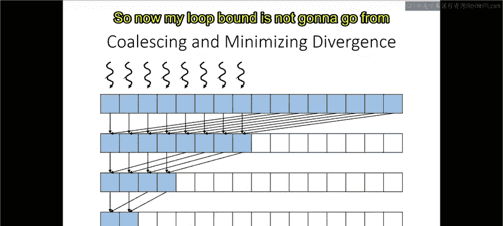

And it stride is。Greater than or equal to one。Okay， I can also write just greaterd than0。

 as I do strip。Divided by two。

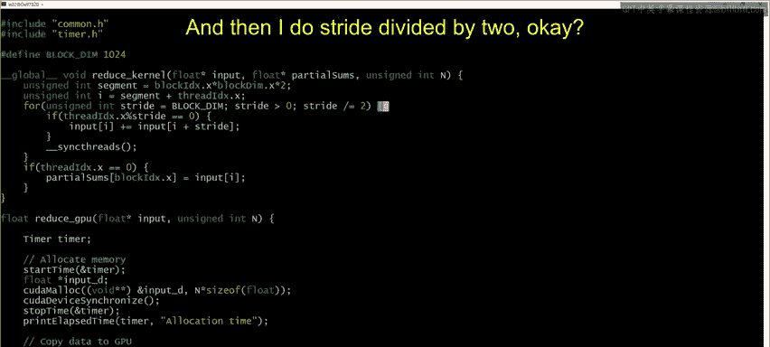

ok。😊，And the next， next what I need to do is I need to make sure that only the threads that are supposed to compute are actually active。

 So in the first。

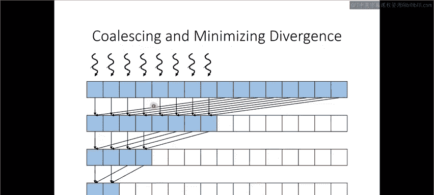

And previously， every other， you know， all the threads that were multiples of strideide were the ones that computed。

 So first， all threads computed， then all the multiples of two computed and all the multiples for computed。

 etc cetera。 This time， let's see which threads are supposed to compute in the first iteration everybody computes。

😊。

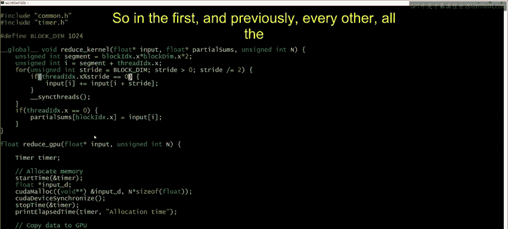

So when the stride is8， everybody computes， when the stride is four。

 only the first four threads compute。When the stride is two。

 only the first two threads compute and with the stride of one， only the first thread compute。

So what should be our condition in this case？To make sure that to only make sure the threads that are supposed to compute to the computation。

Bread I D below stride。Right exactly， I just have to do threadtt。X。

Is less than stride， okay， and then I do input of I plus equals input of I plus that's not going to change I do sync threads。

 that's not going to change。 and then finally the thread zero stores its value to the partial stone that's not going to change。

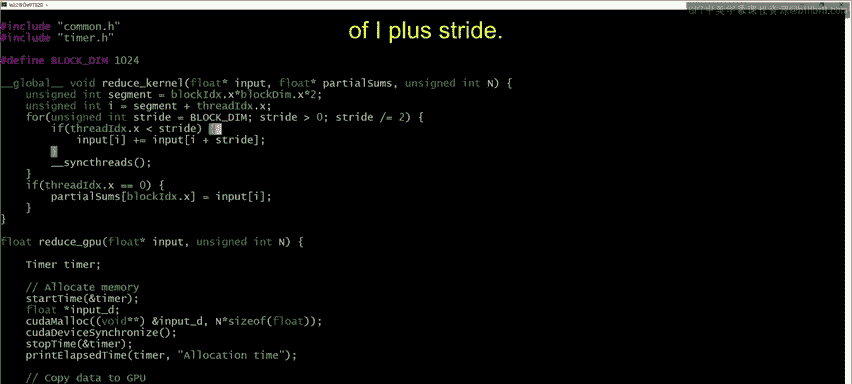

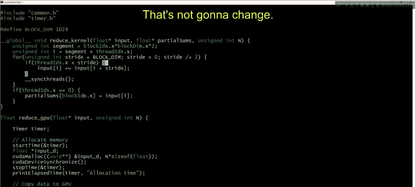

ok。😊，We how we reulated the tree to eliminate the controlled divergence and to have better coalescing。

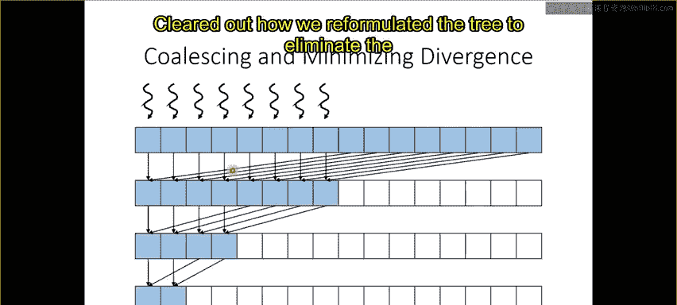

Let's see how well this could perform， I'm going to compile it。Remember previously we had 3。

79 milliseconds。 So now if we run our reduction， we have 2。75 millcond。

So we see there's a kind of a significant improvement from eliminating control diverges and also enabling memory for。

ok。😊，Any questions？

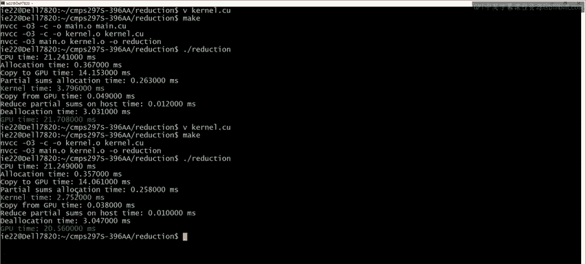

InstructYes， go ahead。I wanted to ask so detail， I'm not ready do this exactly but when when we do operations。

 things liketeger integer operations like multiplication division and the addition or even in simpler operations like addition and shifting does GPU use the same As different Alus So we have integer Alus and we have floating point Alus。

 just like in your CPU， you have your integer Alu and you have your floating point coprocesor with its own AluU。

So you only have one type of each， not like simple areas use for simpler operations like addition and and shifting and and another type for multiplication division I mean。

 that that just has to do with where you draw the box around the AluU in your hardware， right？Yeah。

 okay， you can think of your your adder and your multiplier as being two different blocks。

 or you can think of them as being the same blocks just that's just a logical difference。

 that's not really a physical difference。Okay。Professor。

 is it possible to bring in other blocks at different times to， to fill in the。Unused threads。

So want to you're asking if we can bring in other blocks to fill in unused threads。

 I don't think I understood what the question is。Well there are still a lot of unused threads。1。

For example so instead， for example in the first iteration。

 we can actually maybe do maybe on different threads， execute two different blocks or okay。

 I see what you mean yes， that's actually a good idea so what you're saying is you want because we're paying this price of synchronization and divergence as we come down here we can have each thread add multiple elements first before doing this divergent tree right？

is that微信。I'm I'm not sure。you basically， for example here we have one three we have a couple of threads。

 for example， something over two。So the next step would be to bring in another block and also execute this thing over to then we can start adding adding it into maybe a shared memory or something to fill in the。

The threads you see what I mean。Okay so we will use shared memory you mentioned shared memory we will use shared memory。

 I think what you're saying is you want to try and reuse so here when you're in this step you want to try and reuse these threads to do something else。

😊，The answer is that， you know， if you try to do these kinds of gymnastic。

 the whole reduction tree is getting smaller and smaller。RightSo ultimately。

 you will reach a point where there is not enough work to go around to fully utilize all your threats。

So this this bottom part of the tree is inevitable what you could do， however。

 is you could try to have the threads do more work initially by processing a larger segment where the initial steps are not don't have divergence before you reach this phase over here where the divergence is suitable and we we will actually do this short so hold on to that question I think I think you'll see that we will try to do something along the lines of what I think your're such。

APro。Yep。Just in this example， for the first step， wouldn't it have been better from a memory coalescing perspective to have each thread process。

 say one element and the element right next to it， kind of like what we did last time instead of having them。

Like instead of having each element process one element at one position and the other at。

Say 1024 elements away。So a good question I'm glad you asked that so remember coalescing happens Okay。

 let me move on to the code so this is the we have written so the aes that get coalesced are the aes that are issued by the same law。

😊，That by thread of the same work and the same instruction。Okay， so what that means is that。

The load instruction to load input of I。As theder is different from load instruction to load input of I plus strip。

Okay， so here on the diagram。The aes that are being issued。

 by the load instructions that are being issued by the same threads in the same instruction are when these authors act the left value。

 which is these elements here。😡，And then the the via the。When these sort eight threads access。

 the right values and these elements over here。Okay， however。

 when this thread accesses this value and then accesses this value。😡。

These two values are being loaded at different points in time。But that， but that's not this。

 that's not the scope where coalescing happens。 Coescing happens across threads in the same war that access data at the same time。

 not within a thread that accesses data at different points of。D clear。Yeah， it's very clear。

 Thank you very much。 Yeah， you welcome。Okay， so so this is a code that we wrote。

 And just kind of look at what the divergence looked like。

 So what we did is we started off with all of these threads being active in the first iteration。

 in the second iteration， the top half of my threads drop out。

 So now here warps 2 and War 3 are dropped out and Warp 0 and Warps1 are fully utilized。

 So I have no control divergence in my second iteration now。 in my third iteration。

 the top half of the threads drop out。 So here， Warp1 drops out and Warp 0 is fully utilized。

 So again， I have no control divergence in this step。 And then in the final steps。

 half the threads are going drop out and half threads are going drop out。

 So here in the final steps I'm going have control divergence。

 But only one of these warps is going to be divergent。

 And this this divergence in the final step is inevitable。😊。

You're going to have to pay it eventually， but you're notice that significantly less than the divergence we had in the previous figure where every one of these steps had control divergence。

And multiple words。ok。😊，So having said that， I hope this reduction exercise gave you a flavor of how we typically optimize uncoesed aes and divergent code。

 usually it involves having to either rearrange the data that we're accessing or rearrange the threads that we're using in order for us to make sure that the threads are are not diveivergent and the way they access memory as coalesed。

 and we will actually see an example in the future。 in this case。

 we rearranged how the threads are accessing the data。 And later on。

 we will see another computation pattern where we will actually rearrange the data itself in order for the threads to access it in a coalesed and nondivergent way。

 Okay， we will look at this one we look at sparse matrix vector multiplication。😊。

So for now we've we've kind of we've seen these optimizations of eliminate divergence and memory coing。

 Let's now go back to the optimizations that we we're we we've practiced quite a bit and we're comfortable with。

 So a lot of you said shared memory Okay and that's right we can use shared memory here to optimize something about optimized what。

 So we don't really have data reus here。 Okay， because no specific value is actually reused However。

 the memory locations in which which contain these values are actually reused Okay。

 so one of the optimizations is that we can load。😊，To shared memory， the input。

 to shared memory first。 And then we can perform the reduction tree on shared memory。

 And what this does is that it avoid this this avoids。Modifying the input。 So somebody commented。

 aren't we modifying the input， Yes， we are。 And if we use shared memory。

 then we we wouldn't be modifying the input。 So let me show you an illustration of what I mean by this。

So here we have our threads loading data of this data。

What we can do in the first step is when these threads add the first two elements。

 rather than putting the result in the global array。

 they can put the result in a shared memory array。So， basically。

I don't need to load the entire segment into shared memory， right。

 I can have the threads load their first two elements， add them and then store them in shared memory。

 So I actually only need as much shared memory as half of the entire segment。Okay。

 and then so the initial load is from global memory and then from here on。

 the remaining steps can happen inside of shared memory right so next I can I can access shared memory and then I use shared memory and then I use shared memory and then when I'm done。

 the final thread go will take the value in shared memory and put it in global memory and what this does is it'll reduce the amount of times I'm accessing global memory each time。

😊，ok。😊，Doess it clear everyone。Doctor Wild who use registers。

 aren't registers faster than she memory is the same technology。Well， great question。

 Registers are faster than share in memory。 However。

 the reason we don't use registers is because when this second thread well。This thread over here。

Actually， let me not do it this way。 This thread over here。Right， is going to load this element。

And it's going to load the element that's straight away from it。

 it's going to add them and it's going to put them here。Right。😊，But the next iteration。

 which thread is going to load this element。Is it this thread？No， this thread is not active。

The thread that's going to load this element on the next iteration is actually going to be this thread over here。

ok。😊，And that is why this thread has to store its result in shared memory so that after the sync threads。

 this thread can come and access the value from shared memory in order to use it to perform the addition。

But why can't he do the same thing with the register。Well， well。

 because because one thread is writing the value， Another thread is reading the value。

So the registers are private to threads， right？Okay， okay， okay， my registers are private to threads。

 So if I want to have a value read and written by multiple threads in the same block。

 I need to put that in chairmen。Okay， so let's let's implement this。

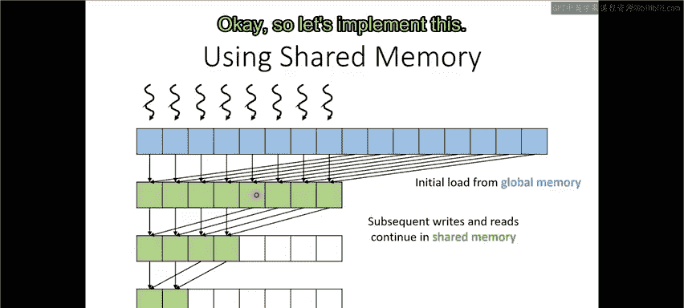

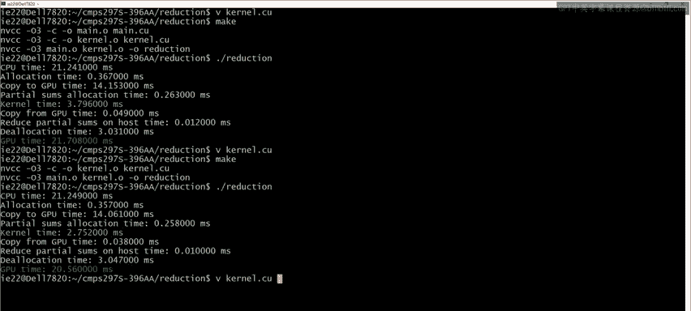

So what I want to do now is I want to allocate this shared memory array and after I do my initial load。

 I want to put the results in the shared memory array。

 So the way I'm going to do that is as follows I'm going to create a shared。😊。

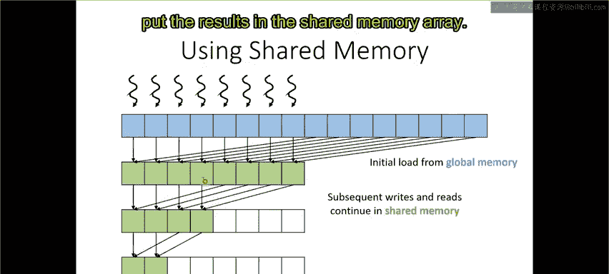

memory array。I come input underscore S。What's the size of this arrayego to be。Andb them them。

I'm going to have as many elements as I have threads。 Okay。

 so the assignment of the array is going to be。Log them。 Okay， and the first app， I'm going to load。

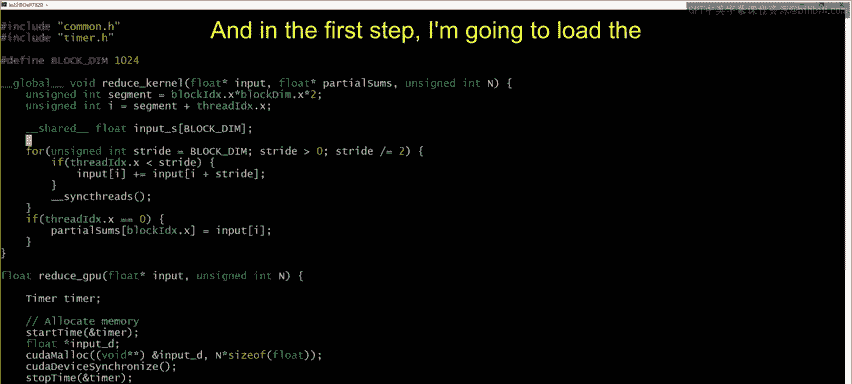

The input that the the value the thread is responsible for and the value that's tried away。

 And I'm going to put that in the shared memory array。 that been write。

Andput underscore S。嗯。Tread index dot X。It's equal to。Input of I plus。Input of I plus。Right。ok。😊。

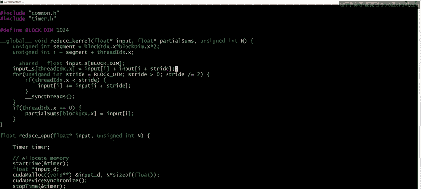

So now I do the first step， what do I need to do after the first step before I begin the second step？

Synchronize。Right， you have a think something I do？Sink threads over here。Okay。😊。

So now I have my result and my。

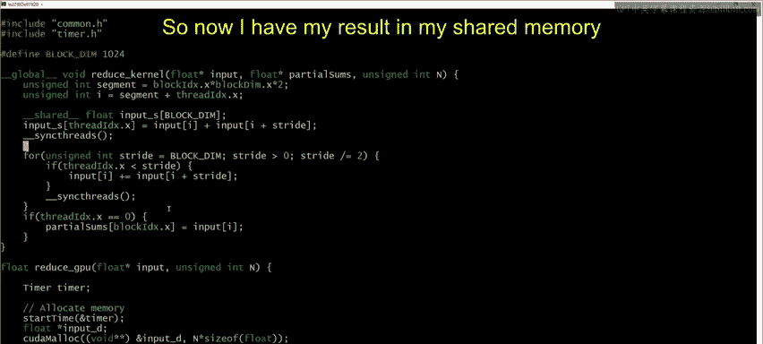

Okay now I'm going to continue this reduction tree in shared memory。Okay， but this time。

 I'm not going。 my stride here is going to be now half blocked them。

 It's not going to be blocked them。Okay， so here。

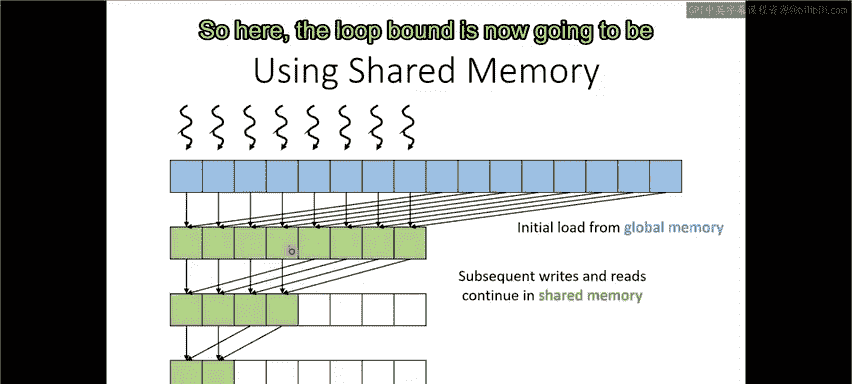

L down is now going to be from block them over 2 until until one。Okay。

 and then here when I access input the input， I'm going to access it from sharing memory each time。

 So rather than having input of I， I'm going to have input S。Undersco S of thread index side x。

 And here rather than having an input of I plus stride I'm going to have input underscore S of。

Let index dot x plus strike。And then finally， when index when threads 0 comes to store the final result。

 that final result is going to be in shared memory。 so I'm going to write input of that off。这。Okay。😊。

Dear to everyone。Any questions。Alright， well， then let's run this code and。各位好。

Tells me surprise that the fine looks like I have the text error somewhere。Oh okay。

 so here this was supposed to be， I put stride over here。

 what is the stride value in the first iteration？😡。

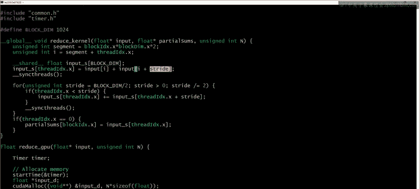

Then logged in lockgged in， exactly。

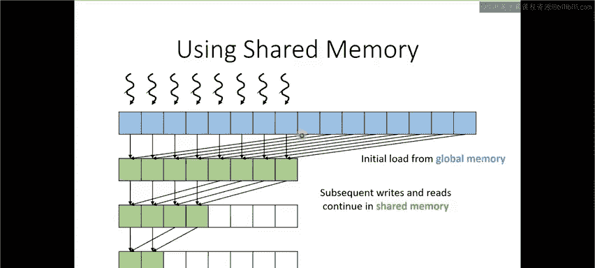

This stride value is supposed to be blocked。几。😊，欢迎。😊，I remember my my time before was 2。

75 milliseconds， so now I'm going to run it and it's now going to be better。 It's going to be 2。

15 millise。ok。😊。

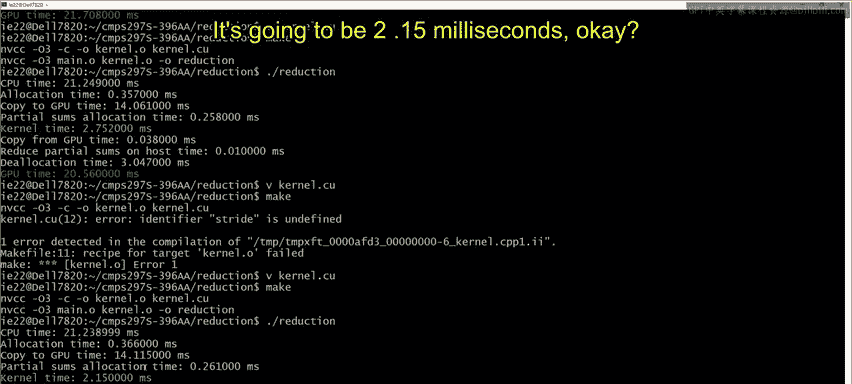

Al right， so now we've seen how we can use shared memory to capture the data reus。

 And this over here is the code that we wrote。 The final step is thread。

 the final thing we're going apply is thread coing。 So remember， thread coing。

 what we said about thread coing is that。😊，When is that if when we give hardware the hardware。

 more thread blocks。Then it has resources for。What the hardware typically does is that it serializes those thread losss。

😡，No。If theres a price， I am paying for the paralyization。😡。

Then what I would like to do is I can reduce that price that Im paying for the parallellyzization by rather than letting the hardware serialize the threadb。

 me serializing the thread blocks and the code。Okay。

 or having the thread log do the work for multiple thread log。So in this case。

 over here in introduction， what is the price that I'm paying for paralyzization？What price do I pay。

 What's expensive about doing the reduction in parallel compared to doing it sequentially。😡。

At some point， some threads become useless and they race。Right， exactly。

 so one of the prices that I'm paying is control divergence。ok。What's another price that I'm paying。

IPro multiprocessors。Right so the fact that I'm using multiple threads right to run simultaneously。

 what do these threads need to do with each other？Think。Right。

 they need to synchronize exactly so the prices that I'm paying for for parallellyzization are synchronization and control divergence。

 There my cost of parallellyzization is synchronization and control divergence。😊。

So what I can do is if my thread blockss are going to get sterilized anyways。😡。

Rather than letting the hardware serialize them， I canize serialize the work myself by rather than having every thread lock responsible for every thread responsible for one input element have or in our case。

 two input elements， we can have it responsible for multiple input elements， okay？😡。

So it is better to course in the threads if there are many more blocks and resources available。

 and let me show you an illustration of what I mean by this。

If I have what I can do is if I apply threat coing is I can assign a much bigger input。

To my to my threads， then then the number of threads I have so previously I was assigning two times the number of threads to the block here I'm assigning four times the number of threads to the block。

Now， what happens in this case is that these these eight threads now。

 they're going to add the elements that are that are。Side then block them away。

And then they will all add the elements that are two times blocked them away。

 then they will add the elements that are three times locked them away。

 and then they put the result in shared memory。Okay。

 so now rather than having each thread responsible for adding two initial elements。

 I have each thread responsible for adding four initial elements。😡，Okay。

 now if you'll notice this initial phase where these threads are adding these these these。

Subsegments of the segment that was assigned to the thread block。

 I don't have any control divergence here。Right， because all eight threats are active in each of these editions。

Not only do I now have controlled divergence， I don't need to synchronize。😡，Because over here。

 these threads are adding four elements here。😡，These four elements that the thread， this thread。

 the four elements of this thread adds。Are not produced by any other threats。These four elements are。

 are， are you know， the or owned by this thread。 So this thread goes that add as this element and this element。

 and then after that by 8 and then after that by 8。Okay。

 these other elements that the thread is fetching here。And it's such here。

 these are not being produced by other threads， so I actually don't need to synchronize each for each one of these steps。

Okay， so by applying coing， now able I'm adding this entire segment。

 I'm reducing this entire segment， but with fewerchron fewer relative number of synchronizations and less controlled evidence。

Now， once I've reduced it down to the number of threads。

 then I will have to do the reduction tree and shared memory。

 which has synchronization and control dive。So the synchronization control diveence is here now。

 okay， but it's not over here。However， if I had if I had， if I didn't do couring。

 if I had the first thread block do 16 elements and the next thread block do 16 elements。

Then what would have happened if those thread blockss got serialized is that the first red block is going to do a tree。

 so it's going to have synchronization and divergence。

 and the next thread block is reducing these top 16 elements。

 it's also going to do a tree with synchronization and control divergence。

But by having one threadlock be responsible for this segment。

 I only have the synchronization of the control divergence once。

 and the addition of the second segment happens without any the addition of the second half of the segment happens without any part any control divergence or synchronization。

Okay， let's implement this to kind of make it clear。

 clear what we're talking about So what I'm going to do I'm going to switch to the code now and what I'm going to do is。

😊。

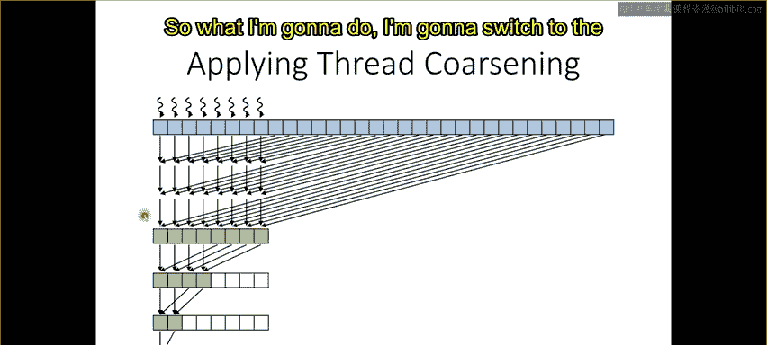

We need to first define a cose factor。Right， so I need to first define a co factor。

 So I'm going to define。My coing factor。Okay， let me start with something like four。Okay。

 now with a corresponding factor of four， what that means is that every thread block is going to have an input segment that is four times the original what it originally had。

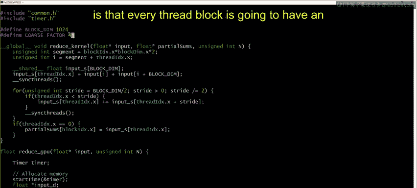

So originally， the thread block the size of a thing。

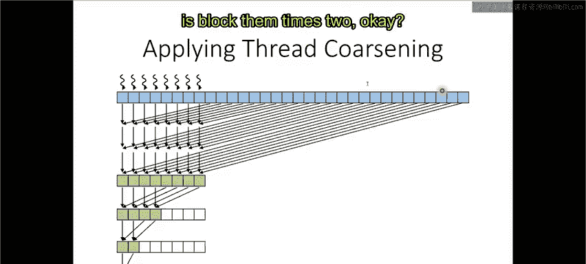

This block in times 2 Okay， so now the size of a segment is going to be blocked in times2 times the coing factor Okay。

 so here I'm going to multiply by the coing factor。ok。😊。

So now each threadb goes through the segment that is responsible for every element this doesn't change right every element is going to primarily be responsible for the segment the beginning of the segment plus the third index okay。

 but now what I before what I was doing is I was loading two elements。

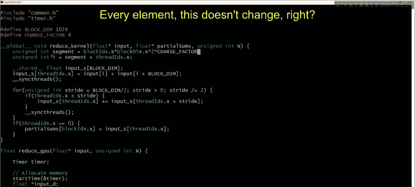

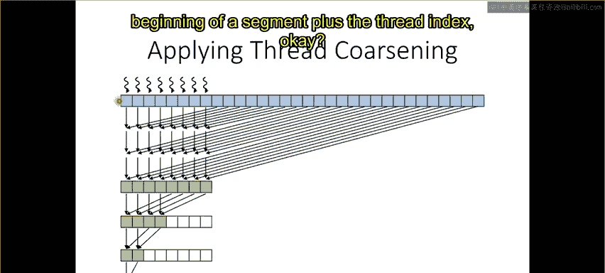

Adding them。 and then I was loading two elements， adding them and putting the result in shared memory。

 Okay， now what I want to do is I want to load this many elements and add them and store them a shared memory。

 okay。😊。

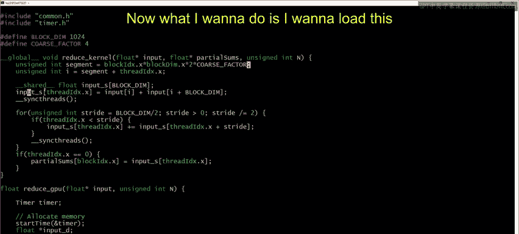

So here in this illustration my coseic factor is two。

 so now I want to loop over the elements that so if my coseic factor is two。

 every thread is responsible be going to be for four elements。

 if my coseic factor is coursear factor， every third is going to be responsible for two times coarse factor elements。

Okay， so what the threat。2 is the threads will first load this tile and then load this tile and then load this tile and then load this tile and add them to share them。

 So the way I do that is as follows。

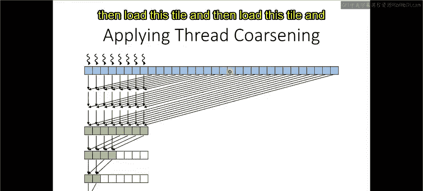

Can I get rid of this。Okay， I'm going to write float sum equals 0。 Okay。

 this is going to each thread now is going to add comments that is responsible for in this segment。

 I'm going to go for。

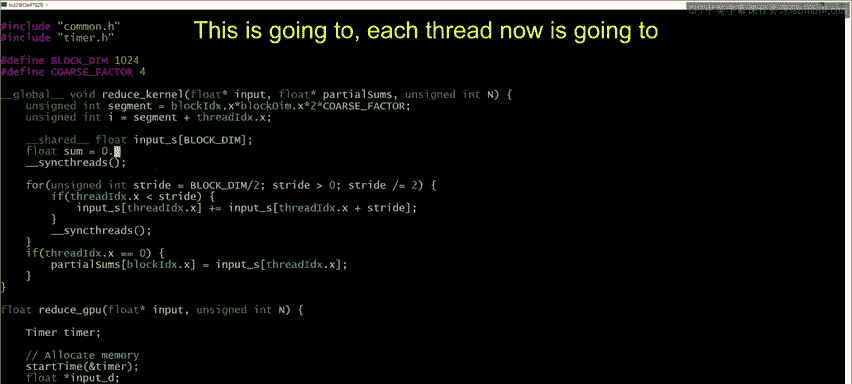

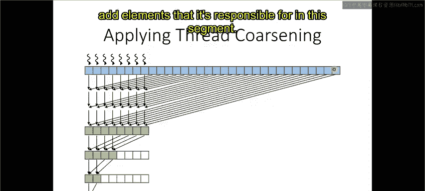

Professor， if you a， if you have a for loop， don't you still have control divergence？

Not if we all execute the same number of iteration。Can you repeat。

So not if we all execute the same number of iterations。Okay。So here what。

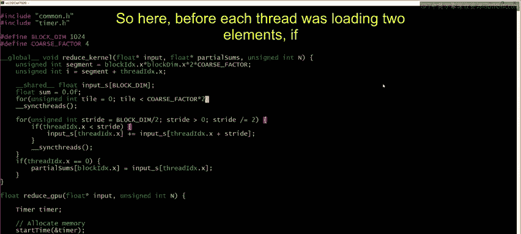

Before each thread was loading two elements， if I have a course setting factor of course factor。

 then each thread is going to load two times course factor element。

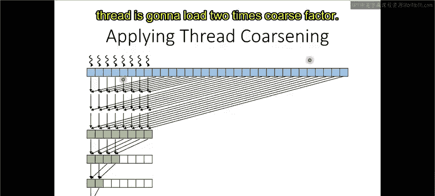

Okay， so we will write four tile equals zero tileus of coursese factor types 2。

 notice all threads have the same loop bound， so all there will be no divergence。

 then I do plus plus tile。Okay， and then I'm going to do some plus equals。

 and now I'm going to load the input value corresponding to the tile。

 So in the first for the first style threads zero is going to load element 0 for the second tile threads0 is going to load element 8 for the third tile thread zero is going to load element 16。

 then it's going to load element 24， etc ceter。 Okay， so in general。

 the thread is going to load the input at I plus the tile times the。

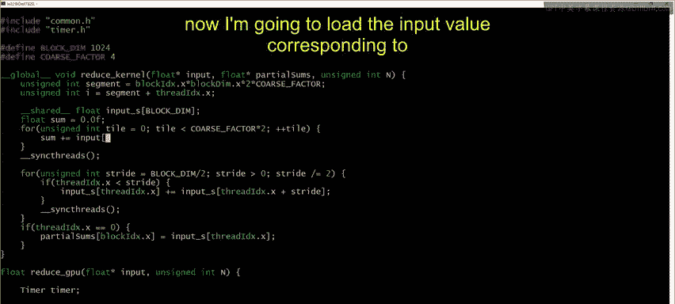

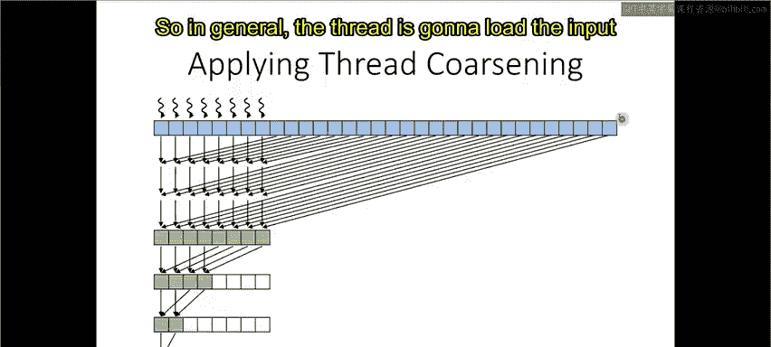

Por the name， that's sorry， times D blocked them。Okay。😊，So first iteration loads the element it has。

 next iteration loads the element block them away， next iteration loads the element to block them away。

 next iteration loads the element three block them away etca。😊。

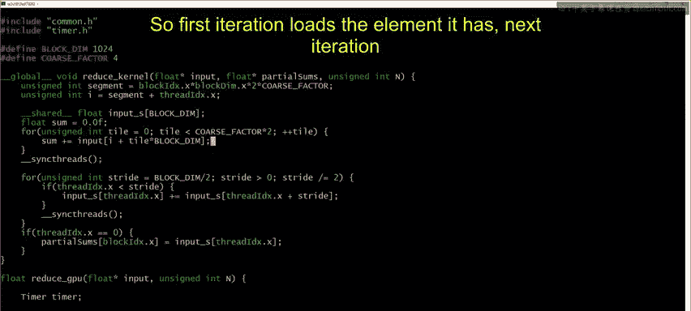

Okay， so here I accumulate these elements actually register I notice that I don't need to sync here okay。

 because these。😊。

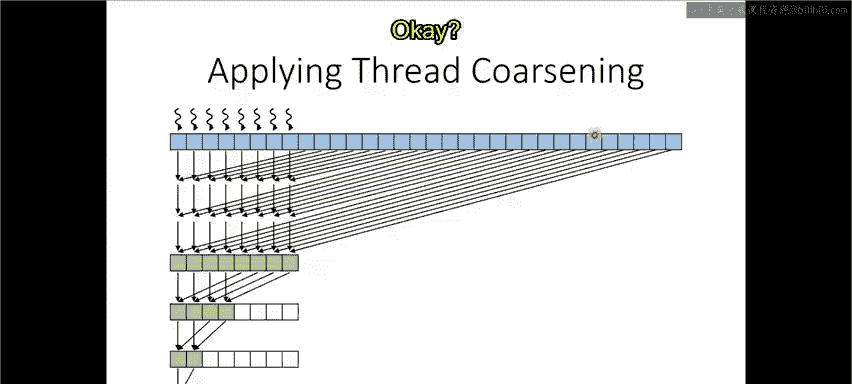

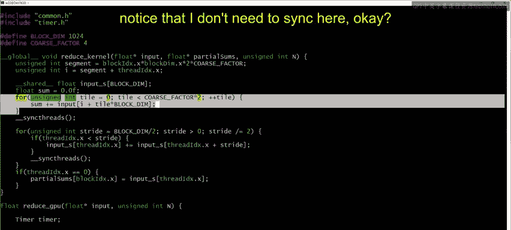

s don't require synchronization， I'm just soaring the partial result in the S register and then a partial result again in the S register。

Now I'm done with this， now I need to take the final result after the dispersing step and put it in shared memory。

 so now I'm going to write。

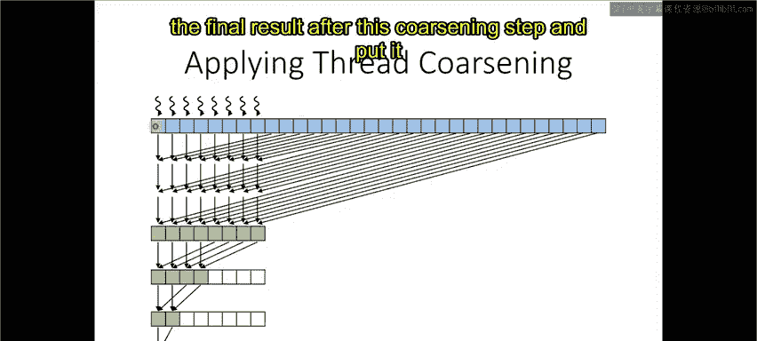

Andput underscore S of red index dot x。十止模十三。Okay， and then I'm going to continue with this this part of the code where I do the reduction tree and shared。

Okay， any questions about this？Professor yes， you once mentioned a concept。

 I think it was called transparent scalability。 So when you do， when you apply coing。

 you lose that property， right， Abolutely， yes， so we we spoke about that before when we we said when we coin。

 we're interfering with the hardware scheduling because we're assuming the hardware is gonna serialize So we're serializing ourselves。

 If the hardware doesn't serialize that we lost the transparent scalability。

 And that's why the disadvantage of applying coening is that we end up having to the disadvantage of applying coening is that we we have to ret this coening factor every time。

Okay， okay。Okay， so the final step now is since each threadb is responsible for more data。

 we're going to need fewer thread blockslock， I have to go down here and I need to decrement sorry I need to divide the number of blocks。

That I am I am launching Where that， yeah。 So here I need to divide。

I need to multiply the number of elements per block by the coursesetic factor。Okay。

 and by doing that， automatically， the number of blocks is going to be divided by the course of effect。

Okay， so I multiply the number of elements per blocked by the corresponding setting factor。

Can handle have that many threads per block？I'm not increasing the number of threat for， remember。

Oh elements， okay， four elements， each thread is responsible for more elements。

AndThat's why I have to loop over these elements that the thread is responsible for。ok。😊。

Do now know this。And let's run it。And， wow。喂。Thats we got some good speed up from this。Okay。

 and you can try all kinds of course time。Let me try a larger coing factor Okay， and and you know。

 depending on the hardware， if you， if you increase the coing factor。

 you'll get good improvement And then once you hit a point where you're starting to to serialize too much。

 then you'll you'll hit a performance degradation。 Okay。

 so here see we get even better performance Okay， but if I make this something very， very large like。

I don't know。So here， if I make this too large。Then then， you know。

 I'll probably expect to start seeing a performance to regression。 Well， it hasn't regressed yet。

 So the input that I'm passing is really， really， really big。 Okay， but at some point。

 it's going to start performing worse because I'm getting too much stization and it interfered with that transparent capability。

Okay。😊，嗯，嗯。

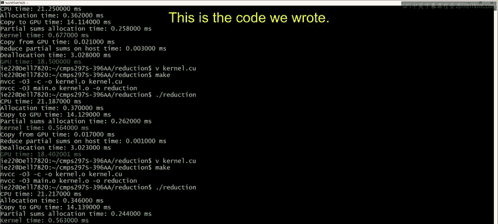

ode we wrote， and again， the benefits of co sitting is that if all the blocks are executed。

So in general， if all the blocks are executed in parallel we need log end steps and each step requires a synchronization so we need log n synchronization。

 if the hardware serializes the blocks by a factor of C。

 then each block is going to have log n steps log n synchronization。

 so I'm going to have C times log n steps and C times log n synchronization。Okay。

 what here n is it refers to the number of elements that a block is responsible for okay， however。

 I if I coen the block by a factor of C rather than letting the hardware serialize it。

 then I'm going to have two times c minus1 initial steps and then I'm going to have log n steps and log n synchronization。

Okay， so by coercing， I've reduced the number of synchronization。

And I've also reduced the number of steps。ok。😊，Finally。When boundary conditions。

 might when you might end up in a situation where the very last thread block has some elements that are out of bound。

 so when you do that you need to make sure that you handle the boundary conditions properly when you are loading from global memory and what that means is that over here when you load from global memory for the first time。

 you need to make sure that the value that you're loading is within bound。

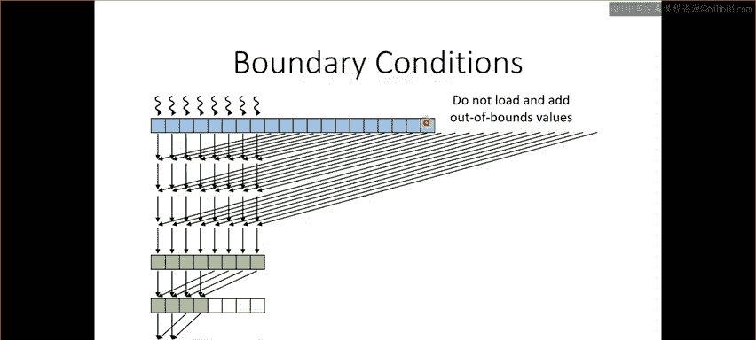

Otherwise， you could just load zeros and then afterwards， if you do this。

 if you handle the boundary condition when you're doing this initial step。

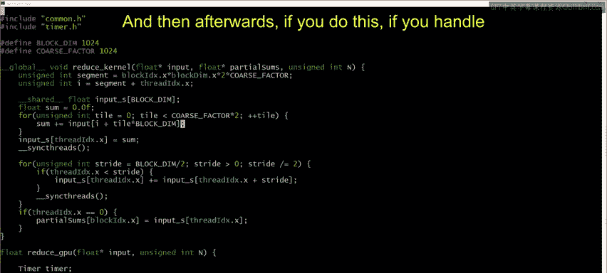

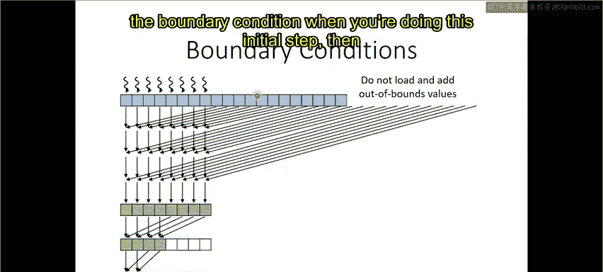

Then you you don't have to handle it over here， you just put zeros and the irrelevant for the irrelevant values and then shared memory is kind of all within bound and then everything else is the same so handling the boundary condition requires you to just be careful over here when you're loading from global memory and make sure not to load out of bounds。

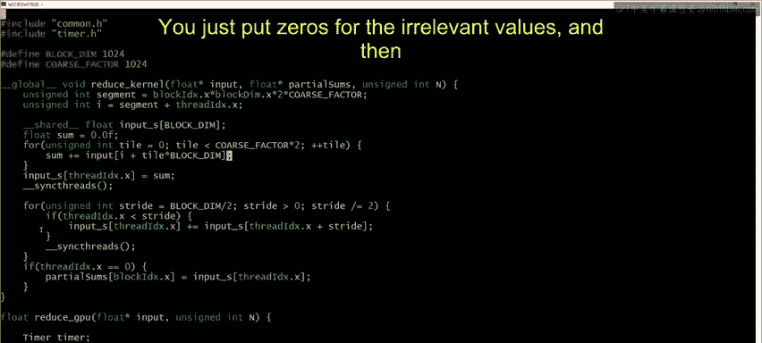

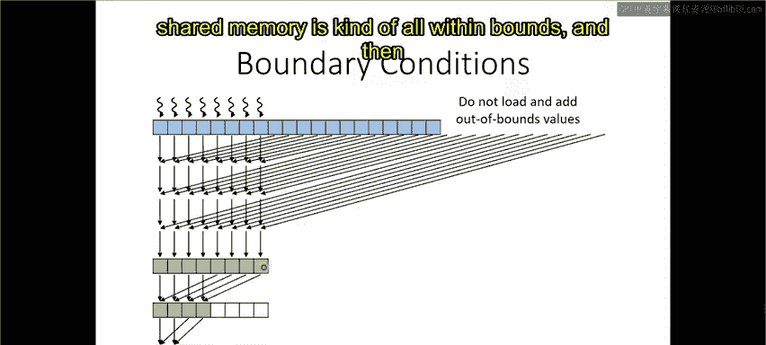

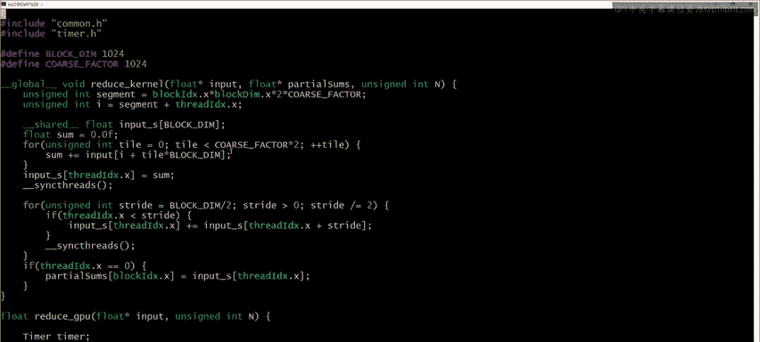

Okay， and with that said， that is all for today and you can read more about what we talked about today in chapter 5。

 section 5。3 of the textex。Somebody was asking a question and we were kind of we kept colliding。

 so does anybody have any final questions before we end。Yes I wanted to ask。

 how can you find the coersating factor without trial and error Like what's the hardware resource you should look。

 you should look at。So you can remember how we said in the first lecture or the second lecture that you can query the hardware or maybe it was the third lecture。

 don't remember which one or you said we can we can query the hardware Yeah I think it was the third lecture we said we can query the hardware for its resources。

So we can actually， no wait。 It was the fourth lecture。 I'm sorry。

 So we can clear the hardware for the resources that it has。 Okay。

 so what we can do is we can figure out how many Ss we have in the in the GPU， right。

 We can figure out how many。THow many threads we can have per SM。

 we know what our block dimension is and this case it's good to have the block dimension be as large as possible okay and then what you can do is based on that you can calculate what is the maximum number of blocks that you can have executing simultaneously。

If you're gonna be launching many more blocks than that， then you can somehow， you know， figure out。

 okay， what is the， what is a good corresponding setting factor。

 So if you figure out that you can only execute 160 blocks at a time。So you have  ATSMs。

 your blocks 1024， you can have 2048 threads per SM。

 then you can only have 160 blocks at a time if your application has 124 blocks，Okay。

 but you can only exit 160 at a time， you probably want to coen it down to something that's closer to 1060。

😡，Right， obviously you don't want to make it less than 160。

 but making it exactly 160 is also not a very good idea because it takes away the ability of the hardware to to you know。

 have have some flexible assignment to deal with load and balance Okay。

 probably have it something you know， closer you know， of the same order of magnitude to 160。

 maybe twice that amount or four times that amount as opposed to 3 times or 1000 times160。Okay。

 thank you。Yeah， you're welcome。Professor。Yes is the performance as a as a function of the coing factor can you assume it to be convex so like we tried here with four and 100 and 1024 can we assume it to be somewhere in the middle for the optimal coaring factor Yes as you increase the coarsing factor you'll the performance will probably improve improvement and at some point it starts getting worse。

I see。 So it's a fair assumption。 It's not like， Yeah， you can， you can assume that I see。 Okay。

 thank you。Yeah， well let's you' in a kind of some kind of application where where a course factor of two actually hurts to your performance right so it depends also on the context maybe course maybe it heard coursein is not a good optimization for your application or maybe maybe it's not a good good optimization for the particular data set that you're using Okay so that's so that's a case where you might start degrading performance from the very beginning okay。

😊，But it's still convex to some extent， right， because as we increase the co in factor。

 it gets worse and worse。 So yes， yes。 But yeah what I meant is it won't increase before decreasing and just decreasing。

 But yes， it's not going to be oscillating back and forth。I see thank you。Yeah， you're welcome。

But sir， I have a question that's not directly related to。So， for example， if I compile some code。

NBCC。My machine using a certain GP。And I just run the executable in another machine。

That has a different GP， but still from Nviia， is it got to work or？Let Ser。So remember。

 in the second lecture we spoke about how the NVP generates this virtual ISA called CX。

 and then compile that gets compiled just in time to the low level ISA when you execute the code。

So yes， you could compile on one machine and run on another machine。

 but there's other aspects of compilation like making sure that you are know you're targeting not just they're both an video you used。

 but they also both have the same architecture， the same version of the ISA。

So if all those things hold， yes， it's possible to file machine run。Okay， thank you。Yeah。All right。

 well， if there are no other questions， then that is all for today and I'll see you next time。

拜准。