# 美国贝鲁特大学《GPU计算｜CMPS 297S396AA - GPU Computing - Spring 2021》（豆包翻译 - P11：-11-Lecture 11 - Scan (Kogge-Stone).zh_en - GPT中英字幕课程资源 - BV1bw4m1k7a1

Hello everyone and welcome to lecture 11 of GPU computing。

 and today we're going to start talking about new parallel pattern， which is scan。 and in particular。

 we're going to look at a specific approach to parallel scan。

 which is the cojistone algorithm and next time we'll actually look at a different approach for doing parallel scan。

 But before we start just a quicker review for what we covered last time last time we looked at reduction。

 we said that the reduction is an operation that takes set of input values and reduces them into one value by some kind of operator such as some product mini in general。

 this operator， this operation should be associative commut and have some kind of identity value。

 and we used some as an example but the same the same thing that we learned applies to the other operators like product minimum max。

😊，If sequential reduction for sum would look like this。

 you would initialize the sum to sum to0 and then you would loop over the elements of the input array and you would accumulate them to the sum accumulator in general。

 if doing if you're doing a reduction， you would initialize the sum accumulator to the identity value and then you would loop over the input elements of the array and you would apply the operation to the accumulator and the input value and put the result in the accumulator so for example。

 if this was max the identity would be the absolute minimum and then the F over here would be the max operation。

We then looked at how to paralyze this and we said that one way we can paralyze it is by， you know。

 if we have a certain set of inputs， we have you know。

 we have half the number of we have half half the number。😊。

Half a number of inputs and threads and every thread is responsible for adding two elements and that reduces the number of input values we have in two and then we have a number of threads to again add add two elements in each thread adds two elements all in parallel and then we have half a number of elements again and we keep doing this until we have the final result and we saw how we call this a reduction tree and what we can do is we can add n elements in log and steps in parallel but we saw that we need to have a global synchronization across threads on every iteration because the the threads need to wait for each other to finish because in the next iteration。

 one thread is going to have to use the result of multiple previous threads and because this operation requires this kind of synchronization we usually saw in a segmented way where we take the input。

 we segment it， every thread block does a reduction tree locally and then they store the partial sums somewhere and then we go and reduce these partial sums。

😊，either by having a new reduction kernel that reduces these partial sums or using atomic operations which we will cover later or by adding them on the CPU and the reason we do this is because we can't have global synchronization across different thread locks so we can't just have one big reduction tree across the entire GP。

We looked at different ways of doing a reduction tree within a thread block the first and you know perhaps most intuitive way of doing it is like this。

 we had a thread assigned to every other element and this thread first would add the element that these threads would add the elements that were one away from each other and then every other thread would add elements that are two away from each other and then we keep going until we have one final result but we observed that this approach is not actually is not very good for memory coalescing and control divergence because every time we have every other thread dropping out and also when the threads are accessing data they're accessing it in a strideed way so what we did is rearranged how the threads are accessing the data in order for us to first minimize the control divergence and then second also have coalesced and and re to these so here when these threads access all access their first element these first elements are all next to each other and then when these threads all access the second element。

 these second elements are all。😊，We then saw that we repeatedly reuse the same memory locations so what we did is we put we used after after the first initial load from global memory。

 we continue doing the reduction tree and shared memory and we also saw that doing reduction in parallel actually has this overhead of doing global synchron of doing block wide synchronization and also of this control divergence that we have towards the end of the reduction tree so what we did to minimize that price of parallellyization is applied threat coening。

So if the hardware was going to serialerize our threadbs anyways， we could just have one threadb。

Of multiple thread blockss where the thread block would initially do a sequential reduction across the thread blockss until it has enough element for one element for each thread and then which would continue doing the reduction tree and shared memory and the advantage of this is that this initial phase where the block loop over goes through more elements this initial phase does not require synchronization across threads and it also does not require you to to the intermediate results can be placed in register。

And here we analyzed the benefits of co， we saw that if the blocks are all going to get executed in parallel。

 then we need log n steps and each step uses synchronization， so we need log n synchronizations。

 but if the hardware was going to sterilize my blocks by a factor of C。

 then the execution time is going to be around C times log n steps and I'm going to need C times log n synchronizations on the critical path of the execution。

😊，And the reason is that each thread log needs log end steps and log n synchronizations and we're executing threadbs one after the other on the other hand。

 if we coen the threadlocks then rather than having log end steps and log n synchronizations we're going to have an initial phase where we do a sequential accumulation without without any synchronization and that's going to require two times c minus one steps and then at the very end we're going to have log end steps and log and synchronization but you'll notice that coarsing reduces the number of synchronizations that I need to make and also reduces the number of steps that I need to take。

So this was a quick overview you uncover last time。

 any questions before we move on to talking about scam today。Okay。

 well then today we're going to talk about scan in particular。

 we'll look at the cojistone method for doing parallel scan and next time we'll look at a different method。

 and we're also going to cover an optimization we haven't seen before， which is double buffering。😊。

Let me start by introducing what scan is So a scan operation is an operation that takes an input array so this array can be x0 to xn minus-1 and an sosoci of operator and this operator could be anything it could be some product minimum maximum and what the scan operation does is that it returns an output array y0 to y and minus1 and there's two versions of scan inclusive and ex an inclusive scan every element in this y array is going to be the combination of all the elements in the x array up to that up to the same index So for example。

 Y I is going to be x0 up until X I all combined with each other using this sosociative operator an exclusive scan an exclusive scan。

 every element and Y So Y I is going to be the combination of all the preceding elements， but not。😊。

Including I。 So here， Y I is going to be the combination of X 0 to X I -1， but not including X I。

 whereas inclusive scan includes X I。 So let me show you an example of what I mean by this。

We'll start with addition so an inclusive scan in the context of addition looks like this in the first I have an array that has three these values over here。

 the first element in the result output array is going to be just the correspondnt element in input array。

 the second element is going to be the sum of the first in the second element。

 the third element here 16 is going to be the sum of 3，6 and 7。

 the fourth element 20 is going to be the sum of 3，6，7 and4 etc。😊，Okay， on the other hand。

 with exclusive scan and the output array， the first element are going to be 0。

 The second element is going to be the sum of the preceding elements。

 but not including the corresponding elements。 So it's going to be the sum of just 3。

9 here is going to be 3 plus 6， but we don't include 7，16 will be 3 plus 6 plus 7。

20 will be 3 plus 6 plus 7 plus 4， etc cetera。 So every element is going to be the sum of all the preceding elements。

 but not the corresponding element。 This is an exclusive candidate。😊，In general。

 if we have an array x0 to x 7， then an inclusive scan。

 every element is going to be the combination of all the preceding elements and the corresponding element。

 So in this case， this value will be x 0 to x 3。😊，And an exclusive scan。

 every the initial value will be the the identity value。

 and then every element will be the sum of all the preceding elements。

 not including the corresponding elements。 So here the value of y 3 is going to be x0 to x2。

 So it's x0 to x2， but not including x3。Okay， so this is what the scan operation is。 As you can see。

 it's actually quite a sequential operation。 but there are actually good ways to paralyze it。

 Let's look first at how we do this as scan sequentially。

 So a sequential scan for some is going to look like this and the inclusive scan case output of0 is going to be input of0。

 Al right， and then we're going to loop over the elements from1 to n。

 and then output of I is going to be output of i minus1 plus input of I Okay， so in other words。

 output of1 is going to be output of0 plus plus input of1 output of two is going to be output of1 plus input of2。

 etter。 with exclusive scan， we're going to initialize the output to0。

 and then we're going to do output of I is equal to output of i minus1 plus input of I minus1 as opposed to input of I over here。

😊，ok。😊，And in general， this is what the inclusive scan and the exclusive scan look like。 Again， here。

 instead of 0， we have the identity value。 And instead of addition over here。

 we just have whatever operator we are we are we are using to define our scan operation， okay。😊。

Is it clear what scan does to everyone， anybody have any questions？Okay。😊。

So similar to reduction when we do scan in parallel。

 we're going to have to synchronize across threads and because we need to synchronize across threads。

 we can't do a global scan across the entire GPU So what we do is we typically do a segmented scan So similar to reduction threads must synchronize the perform scan and we cannot synchronize across threadbs so the solution is to do use a segmented scan。

 the textbook also refers to this as a hierarchical scan where every thread lock scans a segment and then we scan the partial thumbs and then we update the segments based on the partial sum。

 So this is what it looks like if we have some input。😊。

Every block is going to take a segment of this input that is going to perform a scan on this segment。

 So every block has a scanned version of the array。

 and then every block is going to store a partial sum。

 which is going to be the sum of all the elements in their segment into some array。ok。😊。

And then what we will do is we will scan these partial sum Okay。

 so here each each each sum over here corresponds to the sum of the blocks。

 so we do is we scan the partial sum。So now this element corresponds to the sum of all the elements in block 0。

 This element corresponds to the partial sum of block 0 and block 1。 In other words。

 it corresponds to all the sum of all the elements in block 0 and block 1。

 This element here corresponds to the scan of the partial sums。 So it's the of block 0，1 and 2。

 In other words， it's going to be the sum of all the elements in block 0，1 and 2， etc ce。

 And then what we do is we have to go back。 So here to block 1。

 we need to add the sum of all the elements in block 0。Which is this value over here in block 2。

 we need to add the sum of all the elements in block 0 and block1。

 which is going to be this element over here， et cetera。

 So what we do is we take these scan partial subs and then we add them back to to to all the elements in each of the blocks results so that we have the final scanned array。

 Okay， so we do a local scan。And then we produce a partial sum for each block。

 we scan the partial sums， and then each block takes the partial sum of the previous blocks and adds it to its own element Notice here how block 0 is not going to add anything because block  zero doesn't have any blocks before it But here block one is going to add the partial sum that correspond this partial sum here which corresponds to the block  zero value block two is going to add this partial sum etc。

ok。😊，So now we know how to segment scan and do it in different blocks in parallel so what remains is how to implement a parallel sum in each block。

 and this is what we will be talking about for the rest of today but before I move on is the idea of a segmented scan clear to everyone。

So I was asking this one is inclusive yes， you can think of this as being inclusive actually over here。

 I intentionally did not draw an arrow from a specific element to a specific block because I wanted this figure to be general enough to work for inclusive and exclusive。

😊，But yes， the whether it's inclusive or exclusive will impact what element we're going to use when we access this partial summary to accumulate the final result of these blocks in the second place。

😊，ok。And professors， we could implement this recursively if it was like a CPU to to have good performance plan GPU。

 that wouldn't work。So what we usually do is we can do the recursion。

 so here these thread blocks when they store their partial sums。

 they all need to wait for these partial sums to be scanned before they can accumulate their partial sums to their elements。

So here， these thread locks are not we're not going to do the recursion on the G。 Okay。

 So these thread locks are going to go away because the only way we can synchronize across all the thread locks is by by terminating the kernel and launching a new one。

 So here what can be done is we have a grid that that does these local scans and produce these partial thumbs array。

 But then when to scan this array， we can recursively clone the thumbump function on the CPU so that we perform a scan for this array on the GP。

😊，几。😊，So this is how we can we can use recursion to do。So yes， we can't use the recursion。

 but as you said， we're not going to do it on the GPU instead we will do the recursion on this。

With the st function。I see okay， thank you。Yeah， you're welcome。Okay， so having said this。

 let's proceed and see how we can do a parallel scan inside of each dline and the algorithm we're going to use is called the coojistone parallel the algorithm。

 And in particular， we're going to use the inclusive scan first we're going to start with inclusive scan。

 And the way the Koojistone algorithm works。 we're doing a parallel scan is as follows。

 I'm going to start off with this array x0 x1 x2 to x 7。😊。

I'm going to assign a thread to each one of these values。Okay， and in the first iteration。

 what's going to happen is every thread is going to add the element it owns。To the previous element。

 the element that's one to the left。Okay， so at the end of this iteration。

 you'll notice that obviously for x0， there's no element to the left。

 so we won't do anything with x0， but here for x1 now we have x0 to x1， so this value is complete。

For x 2， we have x 1 to X 2。 Okay， so it's not it's not complete yet。

 But now each value is going to be consist of itself and the pre the value to。Well。

 now what we observe is that here x1 X 2 here I didn't have x 0 to x 2。 So I'm still missing x 0。

Over here， if x2 to x 3， I still need to have x0 and x1。 So I'm still missinging x 0 and x1， right。

 And here， X3， X4 needs more than that。 It needs more than just two elements。But what we can do next。

 if we just want to complete these two elements is we can have every thread rather than adding the element that's one to its left and add the element that is2 to its left。

 So here， every thread is going to now add an element that's 2 to the left。 So here to x1 x2。

 this thread that owns x1 x2 is going to add x0。😊，The thread that owes x2 to x3 is going to add x0 to x1 so that we get x0 to x3。

 and now we have these first four elements are complete and we have these remaining four elements are。

Okay， but all the threads are going to add the elements sc。Okay， now in the next iteration。

 what we will do。 Well， we observe here that x this partial sum x 1 to x4 just needs x 0 so that we can have the final x0 to x4。

 So we all we need is x 0。 This partial sum here， x 2 to x 5， It just needs x 0 and x 1。

 which is over here。 This over here， x3 to x 6。 It only needs needs x 0 to x 2， which is over here。

 et cetera。 So what we can do finally， is that every element is going to add the value that is 4 to its left。

😊，Okay， to get the the the next result。 and you'll notice that with three iteration。

 we are done performing。ok。😊，So we have an array of8 element。

 and we were able to perform this scan in parallel using three steps， which is log H。 Okay。

 so with log N steps， we were able to perform the scan in。😊。

Any questions about this approach that cleared everyone？

So basically all the threads work in the first step。

 each each thread adds the element that's one to its left and the second step。

 each thread adds the element that's two to its left and the third step step。

 each thread adds the element that's four to it。Cl。😊，Okay， well， if everything's clear。

 let's go and implement。😊，So over here， I started this off with sub code here what the scan what this scan。

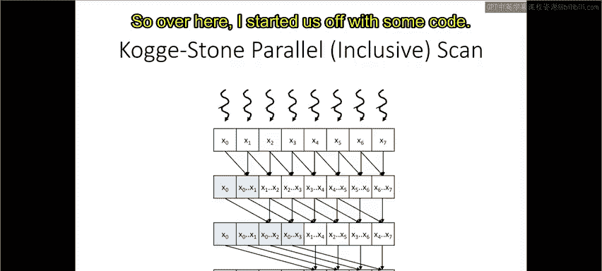

Is that we allocate the partial thumbs。 So here the sea view is taking care of the segmented hand stuff。

 So here I allocate the partial thumbs。 I call the pan kernel。

 And then you'll notice here if I have one thread block that means I'm done So I just do the addition。

 if I have。😊，sorry， if I have more than one thread lock。

 then I recall I call the thumb function recursively until I'm down to one threadlock and once I'm down to one thread lock that means I'm done it I can go back。

 And after I return from from doing scanning the partial sums。

 I call an add kernel that's going to add the partial sum for each thread Okay so this code over here is basically taking care of that segmented can that I told you about。

 I have two kernels， the second add kernel is the take care of the part where after I scan the partial sums I go back and for each threadlock。

 I I add to with the partial sum that it needs to add to all of its element So what's left is for me to implement this scan kernel to follow this cojistone parallel input Okay。

 let's do that。😊。

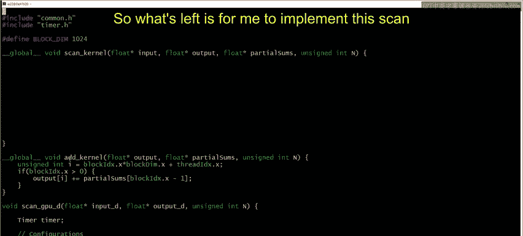

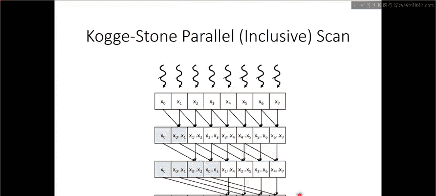

Ele first。😊，As for each thread to identify the input element that it's responsible for。

 you'll notice that unlike production here in scan。

 every thread owned every element has a corresponding thread。 Okay， in reduction。

 we had every thread every other element had a thread that owned it or in the in the coalesced version and the first half of the elements had threads and the others did not。

 But here in scan， every element is going to have a corresponding thread。

 so finding out what element a thread is responsible for is nice。 We just do unsigned。

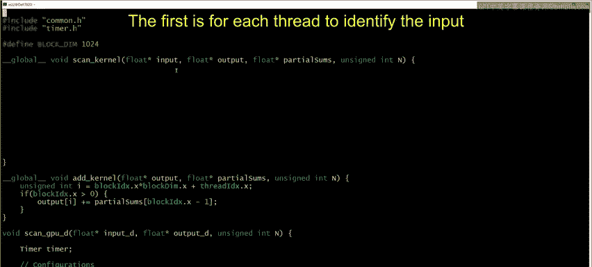

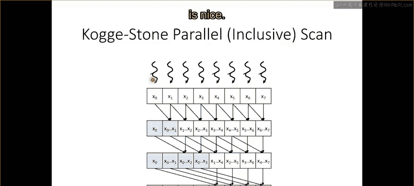

It I equals。Lock and by productsex。Times blocked in the X plus。Red index product。几。😊。

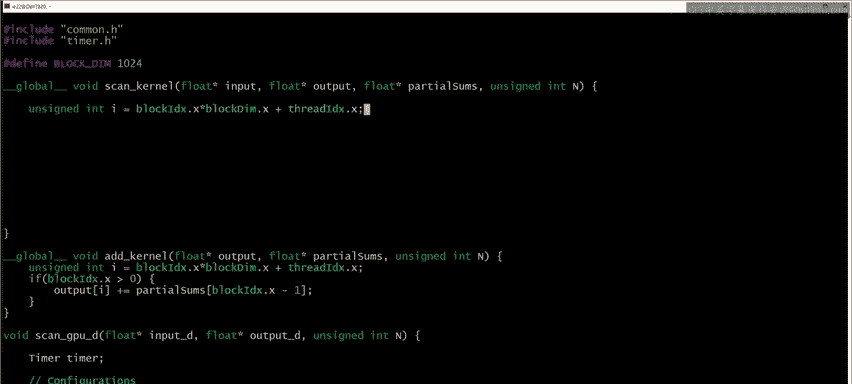

So now every thread has a corresponding element that is responsible for in the input。

 What I'm going to do first is I'm going to move， I don't want to modify my right。

 You'll notice here I'm modifying the values in the place。 I don't want to modify my input array。

 So what I'm going do for starters is I'm just going to move all the input values to the output array。

 and then I'm going to work inside of the output array。 Okay， so I'm going to just write。

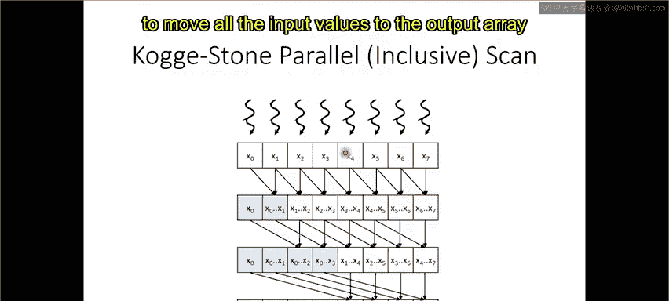

Output of eye。Is equal to input of I。 Okay， so I'm going to move all my input elements to my output array so that later on。

 I performed this then in my output array。 Okay， and I'm also going to sync threads here。😊。

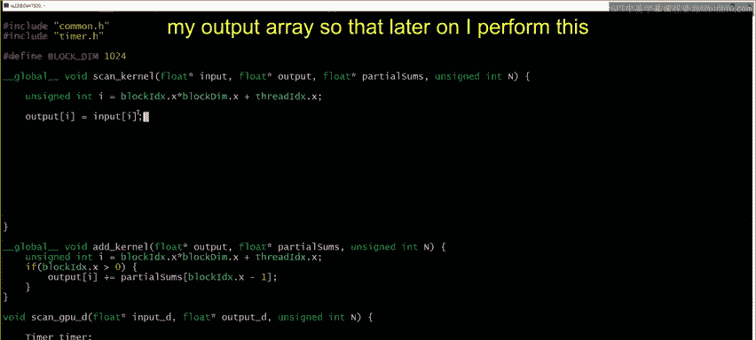

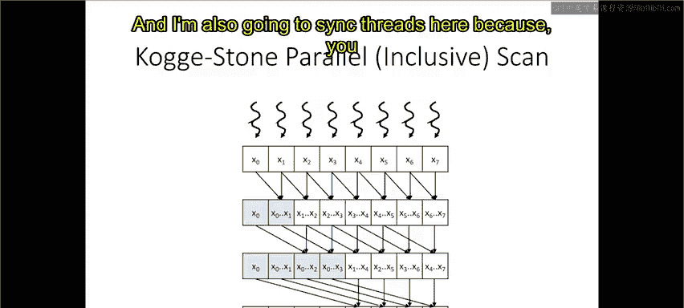

Because， you know this。

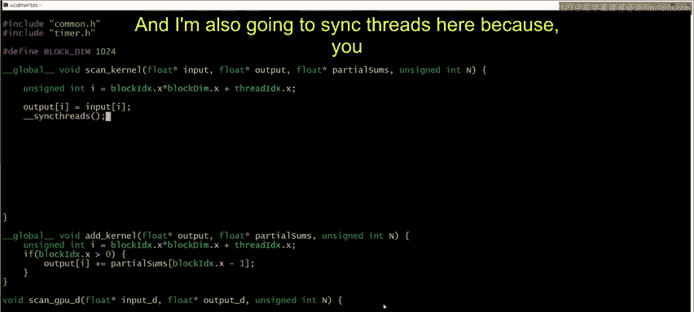

This thread is moving is x1 from the input rate to the output array。

 but then this thread and this thread both need to access X1 in the first iteration。

 So I need to take threads to make sure that this threads finish is moving X1 from the input rate to the output array before this thread tries to access it from the output。

Okay， so I have a saving price now I can begin my loop that does the reduction be。And I'll notice。

 just like with reduction where the stride was a convenient index to use for the loop。

 we're also going to use the stride here as the index of the loop。

 So you'll notice in the first step， the stride was one。 And the second step， the stride was2。

 and the third step， the stride was 4。 Okay， so so basically， the stride is going start at one。

 and we're gonna multiply it by two every time。 So I'm going have a loop then then goes from from。😊。

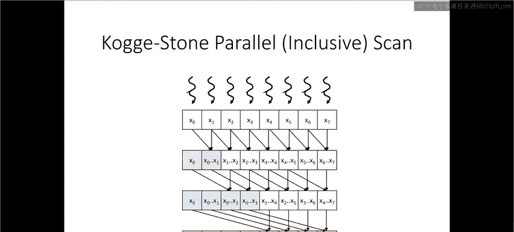

I it。Side equals。Equals one。

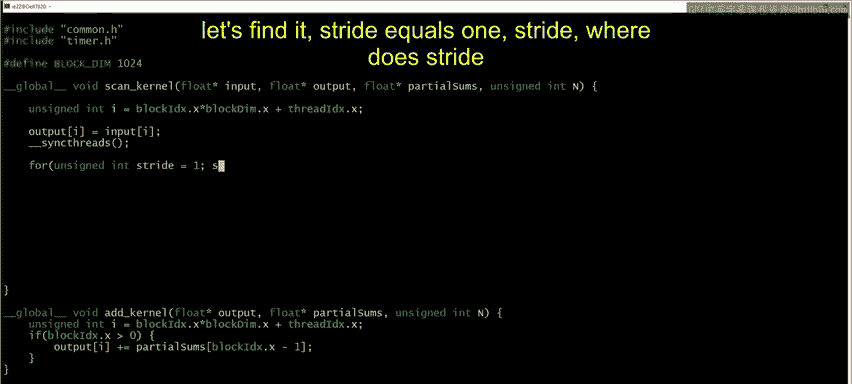

Striide， where does strideide end。 Well let's take a look here。

 Every thread block has eight elements， and we go with a stride of1，2 and then four。 we stop at four。

 because by by by the time we get the four， all the threads have the results ready and obviously we can't have a stride of8 because for any of these threads。

 a stride of8 is just going take out of bound。 Okay， so we so the for8 elements。

 we need we stop at a stride of four in general， block dim element we're going stop at a stride of block dim over Okay。

 so we're gonna to have stride less than or equal to block dim over2 and we are going multiply stride by two on every instrument。

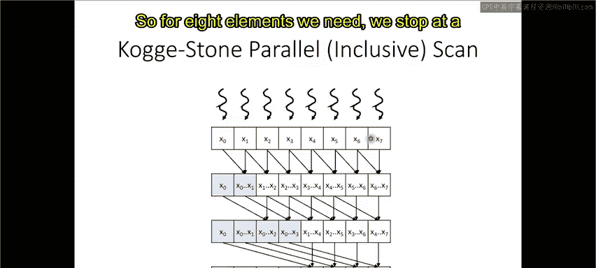

Doctor， yes。Why don't we put the output elements in the shared memory？well。

 then that's that's a very good observation。 So it is a good idea to put the output elements in shared memory。

 but because for pedagogical reasons， we're doing things one step at a time。

 So you're absolutely right。 it's a great optimization to put the output elements in shared memory and in order for me to kind of take things one step at a time。

 And also to show you what is the incremental improvement of putting things in shared memory。

 I'm starting my work in global memory。 And then the first thing we're going do is we're gonna put it in shared memory okay。

😊。

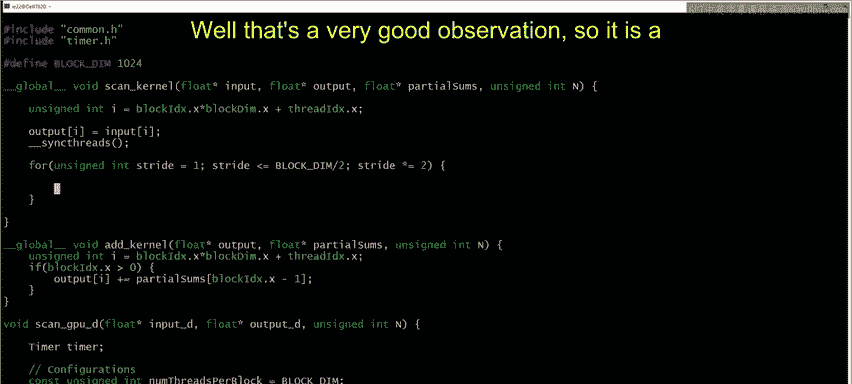

So because yeah， that's a great observation that we should put it and share the group。Okay。啊。

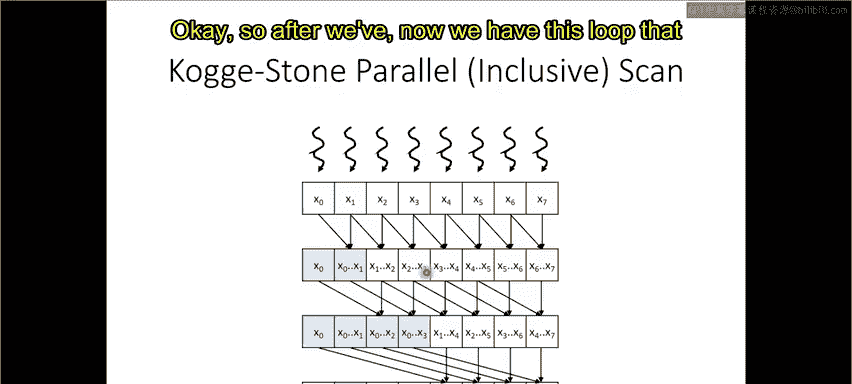

After we've now we have this loop that goes through our our stride now what are we going to do on every iteration well let's take a look on every iteration what we will do is we're going to add the element that is stride to the left Okay so in other words。

 we're going to do output。😊。

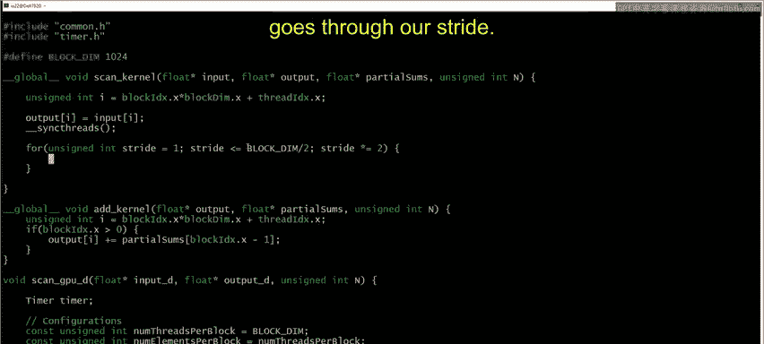

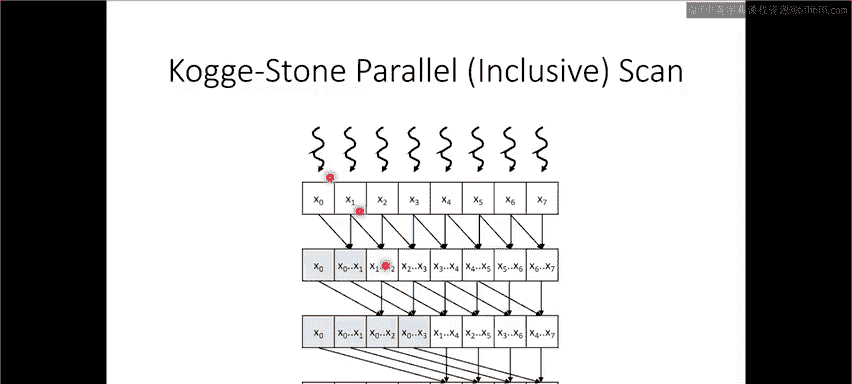

Of I。As plus equals。Output of。I by this stripe。ok。😊，Our vi was occupied by the transfer for each。

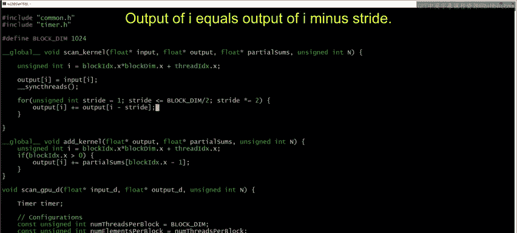

Ele， we're going to add to it， the element that is stride to its left。 Here。

 we add the element that's one to the left。 Here， we add the element of two to the left。

 And then here， we're adding the element that's 4 to。ok。😊。

But you'll notice that not all the threads compute at every iteration， only the threads。

 only the threads that who so here。When the strip is one， only threads one to7 to compute。

Well the stride is two， only threads2 to7 compute， the str is four， only threads four to7。Okay。

 so in general， for any value of stride， the threads that compute are the threads that are going to be whose index is going to be greater than or equal to the strip。

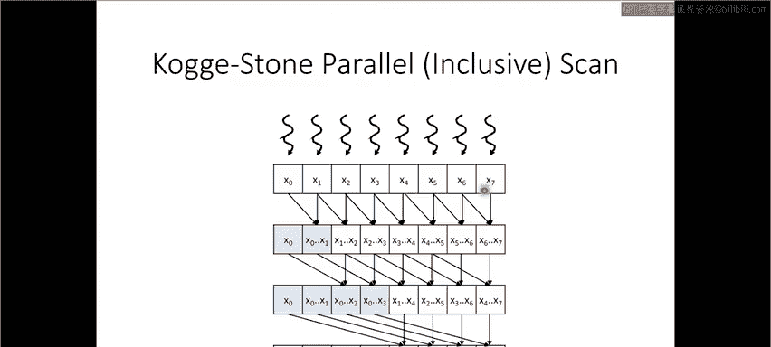

Okay。😊，So we' really need to have a boundary check over here where we write if and again。

 we're doing this on a per thread block basis。 So here the index that we're going to compare is the local index of the thread block。

 not the global。😊。

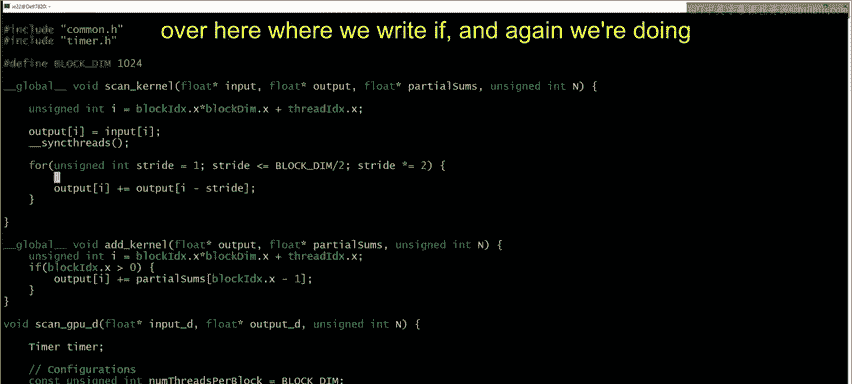

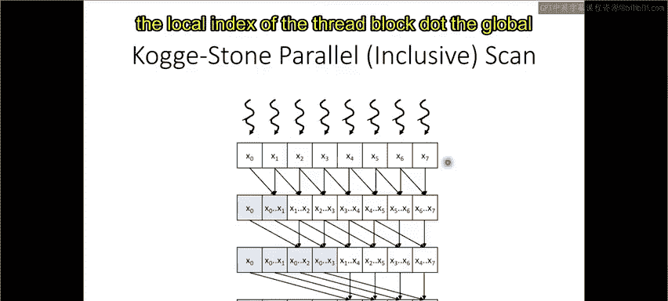

So here we're going to check if thread indexd do x is greater than or equals to。Striide。

Then we're going to do output of I plus equals output of I might describe。ok。😊。

We also need one to not go out of bounds， right。Well that that we can and this in this I'm not worried about if you mean out of bounds at the very end of of the input in general in these lectures。

 youve noticed that I haven't been worrying about the out of the bounds at the end。

 when I'm implementing the code just because I like to leave something for you to do in the assignment。

 so yes， we would need have a check for when we when the very last elements are out of bounds。

 but that is something that you can do as an exercise in the assignment and we are kind of intentionally not covering that in the lecture。

😊。

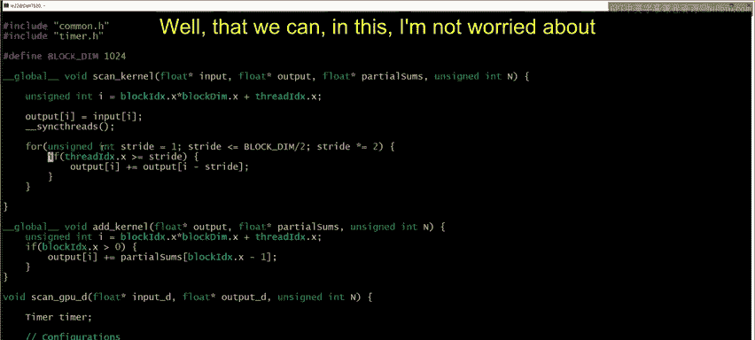

ok。😊，O， so so we。

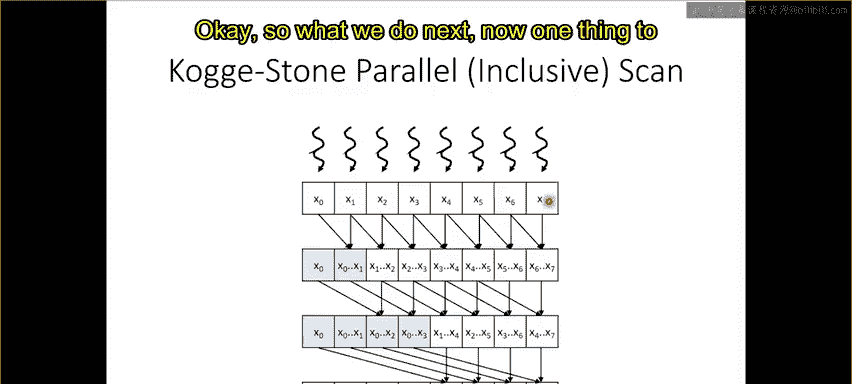

Now， one thing to note is that on each of these iteration。

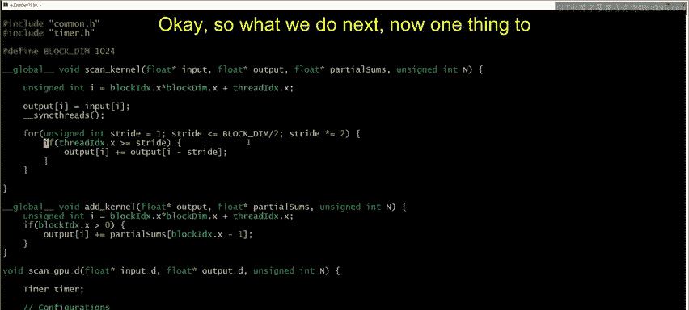

Right we need to wait for all the threads to finish writing their updated values before proceeding to the next iteration where the new thread start the threads start reading the new values。

 So how do we， how do we get all threads to wait for each other on each iteration。 What do we use。

One， guys， how do threads， right， S threads。 right。 So we're。

 we're going to have to use as an every iteration。 We're going to need a。

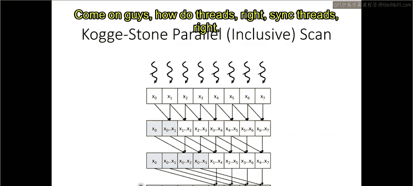

Big threads to make sure that the threads wait for each other before they proceed。Okay。

 and then then what we need to do once we are done is that the last thread is going to have the sum for all the elements of the thread block。

 So this last thread is going to be to take this result and store it in the partial sums array so that when we do a scan of the partial sum array。

 that value is。

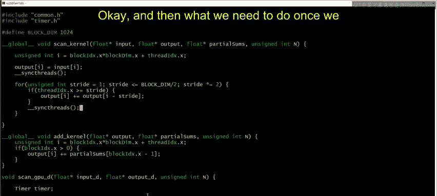

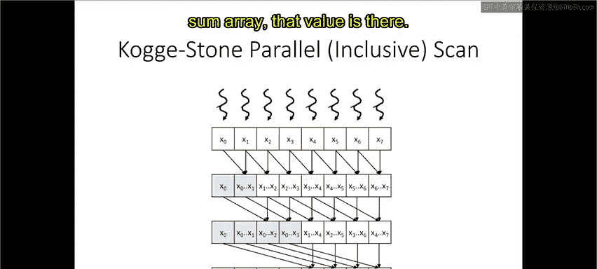

So how do I check if something is the last thread， I'm gonna do if。Tide index dot X。Is equal to blog。

 then I could have wrote Bin。 as well， logged in by this one。Okay。

 and if thread X X is equal to block in by this one。

 then what I'm going to do is I need to take the partial stuff of the thread of the last thread。

 and I'm going to store it as the partial sum for the entire clock。 I'm gonna to write。

 partial sum of。

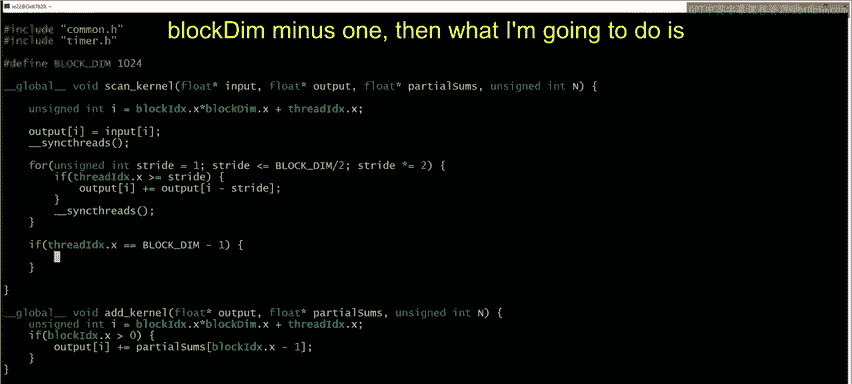

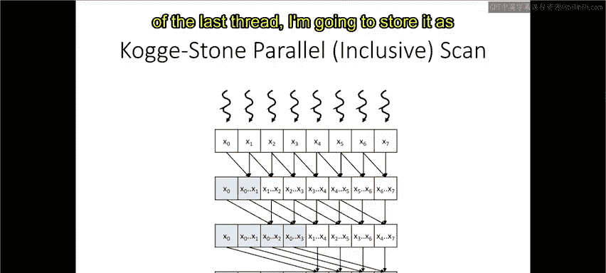

Lock index dot X。 So the partial sum for this block is going to be equal to the the value that is owned。

 the output value that is owned by this thread。 So's go to out。

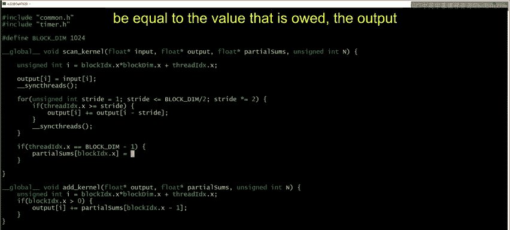

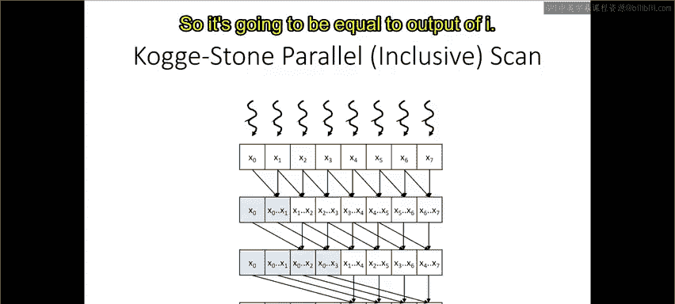

Output of time。ok。😊，Is this clear to everyone already questions？ok。So then let's now compile this。

And， let's run it。ok。Fil through it again。啊。Okay， so somehow this actually worked。

 but it was actually it was not supposed to work， so maybe maybe we just got out low。And this worked。

Okay， so somehow we got lucky and this work。But're not supposed to work actually。

 this was not supposed to work and there's a reason why this was not supposed to work。

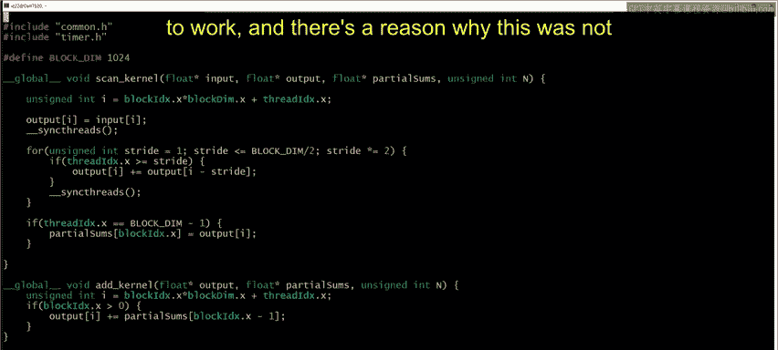

And the reason is that over here， when I read output of I minus stride and I add it to output of I。

 I actually have a race condition。Okay， so this is incorrect。

 It's odd because I actually tested right before the class and this did not work。 So I'm。

 I wonder why it actually does work。

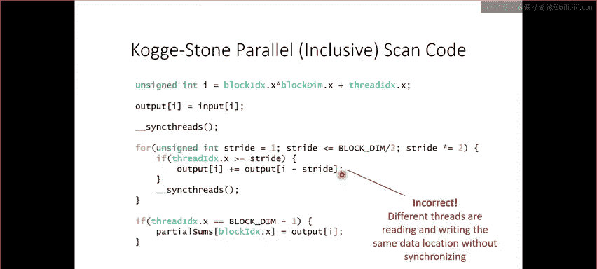

It didnt work now。 anyways， sometimes just the thing are race conditions。

 sometimes they happen and sometimes they don't。 But if you run for enough times。

 eventually you might get into the situation where where where the the code won't work。

 Let me show you why the this code that we wrote does not does not work。

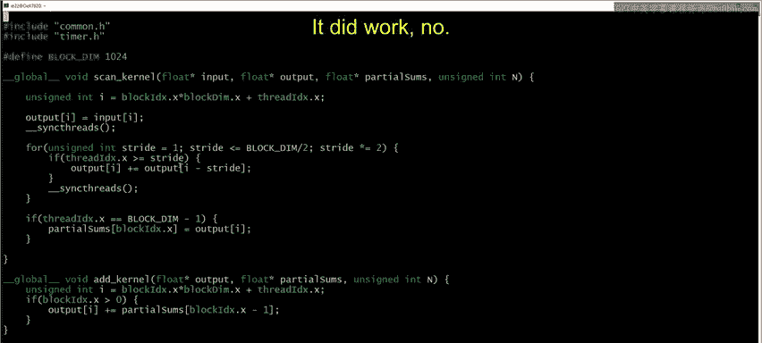

So you'll notice over here， let's focus on what these two threads are doing。

 So this this thread over here reads x1 and it reads x0 and it writes x0 x1 in the up。

 So here both of these are the same array。Okay， whereas this thread over here is going to read x1 and read x2 and store the result from x1 to x2。

Okay， now what's the problem here， The problem is that if we， if we write our code like this。

 where I do adjust do output of I plus equals output of I minus5。

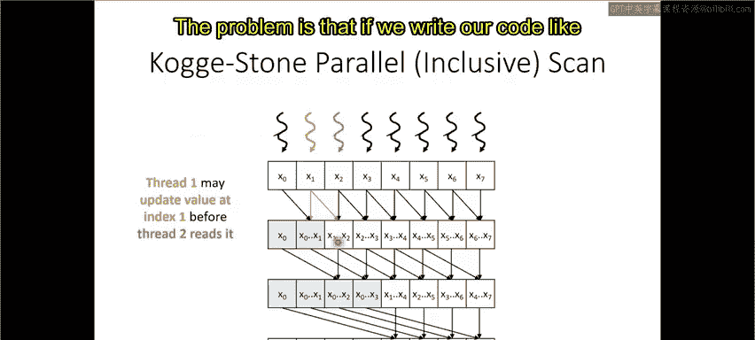

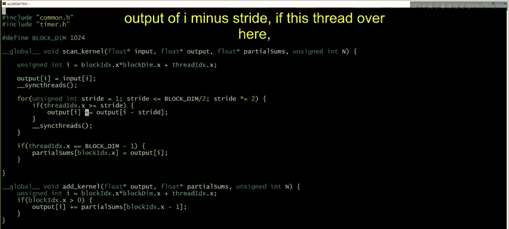

If thread， if this thread over here， thread one。Reads x 0 and X 1 and then writes the result of the addition X0 to x1 before this thread over here reads X 1。

Then， we have a problem。Okay， and the problem is that if this thread reads x0 and x1 and it stores x0 to x1 in its place。

 when this thread comes to do the reading， it's actually going to read x0 to x1。

 it's not going to read x1。Okay， so all we need to do is we need to read。

We need to make sure that this thread thread， too。Reads X 1 before we allow thread1 to write the updated value of X。

Okay， we to make sure that thread two readex one。Before we allow thread1 to update。Okay。

 so what we're going to do is we're going read it。 we're going to sing。

 and then we're going to write。 and then we're going to sing。 Okay。

 so here we need to make sure that every thread is going to read output of I minus strip。😊。

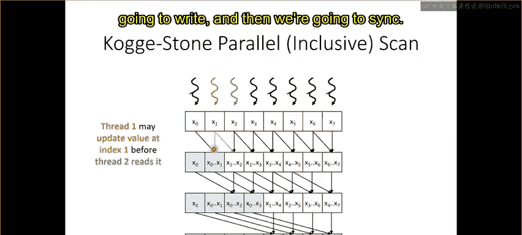

Before we allow the thread that owns output of I minus minus prime to update it when we do output of i plus as the rhythm。

诶。😊，So we're going to separate the statement in two。We're going to create a temporary variable。

 let's call it B。 Okay， we're going to read。Go sort of eye might describe。Okay， we' gonna。

Big threads。Okay， and then we're going to。Update output I by adding to it。

 the whole value of output by is right。Now we have a problem here。

 and the problem is that I cannot have stink threads inside of this。If condition。

 why can't I have the specific threats inside of this if condition？

Because some thread that don't go in with synchronize with the later sync thread。

 So it's gonna mess everything up。Right， so some the threat。

 then not all the threads are going to take this if condition。And whenever I have sync threads。

 I need to make sure that all of the threads can actually reach the sync thread。

So actually it's not going to be the case that some threads will reach this one and some threads will reach this one and they'll sync。

 that's not the way Kuda works and Kuda every sync threads is its own barrier。So different threads。

 reaching different sync threads doesn't mean they will sync together Okay， so in this case。

 if you put a sync threads in a place where you have control divergence where not you put a sync threads in a place where not all the threads in the block are guaranteed to reach you'll actually just have undefined behavior and what that means is that the compiler gives you no guarantees that it will produce correct results for your program。

Okay， so what we need to do is we need to actually put this thing the sync threads outside of the boundary check。

 so we're going to close the boundary check here and then we're going to sync threads and then we're going to do the check again。

😊，Okay， so we read the value。We take threads and then we update the value。 Okay。

 so this actually is correct。Okay， and then I'm going to compile this。

And I'm going to run it and it produces a correct result。

 the other one luckily produced correct results， but it was not supposed the previous implementation was not correct。

Okay， so so you'll notice over here that the kernel， the GPU kernel is called multiple times。

 and that's because you remember we have this cementive scan and then we we were incursively calling the kernel again to do the scan for the partial。

 So here we we did three different scans。 Of course the first scan was the one that took the most amount of time because that's the one that had the largest array。

 These here were small because they were just scanning the partial sums array。

 which were much smaller than the original。😊，Okay， so on the CPU takes around 50 millisecond on the GP it took around 8。

4 milliseconds。Plus all this other stuff and total the GPU time actually took longer than the CPUU time in this case。

 however， if your array is already on the GPU， you definitely want to this time a lot of it is the copy time right a lot of it is copying to the GPU and then copying back from the GP but if you eliminate the time it takes the copy to the GPU and copy back from the GPU then the time that takes the scan on the GPU substantially fast So if your data is already on the GPU then you definitely want to do your scan on the GPU and it will be much faster than doing it on this。

Okay。对。Yes question in which case in what cases do we do we have the data already on the GPU？

So if' if I'm writing this a large code for doing simulation。

 simulating something right what I do is at the very very beginning of my application。

 I copy the initial data to the GPU。 and then I run all the different computations on the GPU。

 I launch many kernels to do many different operations。 and then the final result。

 I bring it back to the okay so if if I have an operation。

 a computation that I'm doing that does many different things and one of those things those things as can。

 Okay， I'm not going to copy the GPU， do my first operation and bring it back and copy and get to the GPU。

 do the second operation and bring it back and then copy the GPU do the scan and then bring it back right I'm going to copy it the beginning。

 I'm going do all my operations of the GPU that I'm going bring back the。😊，Okay， so in this case。

Usually with these long running applications， there are many， many。

 many kernels that run on the GPU one after the other and that's why you know the copy time is usually advertised across all the benefit that we're going to get for all these kernel okay but if all we're doing is just doing a scan。

 which is not typically the case， then yeah maybe it's better to just do it on the。

Have I answered your question？Yes， thanks。Another example， for example。

 is like if you have a neural network with many layers， right。

 you're going to have a kernel that executes each layer。😊， but you don't need to copy， you know。

 the output of one layer is the input to the other layer。 Do you just keep that on the GPU。

 There's no point in copying back the output of the layer to the CPU and then copying it back to the GP as the input of the next layer and running the kernel for the next layer。

 Right， You just keep the the output of the previous layer on the GP as the input to the next。There。

Somebody was asking if I could repeat the issue with sinking inside fight the evening， yes。So here。

 if I did not have the if statement。If I learn how this they do， I just had this。

The problem is that not all the threads in the block。Are you going to come inside of this statement？

So not all the threads in the block are going to reach the sync threads， however。

 think threads requires that all the threads in the block reach it。

And that is why if I put sink threats inside of an if statement like this。

 I'm going to have undefined behavior。Is that clear？Professor。

 but we put't the threads that that don't go into the if be already like inactive and not doing anything。

Right， that's a problem because sync threads means that all the threads in the block need to reach it。

 so if some of those threads are inactive， they're not going to reach the sync thread。Okay。

 but you know， that's that's not necessarily， that's not necessarily。

 you know what what actually happens。 the semantics of sync threads are that。

All wherever you have a sync threads， all the threads in the block need to be able to reach that sync threads。

If you put einc threads in a place where not all the threads in the block can reach it。

 then this will result in undefined behavior。Okay， because the compiler might make the assumption that all threads can reach that same threads and that will impact how the compiler will generate code。

Okay， so you should always put a sync threads in a place where all threads and block can reach it。

 otherwise there's no guarantee that the compiler will give you correct。IProfe。

 but like if you're not if the thread， the same threads are not confused in between each other。

 do they have some sort of ID D number or like some sort of。So so that you know。

 that that is that would be kind of that would be that's related to the hardware implementation and how the hardware implements think thread so there's going to be some kind of resource that is needed if your support being able to do a synchronization right and maybe each of these sync threads is going to have its own resource or not right but the point is that each sync threads is its own barrier and if you if you this sync threads is different from this one if some threads reach this one and some threads reach this one that doesn't mean they're syncing together。

 Okay， it's different for from you know， other。😊，Other parallel programming modes， for example。

 like MPI， where if you do a， if you do a synchronization， different， different ranks。

 reaching different MPI calls might be able to synchronize together from different calls。

 That's not the case in Ka and Pa only threads thread synchronize with each other on the。

V the same call， not via the。I see。 Okay， thank you。Yeah， you're welcome。Okay。

 let's go back to our correct book。Okay， so having said that。

 let's now so we set our solution to wait for everybody to read before we do any write。

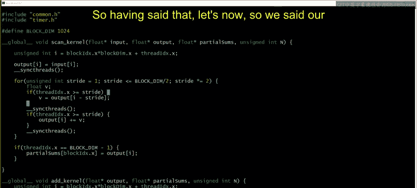

And this is what we did。 And we saw this gave us correct food。 So this is great。

 Now we have a kernel that does scan。 So now let's look at how we can optimize this kernel。

 And as one of you said。😊，One of the first things that comes to mind is what we did with reduction and that is to use sharing memory。

You'll notice here that the memory locations are reused。

 So rather than doing all of this in front of global memory。

 what we can do is we can in the load the initial values of the shared memory and then do our scan and shared memory and then store the final results to global memory and we can do that。

 Let's see our performance benefit that gets up。😊。

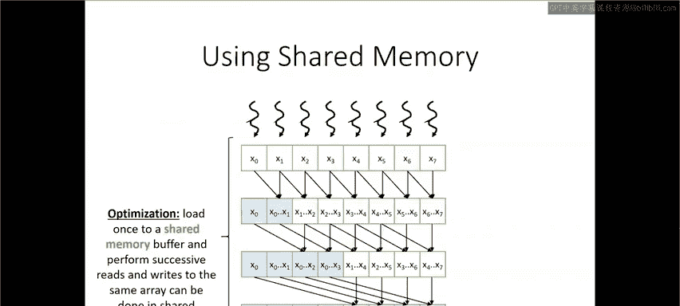

So here， rather than loading from the input to the output。Okay。

 we can load from the input to a shared memory buffer and then we can do all of this inside of the shared memory buffer and then we can store to the output at the very end Okay。

 so let's write the code that。So I'm going to start by creating。A shared memory buffer。

 I'm just going to call it buffer but this for S。How big is this buffer going to be？

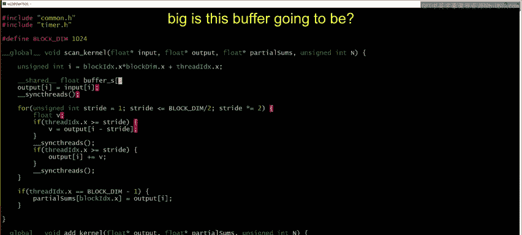

So remember that as the number of elements that a thread block owns correspond to the number of threads in the block。

 Okay， so we're just going to have。

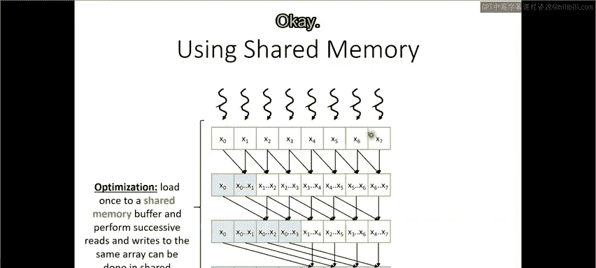

Llock dim element。Okay， next to what we do， instead of loading to the output。

 instead of loading input of I to output of I， we're going to load to the buffer itself。

The answer were load to the。B and of course， when we load to the buffer。

 we're not going to use the global index of the thread to access the shared memory buffer。

 we're going to use the local index of the thread to access the shared delivery buffer。ok。

So now that we've done this， now all the places where we were accessing the global array。

 global output array， we should go and we should use the the the buffer instead。

 So here instead of output， we're going to have。😊，Bffer underscore S and instead of I we're going to use thread indexdex do x by the way。

 this now should make this boundary condition much more clear right so here I'm accessing my sharedman movie buffer with thread indexex dot x minus5。

 which means that thread index mod x minus stride should be greater than or equal to0 which means that thread indexd dot x should be greater than or equal to stride。

😊，Okay。😊，And then over here， I'm going to use。Bffer underscore S， I't going to index it with。

Treaded back。Where did like start？And then down here， I will also use。But address for S。

 and I will index it with。Prit got it。Okay， and then of course， finally。

 I do need to eventually write to my output array， so I will also write out。But。

Of I is equal to buffer underscore for S of。对对对晓的。几。😊。

And with this what we've done is we have changed our code so that we use a shared the re buffer throughout the computation mission。

 and then at the end write we write to the output okay， and it's clear to everyone。Any questions？

Okay， let's read this code。Remember before it took us about 8。

4 milliseconds to do the largest scan kernel so now let's compile and let's see what performance improvement using Chder has given us So now we're down to 6。

4 milliseconds from 8。4 milliseconds so that's around a 25% improvement which is quite nice。Okay。

 let's and improve this further。

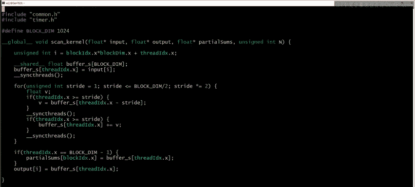

So this is the shadown memory code that we wrote。 Now， one observation is that every loopideration。

 we've had to use big threads。

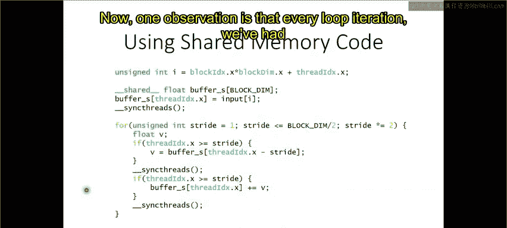

喂。It's different from reduction where we used it once for period。And remember。

 what was the reason we're using？Think threats twice us。

 Well the reason was that we need to read and make sure everybody reads before we let anybody write。

Well one optimization to avoid thinkinging flies is by using two different buffers and having the problem here。

 the main problem。Is that I'm using the same buffer as both an input and an output。 Okay。

 so what we can do is， if we want to eliminate the synchronization is to use a different buffer for both the input and the output。

 And let me show you。

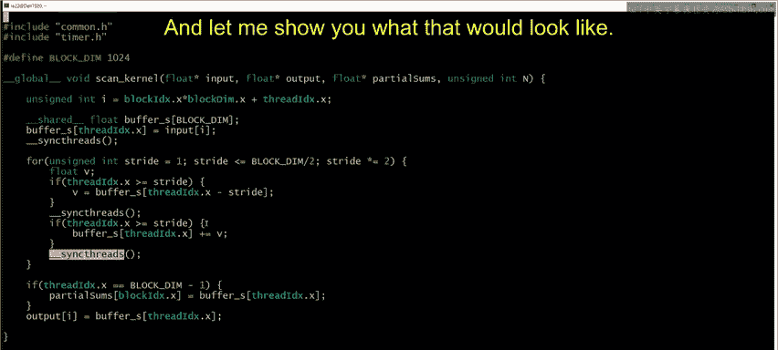

That would look like so the optimize this optimization I' about to introduce is called double buffering and the idea of the optimization is to eliminate one of the synchronizations by using two buffers and then alternating between them so on each iteration we swap what the input and the output are。

So on the first iteration， what we're going to do is we're going to read from one of the buffers。

 but we're going to write to another buffer。Okay， so in this case。

 the input is going to be as I'm going to have two buffers， buffer one and buffer two。

 and in this step， the input is going to be buffer one and the output is going to be buffer2。

Now one thing you notice here is that later on I'm going to need x0 and here buffer2 doesn't have x0。

 so what I will need to do what I use two buffers is I will need this thread that was previously inactive will actually have to participate and it will have to just transfer x0 from buffer1 to buffer2 without doing any of。

Now， on the second iteration， buffer 2 is going to become my input。

 and buffer one is going to become my output， and I will again。

Read from my input and store to my output okay and because I'm using a different buffer from the input on the output。

 I don't have to worry about you know over here I did not have to this I did not have to worry about this thread writing to X1 before this thread read from it because this thread wasn't writing the buffer one was writing the buffer。

Similarly over here， I don't have to worry about。I don't have to worry about this thread over here writing to this location before this thread read from it。

 because this thread is not going to write to this location， if's going to write to buffer。Okay。

 so we're going to read from buffer two， we're going to write to buffer one。

 and then the threads that are inactive， we still need to make sure that we have these results in our buffer。

 so the threads that were previously inactive are just going transfer the value as is to buffer。

And we also do the same thing at the end and the end。

 buffer one is going to be our input buffer two is going to become our output and we're going to read from buffer one and we're going to write the buffer2 and then the threads that don't do any addition are just going to have to transfer the value from buffer one to the buffer。

😊，Okay， so by doing this， what we do is we alternate the input buffer and the output buffer every time so that we're never reading and writing from the same place at the same time and what that does is that it eliminates。

This the need for me to have to synchronize between the reading and the writing。 Is this clear。

Is it clear why using tube buffers eliminates the need to synchronize between reading and writing。

 any questions about this？Okay， well if it's clear。

 let's go and implement this and see what performance improved is。😊。

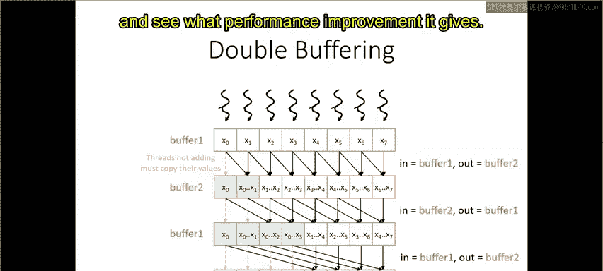

So I'm going to switch to the term。So here， rather than having one buffer。 Okay。

 rather than having this one buffer。Okay， instead， I'm going to have two buffers。

I'm going to have a buffer one。Add a buffer， too。And at each time。

 one of them is going to be my input buffer and one of them is going to be my output buffer。

 so to make things easy for myself。I'm going to create a pointer。 I'm going to call it in buffer。

 and I'm going to initialize it to buffer one。Okay， so now end buffer pointss the buffer one。

 and I'm going to create another point， so I'm going to call it Al buffer。

And I'm going to initialize that to buffer。2。Okay， so now end buffer is going to point to buffer one and add buffer is going to point to buffer。

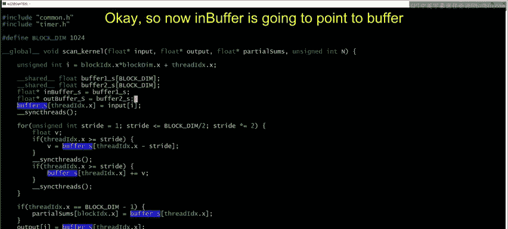

Initially， the end buffer was buffer one， and the add buffer was buffer。

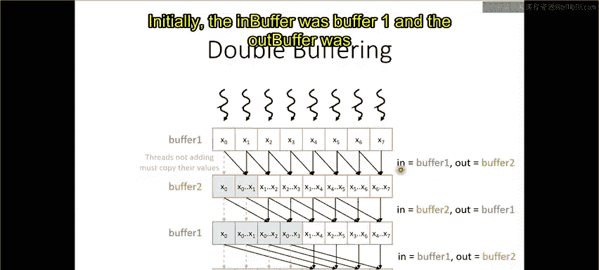

After that I'm going to put my result I'm going to load my input initially to the input buffer。

 so here I'm going to use end buffer。😊，几。😊，But down here， Okay， instead of doing all of this。

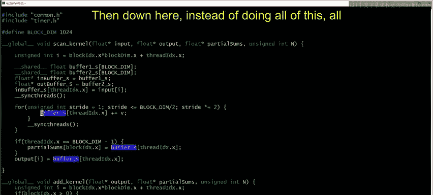

Okay， all I need to do is to load。From the input buffer and add in the store to the output buffer。

 So here， remember， our condition was if。

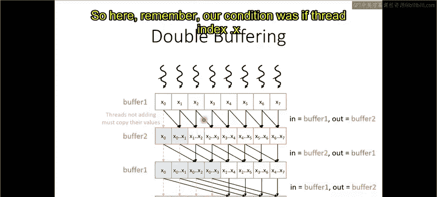

So an index dot x is greater than a equal to stride。ok。人。

The result of the output buffer is going to be the result of the input buffer plus the result of the input buffer minus bright。

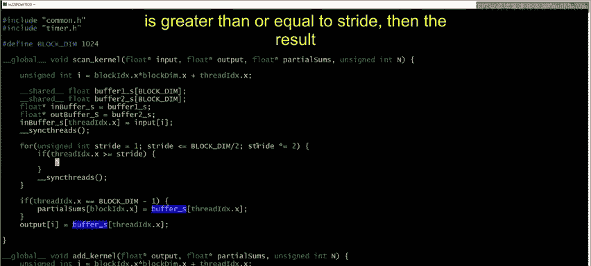

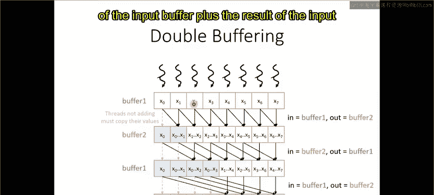

Okay， so here。Out buffer， underscore score S of。Bread index code X。Okay。😊，Ass equal to。

And But underscore asked of。thats that X。Plus， it buffer， underscore asked off。

Tread index got axed by this threat。Okay， so what I'm going to do is I'm going to put in the the thumb of the element。

 the corresponding out in the buffer and the element at tri x x minus strike this is what I'm doing over here okay。

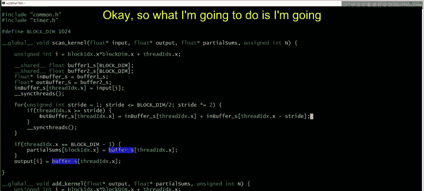

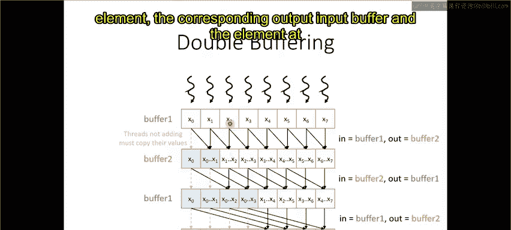

But there's something important that I also need to do what is that。

At least transfer the value as it is。

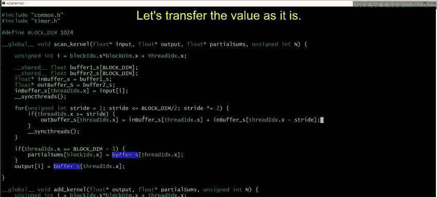

Right， exactly。 So here thread that were previously not doing anything。 Now。

 these threads are playing an important role。 Now， these threads need to take the value and transfer it as it is。

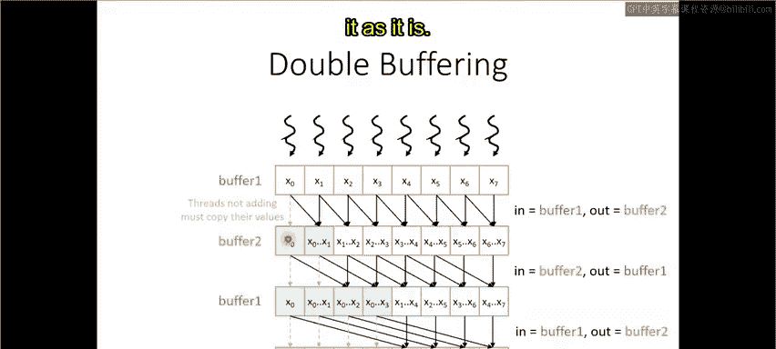

So here I'm going to need to have an else。Okay， and in this else。

 I'm going to have for output buffer is just equals output buffer F index x equals input buffer up an indext x。

ok。And now I do a sink threads。 And the nice thing here is that I only have to sink threads once。

I don't have to do think thread between the reader on the right。 Okay， now I'm not done。

 What do I need to do after I do the edition。Swab pointers。Right， I need to swap the buffers。

 So now at the next it， my end buffer is gonna become buffer 2。

 and the a buffer is gonna become buffer 1。 So I need to swap and buffer and add buffer。

 So I'm gonna just create a。

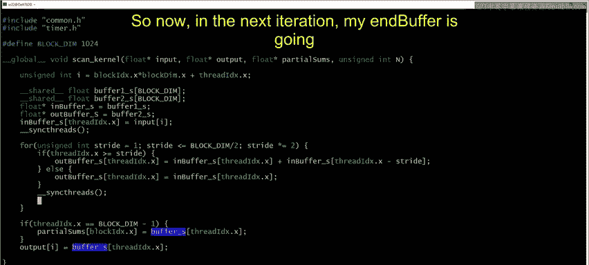

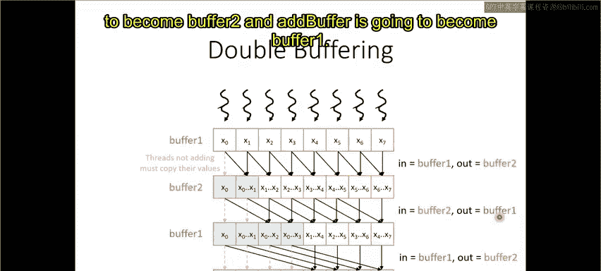

Poer， or attempt。I'm going to write in， I'm going to write well， I'll initialize， I'll save。

The the pointer， the value of Ed buffer。 And then'm gonna to write。

N buffer underscore S is equal to out。But for others were S and then out。

Well friends were asked people to。In case it always swap the buffers。So in every iteration。

 I'm going to use the buffers to do the addition。 and I'm going to swap them。

 Im going to use the buffers。 I'm going swap them。 Okay， I so I'm done。 Once I'm done。

 I come down here。 And what I need to do is I need to。

I need to now store the best total sum in the partial sum array array Okay， how do I do that。

 Which buffer should I use in buffer or out buffer？In buffer。

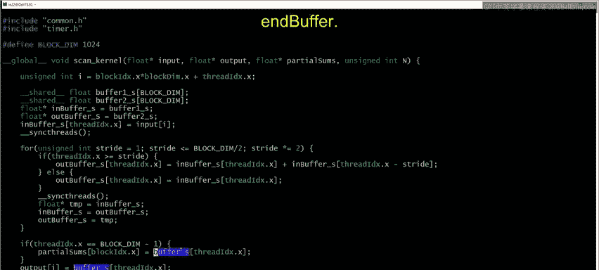

Right， I need to use Ed buffer。 You know， even though at the。

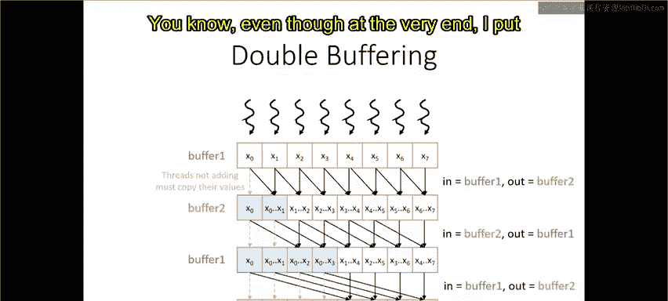

I put the result in the out buffer right， but the last loop iteration here actually swapped them again。

 so I I should use end buffer put to get the final result。Okay， and I will also use。

And buffer over here to put the final result。 Okay， so this double buffering。

 especially what it has done， is that it's saved us one sink threads inside of the ss。

 So now every luineration， rather than doing two sink threads， I'm doing one sink。

So let's see how much performance improvement it does compile。嗯。啊啊 ok。

So here I accidentally use the cap。This should be a lower thing。The of compile。

So remember last time without double buffering that the time of the kernel was 6。4 millcond。

 so now we're going to run and now you'll notice that our time is down to 4。4 millisecon。Okay。

 so again， this is a significant performance improvement from having applied this double buffering。

Okay， any questions about double buffering， Is it cleared everyone。

So what we did is we created two different buffers instead of one。

 and we every time one of these buffers was the input and one of them was the output and we swapped them on each iteration。

And double you know it's an optimization that's used commonly in many different places where you have an input and an output and you constantly alternate between them。

 sometimes we use it to save memory because instead of allocating and buffer for every intermediate result。

 you just continuous the alternate between two buttons。But in this particular case。

 we use it to reduce synchronization and we actually use more memory in order for us to reduce。

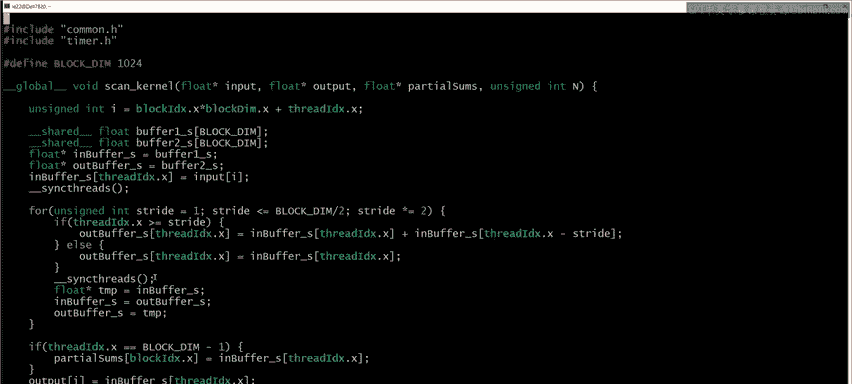

Okay， so this is the code that we wrote and with that we've done taking a look at how to implement inclusive scan。

😊。

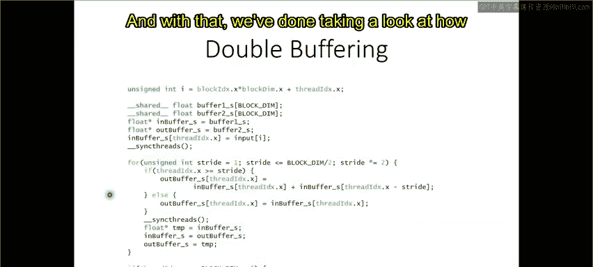

I'd like to do is just to look at how exclusives can differ。 So for for the coachstone algorithm。

 exclusives can， we can just formulate it as an inclusive。😊。

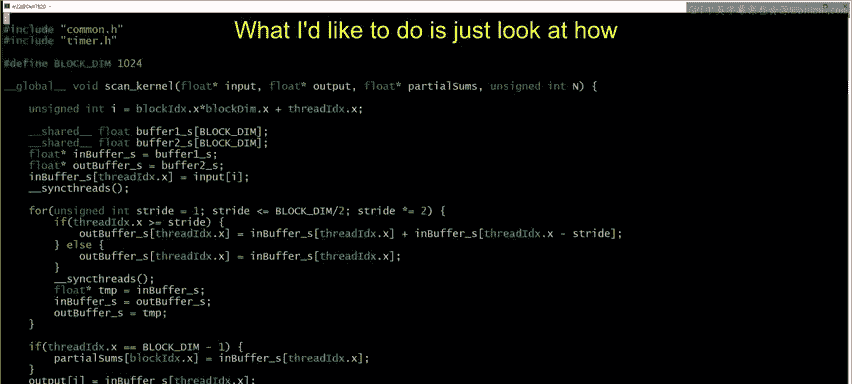

Right， so to do an exclusive scan， we can simply shift the elementss by one when we load them。

To share debris。And then we just and then we just do an inclusive scan for the shifted array。 Okay。

 and then the last element that we were supposed to we supposed to get that will only be used for computing the partial。

OkaySo in other words， use to do an exclusive scan。

 well actually let me first do the exclusive scan on the CPU。

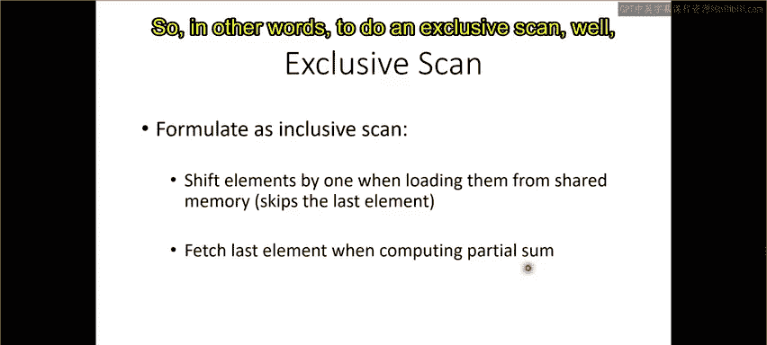

So here for an exclusive catalyst to view， rather than initializing the output of zero to input of zero。

 we're going to initialize output of zero to just zero。Okay。

 and rather than doing output of I equals output of I-1 plus input of I。

 output of I is going to be output I -1 plus input。大です。Okay，Because in the exclusive can。

 output of I does not include input of I， it includes up to input of I minus so here I've modified the CPU code to do and an exclusive。

Notice it's much easier than the modifications we're about to do with the GP code。In the GPU code。

 the way I'm going to do an exclusive pant for the cojistone algorithm is I'm simply going to shift my input by one。

So here， rather than loading input of I to my buffer， I'm going to load an input of I minus-1。

'm going to shift my input to the right by one。 Okay， so here。I'm going to do Ed buffer of Ed。-1。

 Okay， however， I cant do this for the very first element for the very first element。

 because there's no I -1 for the very first element。 So for the very first element。

 what I will do is I will load， I will just load0。 I'm going to do this on a perth friend block basis。

 So I will write F。For index dot x equals 0。 So the first thread in the block for the first thread in the block。

I'm going to load a zero and for the remaining threads， I'm going to load the previous element Okay。

 so here for the first thread in the block。I will load will put a zero， and for the remaining thread。

 I will load the previous element。And now what I have is I have a shifted array。

 I've taken the segment that the block is responsible for。

 and I've shifted it by one and I've put a zero at the beginning。

 and now I'm just going to do what I had did before。

 I'm going to do an inclusive scan on the shifted array。

 which is basically an exclusive span on the nonshifted array。

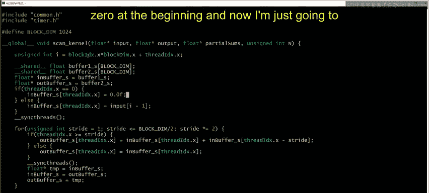

ok。

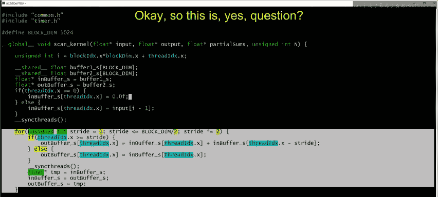

So， this is。Yes， question。Yeah， couldn't we have loaded the whole thing shifted by one to the GPU。

Yes， you could have loaded the whole thing shifted by one as well the part of the problem is that the code I've written here and especially in the recursive code that I've written to do the partial sums is kind of working for inclusive scan so that that's why I'm doing it。

Okay， because I'm trying to have as minimal changes to the inclusive scan code as possible。

So over here， after we do this down here in the partial sums， when we add the partial sums。

 the partial sums should include all the elements in the block segment。Okay。

 but now that I've shifted by one， the last element in the block segment is not going to be included in the in the in the in the total sum in the last element。

 So what I will do is over here， I will need to。Add to this。Andput of I。Okay。

 because the last thread in the block is going to load input of I minus1。

And the first thread in the next block is going to load zero。Okay。

 so input of I is not going to be accounted for anywhere in this code。

 and the way I account for it is it's going to go into the partial zone and I count for it by adding it here to the partial。

Alright。So now that I've done this， every thread has done its own exclusive scan and it has also found its partial sums and put in the partial sums array。

 And now when I do the recursion， I'm going to do an exclusive scan on the partial sums array Okay But if I've done an exclusive scan of the partial sums array。

 Now， when the thread block comes to add the sum of the previous blocks to to its elements。

 Now the sum of the previous blocks is not going to be the sum of the previous blocks in the scan partial sum array is not going to be here when we do the addd in the past。

 what I was doing is I was getting。😊，When I was doing inclusive scan， I was getting the partial。

 scan this is the scanned partial sums of the previous thread block because I wanted to add the sum of all the previous blocks to my element。

 but now in exclusive scan， the sum of the previous threadlocks is actually at block index doX。

 not in block index do x minus1 because when I scanned the partial sums array。

 I used an exclusive scan。So here I will also need to。

Need to remove the minus one from here in order for me to do the。So with these simple modifications。

 we've converted our。Our inclusive scan code to do an exclusive scan and what one of you has mentioned is also correct Another way to have done it is simply to have shifted the global array by one and done an exclusive scan on the global array so that's another possible way of doing it Okay。

 and then after having。Let's compile and run and to compile。And。

See that the code succeeds and also has similar performance， okay？

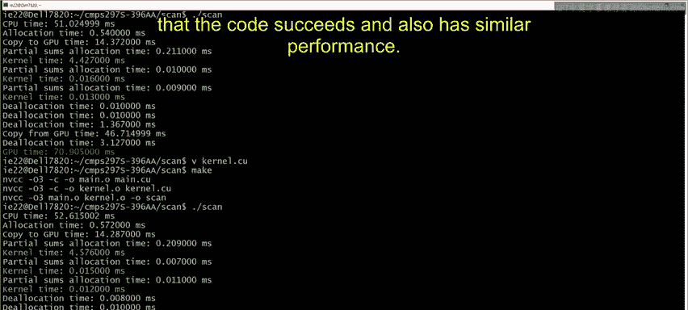

So this is how we support the exclusive Now the final topic I'd like to talk about today is something called work efficient okay。

 something called work E。So a parallel algorithm is said to be work efficient。

If it performs the same amount of work as the corresponding sequential algorithm。Okay。

 so we say a parallel algorithm is work efficient， if it performs the same amount of work and by work here。

 I mean like I mean the the so in the case of scan。

 the number of floating point additions that we perform。ok。😊。

So it's work efficient if it performs the same amount of work as the corresponding sequential algorithm。

Okay， now let's reason about the work efficiency of skin。 Okay。

 How many additions does the sequential scan prefer。

N or the level I thought to scan an array of N element come additions that as it before。 Sorry。

 somebody was that sorry。呃嗯。Right， and additions， right， So here if I move。

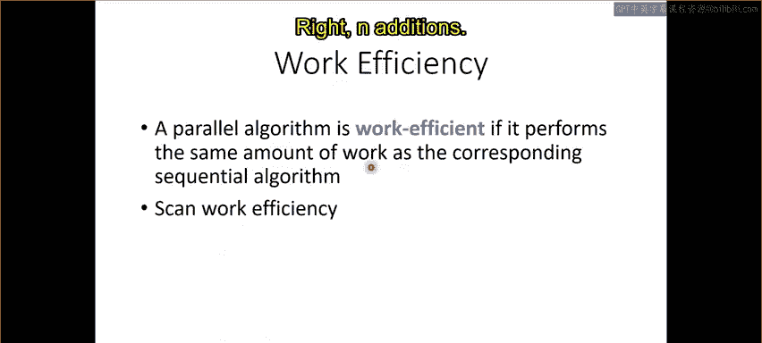

好。Yes。So here if I look at my sequential scan， I just have a loop that's around that goes around n times okay。

 and I do an addition every for each of these loop iterations Okay。

 so sequential the sequential scan performs n addition。

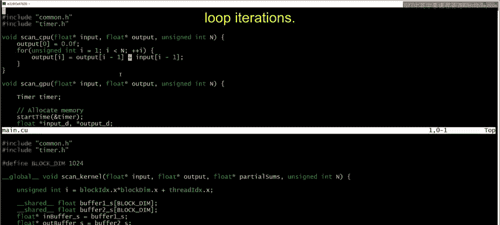

Okay， what about the Kooji stone parallels can， How many additions does the Kooji stone parallels can？

Okay， let's take a look。 Let's go back to our illustration。So here in this illustration。

How many steps do we have first of all， so here are n the number of input elements here n is8 so how many steps do I have。

 I have log end steps。ok。In the first step， how many editions do I perform？I do n -1 edition， right。

In a second step， I do n-2 edition。In the third step， I will be doing n minus-4 editions， etc。ok。😊。

So I have log N。Times。So I have f n-1 plus n-2 plus n-4 plus n2 to the power of the iteration， right。

 and I do that log n time。Okay， so if we go down， we go back down to our reasoning about our work。诶。

😊，We're going to have log end steps。At every step we're going to do n minus step2 to the power of step operations per step。

ok。😊，In other words， we're going do n-1。Plus n-2， plus n-4 dot dot dot plus n minus n and over 2。ok。

😊，And how many， how many terms do I have here， I have log end terms because I have log end step。

So the final result is going to be n plus n plus n plus n log n times， so that's n log n。

 and then minus 1 plus 2 plus 4 plus do do plus n over 2 that comes out to n minus1。So in total。

 I'm going to do n times log n minus n minus1 operation， which is O of and log n operation。

So my sequentialial scan performed only end edition。

Whereas my Poone parallels scan actually performed and log and addition。

And what that means is that my parallel algorithm is not performing the same amount of work as my sequential algorithm。

 In other words， my parallel algorithm here is not work efficient。Now。现事了。Sorry。

 isn't there another n as well for adding the partial sums later on？Well， well， over here。

 what I've assumed over here is that I'm doing the I'm doing the tree for the entire end。Okay。

 oh okay， I see that makes sense Okay， yeah， so this end here is for the entire tree but but you know。

 if you， if you work it out right， basically when you're doing the partial cells。

 it's like you're continuing the retreat。Okay， so it should still be kind of similar for when we didt segment it again。

Okay， so the algorithm and this algorithm here is not work efficient。ok。😊，Now， if。

 if if all my thread blocks will actually run in parallel， because remember。

 even though I perform visiting operations， I'm actually completing the scan and log and step。

So if all my operations are going to be perfectly paralyzed。

 they will actually be over to running it parallel， even though I'm going to perform more operations。

 I will do it in fewer steps。So I will finish fast。However， if my resources are limited。

RightThen the parallel algorithm might become quite slow because the parallel algorithm is actually doing more work than the sequential algorithm。

 It has lower work efficiency。Okay， so having made this observation。

 having seen the Postone algorithm has low work efficiency。

 okay what we will do it next time is we will look at a different parallel algorithm for scan that has better work efficiency and we're going to compare the performance of these two algorithms。

😊，Okay。😊，So if you'd like to read more about what we talked about today。

 you can refer to chapter 8 of the textbook and the chapter 8 of textbook also talks about the work efficient implementation which we will be covering next time any final questions about today's material？

😊，Everything clear。All right， well then if there are no final questions。

 then that's all for today and I'll see you next time。

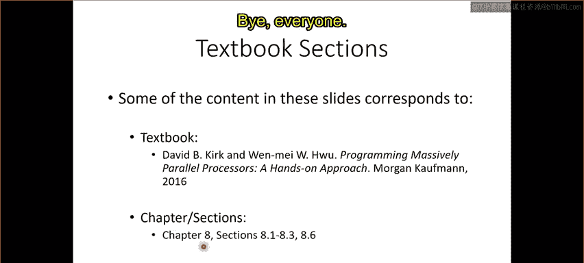

50。